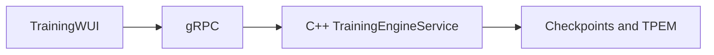

# qminiwasm-core

**[Glossary](docs/GLOSSARY.md)** — terms and acronyms used below.

## Welcome

**qminiwasm-core** is an **edge-oriented ML runtime**: **WebAssembly** sandboxes, **ternary / TPEM** artifacts, optional **quantum-assisted routing**, and **native training** over **gRPC**. The product surface is **Go** (Training WUI, gRPC runners, edge builds, serve stubs) and **C++** (LibTorch training engine, linear-memory encode, WASM host hooks, escalation, expert-fleet primitives). Treat the repo as **infrastructure you provision deliberately**—not a single-language script.

## Runtime stack

| Surface | Role |
|---------|------|
| **Training WUI** ([`training-wui/README.md`](training-wui/README.md)) | **Mission Control** (Go): training jobs call the C++ **`TrainingEngineService`** over **gRPC** (LibTorch). |
| **C++ training engine** ([`cpp/training/README.md`](cpp/training/README.md)) | Native epoch loop, telemetry, HF row fetch, cascade; must match `grpc_addr` in [`configs/wui.toml`](configs/wui.toml). |
| **Edge / WASM** | Bounded linear memory, TPEM interchange, native encode ([`cpp/wasm/linear_memory_encode.hpp`](cpp/wasm/linear_memory_encode.hpp)), hooks ([`cpp/wasm/wasm_host_hooks_c_api.h`](cpp/wasm/wasm_host_hooks_c_api.h)). |

**Authoritative training contract:** [docs/TRAINING_NATIVE_PARITY.md](docs/TRAINING_NATIVE_PARITY.md) (native stack only).

**Operator quickstart:** [training-wui/README.md](training-wui/README.md) **Path A** — Go 1.22+, `wat2wasm` / WABT if building edge artifacts, C++ engine binary + `go run .` in `training-wui/`. Helpers: [`scripts/start-training-stack.ps1`](scripts/start-training-stack.ps1) / `.sh` where present.

**Remote GPU / RunPod:** [docs/operations/OPERATIONS_RUNBOOK.md](docs/operations/OPERATIONS_RUNBOOK.md), [docs/RUNPOD_QUICKSTART.md](docs/RUNPOD_QUICKSTART.md).

**Depythonization:** remaining non–Go/C++ surfaces are being **removed or ported**—see [docs/DEPYTHONIZATION.md](docs/DEPYTHONIZATION.md).

---

Large models are hard at the edge because **memory, thermal, and bandwidth** are fixed. This stack keeps **determinism and isolation** in **WASM**, puts **training throughput** in **C++ LibTorch**, and puts **orchestration** in **Go**. **Routing** for combinatorial relief may target **IBM Quantum Runtime**, local simulators, or native OpenQASM hooks—see [docs/QUANTUM_QISKIT.md](docs/QUANTUM_QISKIT.md) and native APIs under `cpp/`.

## Ecosystem context

| Piece | Role |
|--------|------|
| **qminiwasm-core** (this repo) | **Training + inference runtime** (native training produces checkpoints / TPEM; inference via Go serve stub and WASM) with optional QAHR. |
| **OmniGraph** | Separate **IaC** workspace—not an ML engine. |

There is **no shipped integration** with OmniGraph. Optional: use OmniGraph to reason about hosts that run training (e.g. `infra/runpod/`)—manual alignment only.

## How we stay within the constraint

Edge nodes fail on **budgets** and **trust boundaries**, not exotic math alone. **Smaller footprints**, **triggered quantum routing**, and **identity at enrollment** are in the [Glossary](docs/GLOSSARY.md) and [docs/Q-Mini-WASM_ Edge AI Taxonomy.md](docs/Q-Mini-WASM_%20Edge%20AI%20Taxonomy.md). Trust lifecycle: [docs/IDENTITY_STACK_REFERENCE.md](docs/IDENTITY_STACK_REFERENCE.md).

Execution stays in **sandboxed WASM** with bounded linear memory. **Training orchestration** is **Go + C++ gRPC**. **Inference** today: Go **`qmw-serve`** and WUI **`/api/serve/*`** return **501** until a **C++ tensor RPC** bridges LibTorch outputs—see [training-wui/infer_serve.go](training-wui/infer_serve.go).

## Documentation map

- Glossary: [docs/GLOSSARY.md](docs/GLOSSARY.md)
- Training WUI: [training-wui/README.md](training-wui/README.md)
- Native training contract: [docs/TRAINING_NATIVE_PARITY.md](docs/TRAINING_NATIVE_PARITY.md)
- Operations: [docs/operations/OPERATIONS_RUNBOOK.md](docs/operations/OPERATIONS_RUNBOOK.md)
- Identity / trust: [docs/IDENTITY_STACK_REFERENCE.md](docs/IDENTITY_STACK_REFERENCE.md)
- Training data / TOML: [docs/TRAINING_DATA.md](docs/TRAINING_DATA.md)
- Quantum backends: [docs/QUANTUM_QISKIT.md](docs/QUANTUM_QISKIT.md)
- Cascade RL / MOPD: [docs/CASCADE_AND_MOPD.md](docs/CASCADE_AND_MOPD.md)
- Environment (secrets): [docs/environment-variables.md](docs/environment-variables.md); CI: [docs/ENV_CI_OVERRIDES.md](docs/ENV_CI_OVERRIDES.md)
- Wiki index: [wiki/README.md](wiki/README.md)
- Hardware: [docs/INSTALL_TORCH_XPU.md](docs/INSTALL_TORCH_XPU.md), [docs/SYCL-Integration.md](docs/SYCL-Integration.md)
- Taxonomy (research): [docs/Q-Mini-WASM_ Edge AI Taxonomy.md](docs/Q-Mini-WASM_%20Edge%20AI%20Taxonomy.md)
- Architecture whitepapers (index): [docs/research/README.md](docs/research/README.md)
- Goals: [docs/Project-Goals.md](docs/Project-Goals.md)
- Journey of a vector: [docs/architecture/JOURNEY_OF_A_VECTOR.md](docs/architecture/JOURNEY_OF_A_VECTOR.md)
- **Removing interpreter paths:** [docs/DEPYTHONIZATION.md](docs/DEPYTHONIZATION.md)

## Mission Control training path

End-to-end weights: **Training WUI** → **gRPC** → **C++ `TrainingEngineService`** → artifacts under `artifacts/models/`.

- WUI: [training-wui/README.md](training-wui/README.md)
- Engine: [cpp/training/README.md](cpp/training/README.md)
- Data: [docs/TRAINING_DATA.md](docs/TRAINING_DATA.md)

## Architecture: inference-oriented lifecycle

After **weights exist**, the focus is **runtime inference and agent state** in WASM. **Weight production** remains the **Go + C++ gRPC** path above.

### Operational tier matrix

| State | Name | Runtime boundary | Purpose | Transition rule |
|------|------|------------------|---------|-----------------|
| **State 1 (Always-On)** | **Ternary WASM inference** | Local CPU + bounded WASM linear memory | Deterministic forwards and expert/path assignment under latency / thermal limits | Default |
| **State 2 (Triggered)** | **QAOA / QAHR routing** | **Control plane + quantum backend** (see [QUANTUM_QISKIT.md](docs/QUANTUM_QISKIT.md)); native policy in `cpp/escalation`, `cpp/router` | Combinatorial routing when State 1 exceeds configured wall | Enter only on explicit trigger |

### Enclave tiering (Tier 1–5)

| Tier | Enclave class | Typical EF / linear memory | Runtime default memory boundary | Role (short) |
|------|----------------|----------------------------|----------------------------------|--------------|
| **1** | **Micro-Enclaves** | Sub-250 MB | `4096` pages (~256 MiB), Memory64 off | Ultra-edge sensing, fast cold paths |
| **2** | **Meso-Enclaves** | ~2 GB | `32768` pages (~2 GiB), Memory64 off | Laptops / gateways; baseline ECL |
| **3** | **Macro-Enclaves** | ~8 GB (Memory64) | `131072` pages (~8 GiB), Memory64 on | Deep ECL, QAHR |
| **4** | **Workgroup Enclaves** | ~16 GB | `262144` pages (~16 GiB), Memory64 on | Fleet-scale orchestration |
| **5** | **Enterprise Core** | ~256 GB+ | `4194304` pages (~256 GiB), Memory64 on | Central policy / coordinator roles |

**Preset + override resolution:** explicit `max_linear_memory_pages`, `wasm_memory64_max_mb`, `use_memory64` override tier defaults; tiers override generic defaults. Full lifecycle vocabulary: [docs/ENCLAVE_LIFECYCLE.md](docs/ENCLAVE_LIFECYCLE.md).

### When to use quantum routing

State 2 is a **hard trigger**, not default—e.g. when classical assignment over **N** experts exceeds a **latency budget**, delegate search to the configured quantum backend, then resume State 1.

### From input to decision (native / edge path)

Full walkthrough: [docs/architecture/JOURNEY_OF_A_VECTOR.md](docs/architecture/JOURNEY_OF_A_VECTOR.md).

**Summary:**

1. **Host ingest** — encoded **hidden state** (fixed width, e.g. **4096** floats) enters the **C++ / Go** path or is derived from **WASM linear memory** via [`linear_memory_encode`](cpp/wasm/linear_memory_encode.hpp).
2. **Ternary packing** — trits → bytes for transport and TPEM; see [docs/TPEM_ARTIFACT_FORMAT.md](docs/TPEM_ARTIFACT_FORMAT.md) and native pack helpers in `cpp/`.
3. **State 1** — WASM module runs with bounded memory; snapshots use **`qmw_wasm_hooks_*`** ([`wasm_host_hooks_c_api.h`](cpp/wasm/wasm_host_hooks_c_api.h)) and WLES semantics in [ENCLAVE_LIFECYCLE](docs/ENCLAVE_LIFECYCLE.md).
4. **State 2** — **CGE** / **`QmwEscalationEnvelopeHeader`** ([`escalation_c_api.h`](cpp/escalation/escalation_c_api.h)); routing outcome applied; resume in WASM.
5. **Fleet routing** — **`on_route_hint`** + **`qmw_expert_fleet_*`** ([`expert_fleet_c_api.h`](cpp/router/expert_fleet_c_api.h)) for multi-expert coordinators.

See also `docs/`, `wiki/`, and `infra/`.

## License

MIT License
