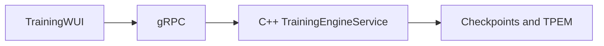

# qminiwasm-core

**[Glossary](docs/GLOSSARY.md)** — terms and acronyms used below.

## Runtime stack (read first)

**Theory vs native (one page):** [docs/TRAINING_NATIVE_PARITY.md](docs/TRAINING_NATIVE_PARITY.md) — what the C++ LibTorch engine actually trains vs the Python graph, and how that maps to the whitepaper matrix.

This repository is an **edge-oriented ML runtime**: bounded **WebAssembly** execution, ternary/TPEM workflows, and optional quantum-assisted routing. Treat it as **infrastructure you provision deliberately**, not a single pip-install demo.

| Surface | Role |
|---------|------|
| **Training WUI** ([`training-wui/README.md`](training-wui/README.md)) | Go web UI; **default training** talks to the C++ **`TrainingEngineService`** over **gRPC** (LibTorch). |
| **C++ training engine** ([`cpp/training/README.md`](cpp/training/README.md)) | Native epoch loop, telemetry; must be built and reachable at `grpc_addr` in [`configs/wui.toml`](configs/wui.toml). |
| **`qminiwasm` (Python)** | Library, **CI/tests**, TOML/schema helpers used by the native stack, tooling, and optional **quantum sidecar** paths ([`docs/TRAINING_NATIVE_PARITY.md`](docs/TRAINING_NATIVE_PARITY.md), [`sidecar/quantum/README.md`](sidecar/quantum/README.md)). |

**Training-first (primary operator surface):** native training produces **checkpoints and trainable TPEM** that **HTTP serve** (`qmw-serve`, WUI `/api/serve/*`) and **WASM inference** stacks consume. Operators should treat **building `qminiwasm_training_engine_server` and running the Training WUI** as the default on-ramp. `pip install` installs the Python package for **library work, CI, schema alignment, and the quantum sidecar**—it is **not** a substitute for the C++ LibTorch training stack.

**Operator quickstart (native training):** follow **Path A** in [`training-wui/README.md`](training-wui/README.md) (Go 1.22+, `wat2wasm` if building edge artifacts, C++ server + `go run .` in `training-wui/`). Helper: [`scripts/start-training-stack.ps1`](scripts/start-training-stack.ps1) / `.sh` where present.

**Remote GPU / RunPod:** **[docs/operations/OPERATIONS_RUNBOOK.md](docs/operations/OPERATIONS_RUNBOOK.md)** and **[docs/RUNPOD_QUICKSTART.md](docs/RUNPOD_QUICKSTART.md)** — not part of a minimal local bring-up.

**Python install (library / tests):** from the repo root, `pip install -e .` and optional `pip install -e ".[dev]"` or `".[training]"` as needed. Extras: [pyproject.toml](pyproject.toml) — `wasm`, `training`, `security`.

---

Large machine-learning models are difficult to run on edge devices because **memory, thermal, and bandwidth budgets** are fixed while model capacity grows. **qminiwasm-core** is a **hybrid classical–quantum ML runtime** that keeps a **sandboxed WebAssembly** execution boundary on the host. **Training WUI and training use Go plus the C++ LibTorch engine over gRPC**; Python covers the WASM host library, CI, TOML/schema alignment with the native engine, and a **quantum sidecar** when Qiskit/PennyLane are needed ([docs/TRAINING_NATIVE_PARITY.md](docs/TRAINING_NATIVE_PARITY.md), [sidecar/quantum/README.md](sidecar/quantum/README.md)).

## Ecosystem context

| Piece | Role |
|--------|------|
| **qminiwasm-core** (this repo) | **ML training and inference runtime** (native training produces deployable weights; inference follows) with WASM sandboxing and optional quantum-assisted routing. |
| **OmniGraph** | Separate **infrastructure** graph workspace (OpenTofu/Terraform, Ansible, CI context)—not an ML engine. |

**There is no shipped integration** between OmniGraph and this repository: no shared schema, no API bridge, and **OmniGraph does not visualize WASM enclaves or model graphs** unless you model that infrastructure yourself in OmniGraph.

**Optional operator workflow:** you may use OmniGraph to reason about **IaC** that provisions training hosts (for example paths under `infra/runpod/`). That is **manual** alignment of tools, not a built-in connector.

## How we stay within the constraint

Remote edge nodes rarely fail because the math is exotic—they fail because **memory, bandwidth, and thermal budgets** are fixed while models grow, because **routing and capacity decisions** get expensive when experts and paths change under load, and because **trust boundaries** at the edge require isolation you can reason about operationally.

Techniques for **smaller footprints**, **triggered quantum routing**, and **identity at enrollment** are summarized in the **[Glossary](docs/GLOSSARY.md)** and in depth in [docs/Q-Mini-WASM_ Edge AI Taxonomy.md](docs/Q-Mini-WASM_%20Edge%20AI%20Taxonomy.md). When wiring trust and identity lifecycle, start with [docs/IDENTITY_STACK_REFERENCE.md](docs/IDENTITY_STACK_REFERENCE.md).

Execution stays in a **sandboxed WebAssembly module** with bounded linear memory; host-native helpers apply where available. **Routing** can delegate to IBM Qiskit Runtime or local simulators when configured via an optional Python quantum sidecar. **Training orchestration** for Mission Control is **Go + C++ gRPC**; **inference** uses Go **`qmw-serve`** and the WUI **embedded HTTP** stub (`/api/serve/*`; extend with C++ tensor RPC as needed). The Python package supports wasmtime-oriented library workflows and tests.

## Documentation map

- Glossary (acronyms): [docs/GLOSSARY.md](docs/GLOSSARY.md)
- Training WUI (native path): [training-wui/README.md](training-wui/README.md)
- Operations: [docs/operations/OPERATIONS_RUNBOOK.md](docs/operations/OPERATIONS_RUNBOOK.md)
- Identity and trust lifecycle: [docs/IDENTITY_STACK_REFERENCE.md](docs/IDENTITY_STACK_REFERENCE.md)
- Training and data: [docs/TRAINING_DATA.md](docs/TRAINING_DATA.md)
- Native training parity (Go/C++ vs Python): [docs/TRAINING_NATIVE_PARITY.md](docs/TRAINING_NATIVE_PARITY.md)
- Quantum: [docs/QUANTUM_QISKIT.md](docs/QUANTUM_QISKIT.md)
- Cascade RL / MOPD: [docs/CASCADE_AND_MOPD.md](docs/CASCADE_AND_MOPD.md)
- Environment variables (secrets / APIs only): [docs/environment-variables.md](docs/environment-variables.md); CI and container overrides: [docs/ENV_CI_OVERRIDES.md](docs/ENV_CI_OVERRIDES.md)
- Wiki: [wiki/README.md](wiki/README.md)
- Hardware acceleration: [docs/INSTALL_TORCH_XPU.md](docs/INSTALL_TORCH_XPU.md), [docs/SYCL-Integration.md](docs/SYCL-Integration.md)
- Extended taxonomy (research vocabulary): [docs/Q-Mini-WASM_ Edge AI Taxonomy.md](docs/Q-Mini-WASM_%20Edge%20AI%20Taxonomy.md)
- Architecture goals: [docs/Project-Goals.md](docs/Project-Goals.md)
- Journey of a vector: [docs/architecture/JOURNEY_OF_A_VECTOR.md](docs/architecture/JOURNEY_OF_A_VECTOR.md)

## Mission Control training path

End-to-end weight production: **Training WUI** (Mission Control) calls the **C++ `TrainingEngineService`** over **gRPC**; artifacts land under `artifacts/models/` and feed serve and WASM workflows.

- Operator guide: [training-wui/README.md](training-wui/README.md)
- Engine build and LibTorch: [cpp/training/README.md](cpp/training/README.md)
- Contract (native vs Python package): [docs/TRAINING_NATIVE_PARITY.md](docs/TRAINING_NATIVE_PARITY.md)
- Data sources, TOML, metrics: [docs/TRAINING_DATA.md](docs/TRAINING_DATA.md)

## Architecture (read next)

The subsections below focus on **runtime inference and agent states** after weights exist. **Production training**—how those weights are produced—is the **Go + C++ gRPC** path in [Mission Control training path](#mission-control-training-path) and [docs/TRAINING_NATIVE_PARITY.md](docs/TRAINING_NATIVE_PARITY.md). Do not read “Step 1 — Python host” as the Mission Control training path.

### Operational tier matrix

| State | Name | Runtime boundary | Purpose | Transition rule |
|------|------|------------------|---------|-----------------|
| **State 1 (Always-On)** | **Ternary WASM Inference** | Local CPU + bounded WASM linear memory | Deterministic forward passes and normal expert/path assignment under strict local latency and thermal limits | Default operating mode |
| **State 2 (Triggered)** | **QAOA Routing (Quantum Approximate Optimization Algorithm)** | Python orchestrator + Qiskit backend (statevector or IBM Runtime) | Solve combinatorial routing when classical assignment can no longer satisfy budget constraints | Enter only when State 1 exceeds configured compute/latency wall |

#### Enclave tiering (Tier 1–5)

| Tier | Enclave class | Typical EF / linear memory | Runtime default memory boundary | Role (short) |
|------|----------------|----------------------------|----------------------------------|--------------|
| **1** | **Micro-Enclaves** | Sub-250 MB | `4096` pages (~256 MiB), Memory64 off | Ultra-edge sensing, fast cold paths, routing QUBO seeds |
| **2** | **Meso-Enclaves** | ~2 GB | `32768` pages (~2 GiB), Memory64 off | Laptops / gateways; ESI decode; baseline ECL |
| **3** | **Macro-Enclaves** | ~8 GB (Memory64) | `131072` pages (~8 GiB), Memory64 on, `WASM_MEMORY64_MAX_MB=8192` | Deep ECL, QAHR, high-fidelity synthesis on unified-memory workstations |
| **4** | **Workgroup Enclaves** | ~16 GB (host-orchestrated) | `262144` pages (~16 GiB), Memory64 on, `WASM_MEMORY64_MAX_MB=16384` | Fleet-level workgroup orchestration with same ECL/CGE/QAHR semantics |
| **5** | **Enterprise Core Enclaves** | ~256 GB+ (host-orchestrated) | `4194304` pages (~256 GiB), Memory64 on, `WASM_MEMORY64_MAX_MB=262144` | Enterprise core memory envelopes and centralized control-plane policy |

**Preset + override resolution:** explicit overrides (`max_linear_memory_pages`, `wasm_memory64_max_mb`, `use_memory64`) win over tier defaults; tier defaults win over generic runtime defaults.

#### When to use quantum routing

State 2 engages at an explicit operational wall, not by preference. **Example policy (control-plane configured):** State 2 engages when classical assignment over 64 or more experts exceeds the 50ms latency budget, pausing local execution and delegating combinatorial search to the Qiskit backend. After the route is resolved, execution resumes in State 1.

### From input to decision

The path below follows the **physical lifecycle of one tensor**, from host input to resumed execution after routing. For the extended walkthrough, see [docs/architecture/JOURNEY_OF_A_VECTOR.md](docs/architecture/JOURNEY_OF_A_VECTOR.md).

#### Step 1 — Python host receives and prepares the tensor

This step is the **inference / library** path through the Python WASM host (not **Mission Control training**, which is Go → gRPC → C++; see [docs/TRAINING_NATIVE_PARITY.md](docs/TRAINING_NATIVE_PARITY.md)). The Python orchestrator (`qminiwasm.model.QMiniWASM`) receives hidden-state tensors and executes through `qminiwasm/wasm_host/engine.py` in a bounded Wasm store. The host captures pre/post linear-memory images as raw bytes so state can be encoded, paused, and resumed deterministically.

#### Step 2 — Quantization to ternary logic

Model values are quantized into ternary states `{-1, 0, 1}` and mapped to base-3 digits `{0, 1, 2}` for transport. The canonical conversion and validation path is implemented in `qminiwasm/wasm_host/trit_pack.py`.

#### Step 3 — Bitwise packing and linear-memory transfer

Ternary values are packed at **5 trits per byte** (MSB-first base-3 packing) before movement across runtime boundaries. Host paths read/write these bytes through Wasm linear memory exports, including direct read/write helpers (`host_tensor.py`) and runtime write paths (`trit_wasm_runtime.py`).

#### Step 4 — State 1 execution in WASM linear memory

In State 1, deterministic execution stays local: the Wasm module runs with bounded memory, and the host reads linear memory snapshots for feature encoding (`memory_encode.py`) and execution telemetry (`engine.py`).

#### Step 5 — State 2 handoff and mechanical resume

If the trigger wall is crossed, the orchestrator builds an escalation payload (`qminiwasm/cognitive/escalation.py`) with linear memory and control metadata. The routing backend returns an optimal assignment path; then the Python orchestrator writes resumed state back into the WASM linear-memory buffer (see `write_linear_memory(...)` in `qminiwasm/wasm_host/wles_wasmtime_harness.py`) and execution continues in State 1 using the selected route.

See also top-level `docs/`, `wiki/`, and `infra/` for deeper operator and infrastructure detail.

## License

MIT License
