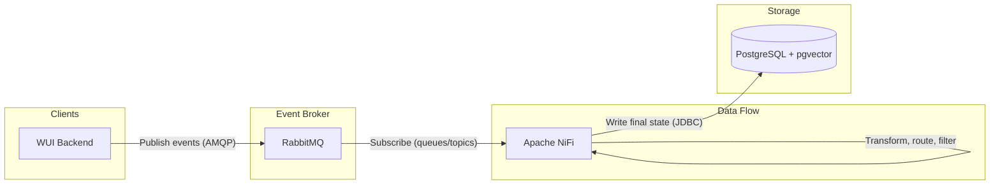

# Data Stack: Event-Driven Architecture (EDA) and Data Pipeline

Vertically scalable, air-gap-friendly data ingestion and storage stack for Q-Mini-WASM tactical edge deployments. Provides a **database** (PostgreSQL with pgvector), an **event broker** (RabbitMQ), and a **data flow engine** (Apache NiFi) with strict resource limits for single-host vertical scaling.

## Architecture



- **WUI backend** publishes domain events (e.g. job submitted, run completed, config changed) to **RabbitMQ** over AMQP (port 5672 on the internal network). Use durable queues and topic exchanges for event-driven consumers.
- **Apache NiFi** subscribes to RabbitMQ queues (or consumes from queues bound to topics), applies data flow logic (routing, filtering, enrichment), and writes the final state into **PostgreSQL** via JDBC. NiFi runs on the same internal bridge network and connects to `postgres:5432` and `rabbitmq:5672`.
- **PostgreSQL** holds the canonical application data and, with the **pgvector** extension, supports vector/embedding storage for LLM and quantum-related data.

All services use an internal bridge network (`data-stack-internal`); only the ports needed for host access (NiFi UI, RabbitMQ Management, optional Postgres) are exposed.

## Prerequisites

- Docker and Docker Compose (v2+).
- Sufficient host memory/CPU for the stack (see `deploy.resources` in `docker-compose.yml`).

## Quick Start

1. **Copy environment template and set secrets (no default passwords in production):**

   ```bash
   cp .env.example .env
   # Edit .env: set POSTGRES_PASSWORD and RABBITMQ_DEFAULT_PASS to strong values.
   ```

2. **Start the stack:**

   ```bash
   docker compose up -d
   ```

3. **Verify:**

   ```bash
   docker compose ps
   docker compose logs -f nifi
   ```

## Accessing the UIs

- **NiFi Canvas (Web UI):**  
  `http://localhost:8080` (or `http://<host>:${NIFI_WEB_PORT}`). Use this to design and run data flows (consume from RabbitMQ, transform, write to PostgreSQL).

- **RabbitMQ Management UI:**  
  `http://localhost:15672` (or `http://<host>:${RABBITMQ_MGMT_PORT}`). Log in with `RABBITMQ_DEFAULT_USER` and `RABBITMQ_DEFAULT_PASS` from `.env`. Use it to create queues, exchanges, and bindings for event-driven flows.

- **PostgreSQL:**  
  Direct access only if needed: `localhost:5432` (or `POSTGRES_PORT`). Database `qminiwasm_db`, user and password from `.env`. Prefer connecting from NiFi or the WUI backend over the internal network (`postgres:5432`) so that the host does not need to expose 5432.

## Configuration

- **PostgreSQL:** `shared_buffers`, `work_mem`, and `max_connections` are set in the compose `command` for vertical scaling. Initial DB and extensions are created by [init-scripts/init-db.sql](init-scripts/init-db.sql) (e.g. `uuid-ossp`, `vector`).
- **NiFi JVM heap:** Controlled by `NIFI_JVM_HEAP_INIT` and `NIFI_JVM_HEAP_MAX` in `.env` (defaults 4g / 8g). Optional file-based tuning: see [nifi/bootstrap.conf.example](nifi/bootstrap.conf.example).
- **Resource limits:** All services define `deploy.resources.limits` and `reservations` in `docker-compose.yml` to manage vertical scaling on a single host.

## Security

- **No default passwords:** Set `POSTGRES_PASSWORD` and `RABBITMQ_DEFAULT_PASS` in `.env`; the compose file requires them (`:?`).
- **Secrets via `.env`:** `.env` is listed in `.gitignore`; do not commit it. Use `.env.example` as a template.
- **Minimal exposed ports:** Only NiFi (8080), RabbitMQ AMQP (5672) and Management (15672), and optionally Postgres (5432) are published; internal traffic stays on `data-stack-internal`.
- **Internal DNS:** Services reach each other by hostname: `postgres`, `rabbitmq`, `nifi` on the same network.

## Solace PubSub+ and Solace Agent Mesh

The stack includes **Solace PubSub+** (`solace-pubsub`) and **Solace Agent Mesh** (`solace-agent-mesh`) **alongside** RabbitMQ and NiFi:

- **solace-pubsub:** Event broker (SMF 55555, WebSocket 8008, SEMP 8080). Used by Agent Mesh and optional event-driven clients. Set `SOLACE_ADMIN_PASSWORD` in `.env` (or inject from Vault).
- **solace-agent-mesh:** Orchestrator + Gateway for event-driven, Agent-to-Agent (A2A) AI workflows. Connects to `solace-pubsub` via `SOLACE_BROKER_URL`, `SOLACE_BROKER_PASSWORD`, etc. Web UI on port 8000. The data stack hosts the event broker that the SASE edge product depends on. Edge agents (see [infra/edge-gateway/](../../infra/edge-gateway/)) connect to the same broker over DMVPN and self-register via Agent Cards for task routing.

Credentials must be set via environment (e.g. `.env` or Vault); see `.env.example` for variable names.

## Optional: Solace-only backbone (no RabbitMQ)

For a Solace-only event backbone, you could remove or disable the `rabbitmq` service and use Solace for all event traffic; NiFi and the WUI would then use Solace clients. The default compose keeps both RabbitMQ and Solace so existing AMQP flows and Agent Mesh can coexist.

## Files

| Path | Purpose |
|------|--------|
| [docker-compose.yml](docker-compose.yml) | Multi-container stack: Postgres (pgvector), RabbitMQ, NiFi; resources and internal network. |
| [init-scripts/init-db.sql](init-scripts/init-db.sql) | Postgres init: extensions `uuid-ossp`, `vector`. |
| [postgres-mtls.conf](postgres-mtls.conf) | Optional: snippet to require TLS and client-certificate auth (no password); see [security-stack](../security-stack/README.md) for Vault PKI and mTLS flow. |
| [.env.example](.env.example) | Template for required and optional environment variables. |
| [nifi/bootstrap.conf.example](nifi/bootstrap.conf.example) | Optional NiFi JVM heap/bootstrap reference. |
