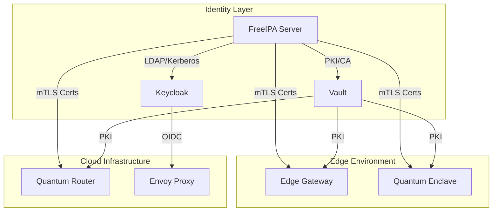

# FreeIPA Integration for Hierarchical Edge-Quantum AI Architecture

This document provides comprehensive guidance for deploying and integrating FreeIPA as the foundational Identity Management system in the QMiniWASM architecture.

## Overview

FreeIPA provides centralized LDAP, Kerberos, and PKI services that integrate with the existing Keycloak and Vault stack to create a military-grade, zero-trust identity infrastructure for edge-quantum deployments.

### Architecture Integration



## Deployment

### Prerequisites

1. **Environment Variables**: Copy and configure `.env.example` to `.env` with FreeIPA settings
2. **Network Configuration**: Ensure proper DNS resolution for edge environments
3. **Storage**: Persistent volumes for FreeIPA data
4. **Security**: Firewall rules for FreeIPA ports (389, 636, 88, 464, 53, 123)

### Quick Start

1. **Configure Environment**:
   ```bash
   cp .env.example .env
   # Edit .env with your FreeIPA configuration
   ```

2. **Deploy FreeIPA Stack**:
   ```bash
   # Deploy FreeIPA services
   docker compose -f docker-compose.freeipa.yml up -d
   
   # Wait for FreeIPA to initialize (2-5 minutes)
   docker compose -f docker-compose.freeipa.yml logs -f freeipa-server
   ```

3. **Verify Deployment**:
   ```bash
   # Check FreeIPA health
   docker exec security-stack-freeipa-server ipa healthcheck --all
   
   # Access FreeIPA Web UI
   # http://localhost:8080 (or configured FREEIPA_HTTP_PORT)
   ```

### Integration with Existing Stack

1. **Update Keycloak Configuration**:
   ```bash
   # Copy FreeIPA federation config
   cp keycloak-init/freeipa-federation.json keycloak-init/
   
   # Restart Keycloak to apply federation
   docker compose restart keycloak
   ```

2. **Configure Vault PKI**:
   ```bash
   # Use FreeIPA CA for Vault PKI
   export VAULT_ADDR=http://localhost:8200
   export VAULT_TOKEN=root
   
   # Initialize Vault with FreeIPA CA
   ./vault-init/setup-pki-freeipa.sh
   ```

## Configuration Details

### FreeIPA Server Configuration

#### Core Settings
- **Domain**: `qminiwasm.local`
- **Realm**: `QMINIWASM.LOCAL`
- **Hostname**: `ipa.qminiwasm.local`
- **Admin User**: `admin`
- **Directory Manager**: `cn=Directory Manager`

#### Security Hardening (STIG/CMMC 2.0)
- **DNS Updates**: Enabled for edge environments
- **SSH Keys**: Enabled for secure access
- **Password Policy**: Enforced complexity requirements
- **Kerberos**: AES256 encryption required
- **TLS**: Minimum version 1.2, preferred 1.3

#### Network Configuration
- **Internal Network**: `172.20.0.0/16`
- **DNS Forwarders**: Google DNS (8.8.8.8, 8.8.4.4)
- **NTP Servers**: Pool NTP servers
- **Port Exposure**: Configurable via environment variables

### Keycloak FreeIPA Federation

#### LDAP Federation
- **Provider**: `ldap`
- **Connection**: `ldap://freeipa-server:389`
- **Users DN**: `cn=users,cn=accounts,dc=qminiwasm,dc=local`
- **Authentication**: Simple bind with admin credentials
- **Sync**: Bidirectional user synchronization

#### Kerberos Integration
- **Realm**: `QMINIWASM.LOCAL`
- **Principal**: `HTTP/localhost@QMINIWASM.LOCAL`
- **Authentication**: Kerberos ticket-based
- **Fallback**: Password authentication enabled

#### Group Mapping
- **Edge-Gateway-Admins**: Edge gateway administrators
- **Quantum-Operators**: Quantum computing operators
- **Security-Admins**: Security administrators

### PKI Certificate Management

#### Certificate Profiles
- **caIPAserviceCert**: Default service certificates
- **caIPAserverCert**: Server certificates
- **caIPAClientCert**: Client certificates

#### Certificate Lifecycle
1. **Request**: Automated via `freeipa_pki_provisioning.py`
2. **Issue**: FreeIPA CA signs certificates
3. **Deploy**: mTLS configuration generated
4. **Renew**: Automated renewal process
5. **Revoke**: Certificate revocation when needed

#### Edge Gateway Certificates
```bash
# Request certificate for edge gateway
python scripts/security/freeipa_pki_provisioning.py \
  --action request \
  --service edge-gateway \
  --hostname gateway01.edge.qminiwasm.local \
  --sans "gateway01.local,gateway01.internal"
```

#### Quantum Router Certificates
```bash
# Request certificate for quantum router
python scripts/security/freeipa_pki_provisioning.py \
  --action request \
  --service quantum-router \
  --hostname router.qminiwasm.local \
  --sans "router.local,router.internal"
```

## Security Considerations

### Zero Trust Implementation
- **mTLS**: All service-to-service communication uses mutual TLS
- **Certificate Validation**: Strict certificate validation enabled
- **Revocation Checking**: CRL and OCSP validation
- **Short-lived Certificates**: 365-day validity with automated renewal

### STIG/CMMC 2.0 Compliance
- **Password Complexity**: Enforced via FreeIPA password policy
- **Account Lockout**: Brute force protection enabled
- **Audit Logging**: Comprehensive audit trail
- **Encryption**: AES256 for Kerberos, TLS 1.3 preferred
- **Access Control**: Role-based access control (RBAC)

### Edge Environment Security
- **Air-gapped Support**: Offline certificate signing
- **DNS Security**: DNSSEC support enabled
- **NTP Security**: NTP authentication for time synchronization
- **Network Isolation**: Separate network for FreeIPA services

## Monitoring and Maintenance

### Health Checks
```bash
# FreeIPA health check
docker exec security-stack-freeipa-server ipa healthcheck --all

# Keycloak federation status
curl -s http://localhost:8080/auth/realms/qminiwasm/.well-known/openid-configuration

# Vault PKI status
vault read pki_int/cert/ca
```

### Certificate Management
```bash
# List issued certificates
ipa cert-find

# Check certificate expiration
ipa cert-show <serial_number>

# Revoke certificate
ipa cert-revoke <serial_number> --revocation-reason=unspecified
```

### Backup and Recovery
```bash
# FreeIPA backup
ipa-backup --data

# FreeIPA restore
ipa-restore /var/lib/ipa/backup/...

# Keycloak realm export
curl -X GET "http://localhost:8080/auth/admin/realms/qminiwasm" \
  -H "Authorization: Bearer $TOKEN" > qminiwasm-realm-backup.json
```

## Troubleshooting

### Common Issues

#### FreeIPA Initialization Failures
```bash
# Check FreeIPA logs
docker logs security-stack-freeipa-server

# Verify network connectivity
docker exec security-stack-freeipa-server ping keycloak

# Check DNS resolution
docker exec security-stack-freeipa-server nslookup keycloak
```

#### Keycloak Federation Issues
```bash
# Check federation status
curl -s "http://localhost:8080/auth/admin/realms/qminiwasm/components" | jq '.[] | select(.providerId=="ldap")'

# Test LDAP connection
docker exec security-stack-keycloak /opt/keycloak/bin/kcadm.sh config credentials --server http://localhost:8080/auth --realm master --user admin --password admin
```

#### Certificate Issues
```bash
# Check certificate validity
openssl x509 -in /path/to/certificate.crt -text -noout

# Verify certificate chain
openssl verify -CAfile /path/to/ca.crt /path/to/certificate.crt

# Test mTLS connection
openssl s_client -connect hostname:port -cert /path/to/client.crt -key /path/to/client.key
```

### Performance Tuning

#### FreeIPA Optimization
- **Connection Pooling**: Enabled for LDAP connections
- **Caching**: Configured for user/group lookups
- **Replication**: Consider multi-master for high availability

#### Keycloak Optimization
- **User Federation Caching**: Enabled for performance
- **Connection Pooling**: Configured for FreeIPA LDAP
- **Session Management**: Optimized for edge environments

## Integration Examples

### Edge Gateway Deployment
```yaml
# Edge gateway configuration
apiVersion: v1
kind: ConfigMap
metadata:
  name: edge-gateway-config
data:
  mtls.json: |
    {
      "service": {
        "hostname": "gateway01.edge.qminiwasm.local",
        "type": "edge-gateway",
        "tls": {
          "certificate": "/etc/ssl/certs/gateway01.crt",
          "private_key": "/etc/ssl/private/gateway01.key",
          "ca_certificate": "/etc/ssl/certs/ca.crt",
          "verify_client": "require"
        }
      }
    }
```

### Quantum Router Configuration
```yaml
# Quantum router configuration
apiVersion: v1
kind: Secret
metadata:
  name: quantum-router-tls
type: Opaque
data:
  tls.crt: <base64-encoded-certificate>
  tls.key: <base64-encoded-private-key>
  ca.crt: <base64-encoded-ca-certificate>
```

## Next Steps

1. **Production Deployment**: Configure for production with proper sealing and high availability
2. **Monitoring Integration**: Integrate with existing monitoring stack
3. **Automated Testing**: Implement automated testing for certificate lifecycle
4. **Documentation**: Update operational runbooks with FreeIPA procedures

## Support

For issues related to FreeIPA integration:
1. Check the FreeIPA logs in the container
2. Verify network connectivity between services
3. Ensure proper DNS resolution for edge environments
4. Validate certificate configurations and mTLS settings

For Keycloak federation issues:
1. Check Keycloak logs for LDAP connection errors
2. Verify FreeIPA LDAP service is accessible
3. Validate user/group mappings and permissions
4. Test authentication flows manually