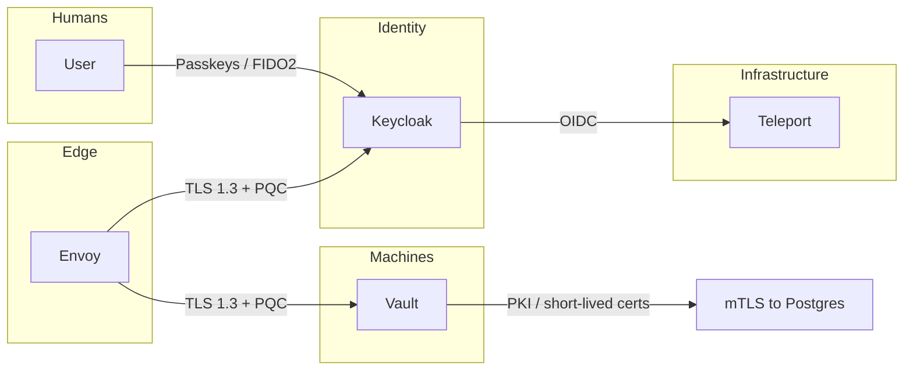

# Zero Trust Security Stack

Keycloak (human identity, FIDO2/Passkeys), HashiCorp Vault (machine identity, PKI/mTLS), and Envoy (TLS 1.3, PQC-ready) for passwordless, Zero Trust, and post-quantum–ready edge deployments.

## Architecture



- **Keycloak:** Human identity. Users sign in with FIDO2/Passkeys (passwordless). Keycloak acts as OIDC IdP for Teleport; configure the `teleport` client and redirect URIs (see [keycloak-init/README.md](keycloak-init/README.md)).
- **Teleport:** Infrastructure access with ephemeral certificates; no long-lived SSH keys. Teleport uses Keycloak OIDC for user authentication.
- **Vault:** Machine identity. PKI secrets engine issues short-lived client certificates so services (e.g. NiFi, FastAPI) connect to PostgreSQL with mTLS and **no passwords**. Run [vault-init/setup-pki.sh](vault-init/setup-pki.sh) after Vault is up to create Root CA, Intermediate CA, and the `postgres-client` role.
- **Envoy:** Reverse proxy in front of Keycloak and Vault. TLS 1.3 only; config supports hybrid post-quantum curves (X25519MLKEM768, X25519Kyber768Draft00) when the Envoy image uses a BoringSSL build that supports them. Default compose uses HTTP-only [proxy/envoy.yaml](proxy/envoy.yaml) so the stack starts without certs; for production use [proxy/envoy-tls.yaml](proxy/envoy-tls.yaml) and place `tls.crt` and `tls.key` in `proxy/certs/`.

## Prerequisites

- Docker and Docker Compose.
- For Envoy TLS: server certificate and key in `proxy/certs/` (or path set in `TLS_CERT_PATH`).
- For production: replace Vault dev mode with a proper seal (Transit, cloud KMS); do not commit secrets.

## Quick start

1. Copy env and set secrets:

   ```bash
   cp .env.example .env
   # Edit .env: KEYCLOAK_DB_PASSWORD, KEYCLOAK_ADMIN_PASSWORD (and VAULT_DEV_ROOT_TOKEN_ID for dev).
   ```

2. Start the stack:

   ```bash
   docker compose up -d
   ```

3. Keycloak: `http://localhost:8080` (or via Envoy `http://localhost:8081/auth`). Vault: `http://localhost:8200` (or `http://localhost:8081/vault`).

4. Run Vault PKI setup (once Vault is up; requires `vault` and `jq` on the host):

   ```bash
   export VAULT_ADDR=http://localhost:8200
   export VAULT_TOKEN=root
   ./vault-init/setup-pki.sh
   ```

   Save the printed Intermediate CA cert; use it as Postgres `ssl_ca_file` when enabling mTLS (see [containers/data-stack/postgres-mtls.conf](../data-stack/postgres-mtls.conf)).

## Service requesting a certificate from Vault (passwordless DB)

1. **Authenticate to Vault** (e.g. dev token, AppRole, or JWT from Keycloak):

   ```bash
   export VAULT_TOKEN=root
   # or: vault write auth/jwt/login role=... jwt=...
   ```

2. **Request a short-lived client cert:**

   ```bash
   vault write pki_int/issue/postgres-client common_name="nifi" ttl="1h"
   ```

   Output includes `certificate`, `private_key`, and `issuing_ca`. Write cert and key to files (or use in-memory for your DB client).

3. **Connect to Postgres** with `sslmode=verify-full`, client cert, client key, and CA cert (Vault intermediate). No password. Postgres must be configured with [postgres-mtls.conf](../data-stack/postgres-mtls.conf) and the same CA in `ssl_ca_file` to verify client certs.

4. **Map cert CN to DB user** (optional): use `pg_ident.conf` so that CN `nifi` maps to PostgreSQL user `qminiwasm` (or create a DB user matching the CN).

## Envoy TLS 1.3 and PQC

- **Default:** [proxy/envoy.yaml](proxy/envoy.yaml) is HTTP-only (port 8081) so the stack runs without certs.
- **Production:** Use [proxy/envoy-tls.yaml](proxy/envoy-tls.yaml): mount it as the Envoy config and place `tls.crt` and `tls.key` in `proxy/certs/` (or `TLS_CERT_PATH`). Envoy listens on 8443 with TLS 1.3 and `ecdh_curves` including `X25519MLKEM768` and `X25519Kyber768Draft00` (BoringSSL). Support depends on the Envoy image; see [Envoy PQC issue](https://github.com/envoyproxy/envoy/issues/33941).

## Security

- No default passwords in repo; set all secrets in `.env` (in `.gitignore`).
- Vault dev mode is for local use only; production must use a real seal and secure token storage.
- Restrict exposed ports; use Envoy with TLS in production and avoid exposing Keycloak/Vault directly.
- Rotate Keycloak admin password and Vault root token in production.

## Files

| Path | Purpose |
|------|--------|
| [docker-compose.yml](docker-compose.yml) | Keycloak, Keycloak DB, Vault, Envoy; internal network and resources. |
| [.env.example](.env.example) | Env template (secrets not committed). |
| [vault-init/setup-pki.sh](vault-init/setup-pki.sh) | Vault PKI: Root + Intermediate CA, role `postgres-client` for mTLS. |
| [keycloak-init/qminiwasm-realm.json](keycloak-init/qminiwasm-realm.json) | Realm `qminiwasm` with Teleport OIDC client and WebAuthn passwordless policy. |
| [keycloak-init/README.md](keycloak-init/README.md) | Realm import and Teleport OIDC setup. |
| [proxy/envoy.yaml](proxy/envoy.yaml) | Envoy HTTP-only (dev). |
| [proxy/envoy-tls.yaml](proxy/envoy-tls.yaml) | Envoy TLS 1.3 + PQC curves (production). |
| [../data-stack/postgres-mtls.conf](../data-stack/postgres-mtls.conf) | Postgres snippet for verify-full SSL and cert auth. |
