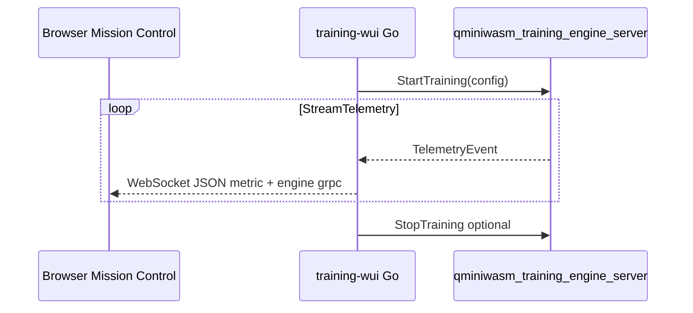

# C++20 Training Engine Foundation

This module introduces a native training orchestration foundation designed for:

- gRPC-first control and telemetry streaming
- staged, parallel training execution with `std::jthread`
- taxonomy-tier-aware runtime policy selection
- clean C ABI fallback for direct embedding from Go (or other runtimes)

## Build (from `cpp/`)

```bash
cmake -S . -B build -DQMINIWASM_WITH_TRAINING_ENGINE=ON -DQMINIWASM_WITH_GRPC=ON
cmake --build build --target qminiwasm_training_engine_server
```

## Run server

```bash
./build/qminiwasm_training_engine_server 127.0.0.1:50061
```

## Telemetry contract (`TelemetryEvent`)

The canonical message shape is **`TelemetryEvent`** in [`proto/training_engine.proto`](../../proto/training_engine.proto). The C++ server fills those fields as training progresses; the Go WUI maps them onto the same WebSocket **`type: "metric"`** messages Mission Control already charts, adding snake_case copies of each proto field for tables and filters.



**Field intent (summary)** — full operator tables live under **Mission Control telemetry** in [`training-wui/README.md`](../../training-wui/README.md):

| Area | Proto fields |
|------|----------------|
| Convergence | `epoch`, `step`, `train_loss`, `val_loss`, `learning_rate` |
| Pipeline | `samples_per_second`, `*_queue_depth` |
| Quantum / stage | `taxonomy_tier`, `precision_mode`, `stage`, `event_type`, `decoherence_score` |
| Security | `enclave_state`, `attestation_state` |
| Placement | `graph_id`, `node_id` |

Prometheus-oriented SOA metrics (SML, LCI, LME, TtC, LMS/TBR) are **not** streamed on this path; use a future exporter or scrape endpoint if you need those alongside engine telemetry.

## Go WUI integration

`training-wui` uses a generated Go gRPC client for `proto/training_engine.proto`:

1. **Done:** Native `StartTraining` / `StreamTelemetry` / `StopTraining` from the WUI for local and RunPod “train on host” runs.
2. **Done:** WebSocket payloads use the `metric` / `alert` contract with `telemetry_source` distinguishing sources; **`TelemetryEvent`** fields from `proto/training_engine.proto` are forwarded on **`metric`** (details and diagrams: [`training-wui/README.md`](../../training-wui/README.md)).
3. **Partial:** Log-line regex telemetry still applies to **subprocess (Python)** runs only; full parity for quantum/prune/QAOA metrics on the C++ path depends on richer `TelemetryEvent` or synthetic lines.

WUI env: **`QMINIWASM_TRAINING_GRPC_ADDR`** (default `127.0.0.1:50061`). See [`training-wui/README.md`](../../training-wui/README.md).
