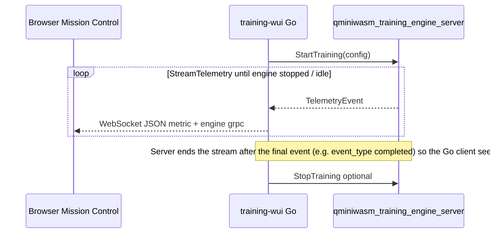

# C++20 Training Engine Foundation

This module introduces a native training orchestration foundation designed for:

- gRPC-first control and telemetry streaming
- staged, parallel training execution with `std::jthread`
- taxonomy-tier-aware runtime policy selection
- clean C ABI fallback for direct embedding from Go (or other runtimes)

## Build (from `cpp/`)

The training server needs **gRPC and Protobuf**. The repo ships **`vcpkg.json`** next to `cpp/CMakeLists.txt`; use **[vcpkg](https://github.com/microsoft/vcpkg)** in **manifest mode** by passing its toolchain to CMake.

### One-time: install vcpkg (Windows example)

```powershell
git clone https://github.com/microsoft/vcpkg $HOME\vcpkg
& $HOME\vcpkg\bootstrap-vcpkg.bat
$env:VCPKG_ROOT = "$HOME\vcpkg"
```

Linux/macOS: clone the same repo, run `./bootstrap-vcpkg.sh`, then `export VCPKG_ROOT=...`.

### Configure and build

**With vcpkg** (recommended; first configure may take a long time while ports build):

```bash
cmake -S . -B build -DCMAKE_TOOLCHAIN_FILE="$VCPKG_ROOT/scripts/buildsystems/vcpkg.cmake" -DQMINIWASM_WITH_TRAINING_ENGINE=ON -DQMINIWASM_WITH_GRPC=ON -DQMINIWASM_BUILD_PYBIND=OFF
cmake --build build --target qminiwasm_training_engine_server
```

PowerShell: use forward slashes in `CMAKE_TOOLCHAIN_FILE` or an absolute path, e.g. `-DCMAKE_TOOLCHAIN_FILE="$env:VCPKG_ROOT/scripts/buildsystems/vcpkg.cmake"`.

### LibTorch (real TPEM weights; default **ON**)

The training library links **LibTorch** for Phase-1 native training: a residual PreNorm stack of ternary STE experts (`d_model`→`d_model`, matching Python `TernaryWASMExpert` blocks), optional linear **stem/head** when `io_d_model ≠ d_model`, Adam steps, and **interchange v2** checkpoints (not Python `torch.save` pickles).

#### Quick install (CPU)

- **Windows** (from repo root): downloads the official **win-shared-with-deps** zip into `cpp/.deps/libtorch` (gitignored):

  ```powershell
  .\scripts\install-libtorch.ps1
  ```

  The archive is large (~2 GB). The script downloads to `cpp/.deps/` (not `%TEMP%`). If `curl` fails with **exit code 23** (write error), the script falls back to **WebClient** / **Invoke-WebRequest**; ensure enough free disk space on the repo drive.

- **Linux** (same layout under `cpp/.deps/libtorch`):

  ```bash
  bash scripts/install-libtorch.sh
  ```

Then configure from **`cpp/`** (with vcpkg toolchain as above). Either pass **`-DCMAKE_PREFIX_PATH=.../cpp/.deps/libtorch`** or set **`LIBTORCH_ROOT`** to that directory (CMake prepends it before `find_package(Torch)`).

**PowerShell** (run `install-libtorch.ps1` from repo root first; then from `cpp\`):

```powershell
cd cpp
cmake -S . -B build `
  -DCMAKE_TOOLCHAIN_FILE="$env:VCPKG_ROOT/scripts/buildsystems/vcpkg.cmake" `
  -DQMINIWASM_WITH_TRAINING_ENGINE=ON -DQMINIWASM_WITH_GRPC=ON -DQMINIWASM_BUILD_PYBIND=OFF `
  -DCMAKE_PREFIX_PATH="$(Resolve-Path '.\.deps\libtorch')" `
  -DQMINIWASM_TRAINING_WITH_LIBTORCH=ON
```

**Bash** (after `bash scripts/install-libtorch.sh` from repo root; then from `cpp/`):

```bash
cd cpp
export LIBTORCH_ROOT="$PWD/.deps/libtorch"
cmake -S . -B build \
  -DCMAKE_TOOLCHAIN_FILE="$VCPKG_ROOT/scripts/buildsystems/vcpkg.cmake" \
  -DQMINIWASM_WITH_TRAINING_ENGINE=ON -DQMINIWASM_WITH_GRPC=ON -DQMINIWASM_BUILD_PYBIND=OFF \
  -DQMINIWASM_TRAINING_WITH_LIBTORCH=ON
```

1. **Manual prebuilt** — pick **LibTorch** (not PyTorch pip), **C++ / Java**, **CPU**, **Release**, and the **shared-with-deps** build from [pytorch.org](https://pytorch.org/get-started/locally/). Extract anywhere and set **`CMAKE_PREFIX_PATH`** or **`LIBTORCH_ROOT`** to the extracted **`libtorch`** root (the directory that contains `share/cmake/Torch/TorchConfig.cmake`).

2. **vcpkg** — optional feature `training-libtorch` (can be slow / large):

   ```text
   vcpkg install --x-feature=training-libtorch
   ```

3. **Disable LibTorch** (synthetic losses + JSON checkpoints only, as before):

   ```bash
   cmake -S . -B build ... -DQMINIWASM_TRAINING_WITH_LIBTORCH=OFF
   ```

After a successful LibTorch build, the **`qminiwasm_tpem_roundtrip`** helper is produced for Python↔C++ interchange tests (see `tests/test_native_tpem_roundtrip.py` and env `QMINIWASM_TPEM_ROUNDTRIP_EXE`).

**ABI / compiler:** use the same C++ runtime flavor LibTorch was built for (e.g. MSVC + `/MD` on Windows). Follow the `find_package(Torch)` post-steps (`TORCH_CXX_FLAGS`) applied in `training/CMakeLists.txt`.

**Windows runtime (`torch_cpu.dll` not found):** prebuilt LibTorch puts DLLs in **`<libtorch>/lib`**. CMake **copies `*.dll` next to `qminiwasm_training_engine_server.exe` on POST_BUILD** when LibTorch is enabled. If you run the `.exe` from another folder or an old build, either rebuild the server target or prepend that `lib` directory to **`PATH`** before starting, e.g. PowerShell: `$env:PATH = "C:\path\to\cpp\.deps\libtorch\lib;$env:PATH"`. The repo scripts **`scripts/start-training-stack.ps1`** and **`scripts/start_cpp_training_engine.ps1`** prepend that path when `torch_cpu.dll` is found.

**LibTorch + vcpkg protobuf:** LibTorch ships `include/google/protobuf` headers that conflict with vcpkg’s protobuf (e.g. `PROTOBUF_VERSION was previously defined`). The build splits **generated `.pb.cc`** into `qminiwasm_training_proto` (no LibTorch includes) and keeps LibTorch only on `qminiwasm_training_runtime`. The target `qminiwasm_training_engine` is an **INTERFACE** library that links the pieces together for the server executable.

If you previously configured **without** the toolchain, delete `build/` (or at least `CMakeCache.txt`) and re-run `cmake` with `-DCMAKE_TOOLCHAIN_FILE=...`.

If configure fails on **NLopt** / `cmake_minimum_required` after upgrading the repo, remove the cached dependency and reconfigure: delete `build/_deps/nlopt-src` and `build/_deps/nlopt-subbuild` (or wipe `build/`), then run `cmake` again.

## Run server

```bash
./build/qminiwasm_training_engine_server 127.0.0.1:50061
```

From the repo root, **`scripts/start-training-stack.ps1`** / **`scripts/start-training-stack.sh`** will look for **CMake** on `PATH`, then **`%ProgramFiles%\CMake\bin`**, then **Visual Studio’s bundled CMake** (via `vswhere`), and run the configure/build steps above if the server executable is missing.

## Telemetry contract (`TelemetryEvent`)

The canonical message shape is **`TelemetryEvent`** in [`proto/training_engine.proto`](../../proto/training_engine.proto). The C++ server fills those fields as training progresses; the Go WUI maps them onto the same WebSocket **`type: "metric"`** messages Mission Control already charts, adding snake_case copies of each proto field for tables and filters.



**Field intent (summary)** — full operator tables live under **Mission Control telemetry** in [`training-wui/README.md`](../../training-wui/README.md):

| Area | Proto fields |
|------|----------------|
| Convergence | `epoch`, `step`, `train_loss`, `val_loss`, `learning_rate` |
| Pipeline | `samples_per_second`, `*_queue_depth` |
| Quantum / stage | `taxonomy_tier`, `precision_mode`, `stage`, `event_type`, `decoherence_score` |
| Security | `enclave_state`, `attestation_state` |
| Placement | `graph_id`, `node_id` |

Prometheus-oriented SOA metrics (SML, LCI, LME, TtC, LMS/TBR) are **not** streamed on this path; use a future exporter or scrape endpoint if you need those alongside engine telemetry.

## Checkpoints (native engine)

When **`TrainingConfig`** carries absolute paths in **`checkpoint_save_path`**, **`checkpoint_best_path`**, and **`checkpoint_latest_path`** (the WUI resolves TOML `[checkpoint]` / `[tpem]` paths against the repo root):

- **`latest`** and **`best`** (when validation loss improves): updated at each **epoch** boundary.
- **`save`**: written once when training **finishes**.

### With LibTorch (**default**)

Checkpoints are **trainable TPEM interchange v2**:

- Binary layout: **`QMWTPEM2`** (8 bytes) + `uint64` JSON envelope length + UTF-8 JSON + raw **safetensors** blob (F32 tensors only).
- JSON envelope includes **`d_model`**, **`io_d_model`**, **`num_ternary_blocks`** (defaults align with Python `QMiniWASM`).
- Tensor keys: **`quantum_router.*`** (frozen snapshot in Phase 1), **`input_stem.*` / `output_head.*`** when stem/head exist, **`ternary_expert.weight`** for a single block, or **`ternary_blocks.{i}.weight`** for depth `N>1` (bias keys from Python are ignored if the native expert has no bias parameter).
- Python loads them with **`load_trainable_tpem_into_model`**. To **create** a v2 file from Python for C++ resume, use **`save_trainable_tpem_interchange_v2`** in `qminiwasm.tpem.trainable_tpem`.
- **`model_uri`** in `proto/training_engine.proto` / gRPC: optional path to an existing interchange v2 before training starts. If **`model_uri`** is empty, optional **`d_model`**, **`io_d_model`**, **`num_ternary_blocks`** on the same message select **cold-start** geometry (random init); otherwise the native trainer defaults to `4096` / `4096` / `1`.

**Scope vs full Python:** Native training approximates the **ternary stack + I/O** path only (no tropical attention, hybrid adapter, cascade router training, or QAOA execution in forward). Use `qaoa_execution_mode="pennylane"` for a typical empty `quantum_router` snapshot. Qiskit-backed routers may still serialize tensors into the interchange; they are passed through on save.

### Without LibTorch (`-DQMINIWASM_TRAINING_WITH_LIBTORCH=OFF`)

The engine writes the legacy JSON manifest `{"format":"qminiwasm_native_training_engine","version":1,...}` (not loadable as weights).

Successful or failed writes appear as telemetry with `stage=checkpoint` and `event_type=native_saved` / `native_save_failed`.

## Phase 2+ (not implemented here)

- Train or port **quantum_router** logic in C++ (classical branches first).
- Optional `hybrid_adapter` / `cascade_policy` in the interchange payload.
- Optimizer state in checkpoints for bit-exact resume (Phase 1 saves weights + frozen router snapshot only).

## Go WUI integration

`training-wui` uses a generated Go gRPC client for `proto/training_engine.proto`:

1. **Done:** Native `StartTraining` / `StreamTelemetry` / `StopTraining` from the WUI for local and RunPod “train on host” runs.
2. **Done:** WebSocket payloads use the `metric` / `alert` contract with `telemetry_source` distinguishing sources; **`TelemetryEvent`** fields from `proto/training_engine.proto` are forwarded on **`metric`** (details and diagrams: [`training-wui/README.md`](../../training-wui/README.md)).
3. **Partial:** Log-line regex telemetry still applies to **subprocess (Python)** runs only; full parity for quantum/prune/QAOA metrics on the C++ path depends on richer `TelemetryEvent` or synthetic lines.

WUI: set **`configs/wui.toml`** `[wui] training_runtime_mode = "native"` (default) and **`grpc_addr`** (default `127.0.0.1:50061`), or **`training-wui -grpc-addr` / `-training-runtime`**. See [`training-wui/README.md`](../../training-wui/README.md).
