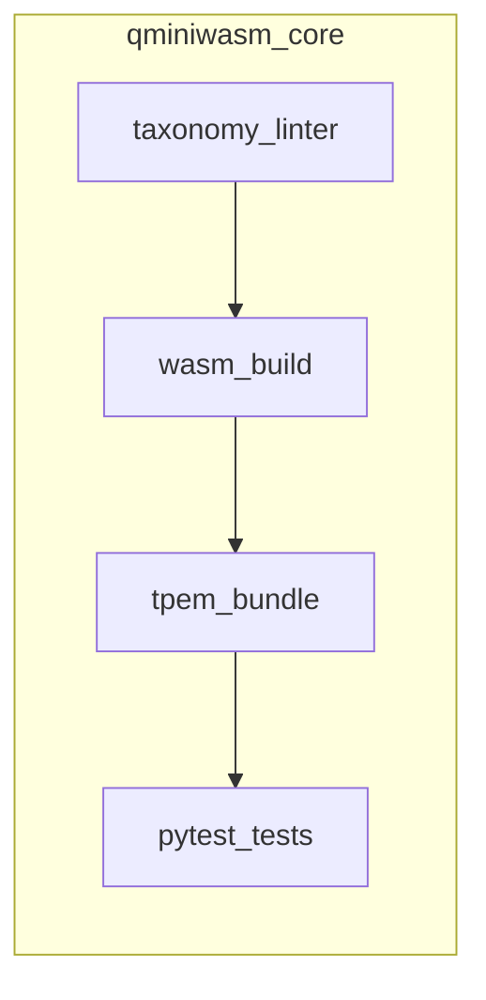

# Q-Mini-WASM Stateful WASM agent ops pipeline (blueprint map)

This document maps the **CQ / Stateful WASM Ops** blueprint to artifacts and automation **in this repository**, and lists components that live **outside** the repo (Gitea, N8N, Ansible, Solace, etc.).

## In-repo building blocks

| Blueprint phase | Repo capability |
|-----------------|-----------------|
| Source ingestion / taxonomic gating | [`scripts/taxonomy_linter.py`](../scripts/taxonomy_linter.py) + [`configs/ci/taxonomy_linter.json`](../configs/ci/taxonomy_linter.json); CI job **`taxonomy-lint`** in [`.github/workflows/ci.yml`](../.github/workflows/ci.yml) |
| TPEM generation / standard | [`qminiwasm/enclave/trit_pack.py`](../qminiwasm/enclave/trit_pack.py) (packing); [`docs/TPEM_ARTIFACT_FORMAT.md`](TPEM_ARTIFACT_FORMAT.md) + [`qminiwasm/enclave/tpem_bundle.py`](../qminiwasm/enclave/tpem_bundle.py) (sidecar file) |
| ECL / CGE / ESI / WLES tests | [`qminiwasm/cognitive/edge.py`](../qminiwasm/cognitive/edge.py), [`qminiwasm/cognitive/escalation.py`](../qminiwasm/cognitive/escalation.py), [`tests/test_wles_esi_harness.py`](../tests/test_wles_esi_harness.py), [`tests/test_escalation_fog.py`](../tests/test_escalation_fog.py), Vec2Text paths under [`qminiwasm/cognitive/vec2text.py`](../qminiwasm/cognitive/vec2text.py) |
| QAHR | [`qminiwasm/fabric/`](../qminiwasm/fabric/) (router + `qaoa_integration`) |
| SOA telemetry names (placeholders) | [`monitoring/README.md`](../monitoring/README.md), Grafana overview dashboard under `monitoring/grafana/dashboards/` |

## External orchestration (not shipped here)

| Component | Role |
|-----------|------|
| **Gitea** (or other VCS) | Webhook on merge / `release/*` |
| **N8N** | Receives webhook, fans out status; call `python3 scripts/taxonomy_linter.py --diff-base <ref>` with the same contract as CI (exit 0/1) |
| **OpenTofu** | Already partially represented by [`infra/runpod/`](../infra/runpod/) and [`.github/workflows/runpod-opentofu.yml`](../.github/workflows/runpod-opentofu.yml) for RunPod; extend for other targets as needed |
| **Ansible** | Runtime install (WasmEdge), NVMe mount points for WLES — maintain in a separate infra repo or playbook tree |
| **Solace / agent mesh** | Tier 2/3 fabric; integrate at deploy time |
| **QAHR controller** | Cost Hamiltonian / topology sync — operational service; consumes escalation metadata shape from `prepare_escalation_payload` |

## Enrollment and trust (ZTEE)

**Zero-Trust Ephemeral Enrollment** is documented in [`docs/ZTEE_FRAMEWORK.md`](ZTEE_FRAMEWORK.md). It specifies host **X.509** identity, enclave **OIDC/JWT** identity, **mTLS** bootstrap to the broker and QAHR controller, **AES-GCM** protected **WLES** migration with **out-of-band** keys, and continuous revocation (**CRL/OCSP** + IdP session drop). Broker, IdP, QAHR key broker, and **Cognitive Provenance Ledger (CPL)** runtimes are **external** to this repo; the markdown spec is the single source of truth for those integrations.

## Suggested artifact flow

Outputs for release: **`.wasm`** (per build), **`.tpem`** sidecar (per packed checkpoint), plus versioned **bundle_format_version** / **pack_encoding_version** as documented in [`TPEM_ARTIFACT_FORMAT.md`](TPEM_ARTIFACT_FORMAT.md).

## Next extensions (out of scope for initial foundation)

- Full **mid-loop WasmEdge freeze** + linear memory extract in CI (Tier B harness).
- **EF profiling** job that fails when packed size exceeds tier cap (Micro 250 MB, etc.).
- Prometheus exporters for **LCI**, **LME**, **SML** matching names in the Grafana SOA panel.
