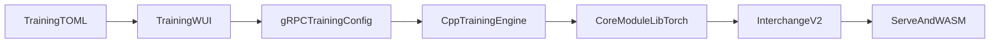

# Training: native Go + C++ gRPC

This document is the **authoritative contract** for what “real training” means in-repo: **Mission Control (Training WUI)** plus **gRPC** plus the **C++ LibTorch** engine. The **Python** column in the tables below is **parity for tests, schema, quantum sidecar, and tooling**, not a parallel production training product path.

Production training from the Training WUI uses **only** the C++ `TrainingEngineService` over gRPC (plus `cmd/qmw-grpc-train` on RunPod SSH hosts and in serverless images that ship the native stack).

## Runtime map (one mental model)

Configs in TOML flow through the WUI into a gRPC `TrainingConfig`, then into `CoreModule` (LibTorch), and out as **interchange v2** (TPEM weights) that **`qmw-serve` / WASM** consume for inference.

Detail for interchange layout and Bloch keys: [cpp/training/README.md](../cpp/training/README.md). Whitepaper implementation status (single source of truth for “paper vs binary”): [ARCHITECTURE_WHITEPAPERS.md](ARCHITECTURE_WHITEPAPERS.md#traceability-matrix).

## Theory vs native core (capability bounds)

This table complements the **traceability matrix**—same expectations, training-focused wording. For each row, the linked matrix entry is authoritative if wording diverges.

| Capability | Python `qminiwasm` graph | Native LibTorch `CoreModule` | Matrix row |
|------------|--------------------------|------------------------------|------------|
| Ternary STE experts, stem/head | Yes | Yes | [1.58-bit ternary experts](ARCHITECTURE_WHITEPAPERS.md#traceability-matrix) |
| Tropical / max-plus attention | Yes | No (Python-only today) | [Tropical geometry](ARCHITECTURE_WHITEPAPERS.md#traceability-matrix) |
| Bloch fidelity attention | Yes (`BlochSphereAttention`, full `[B,T,D]`) | Yes (broadcast token + `pos_embed`; not full sequence pipeline from data). **Roadmap:** a real `[B,T,D]` path from windowed HF rows would match Python sequence semantics beyond broadcast `pos_embed`. | [BlochSphere](ARCHITECTURE_WHITEPAPERS.md#traceability-matrix) + [Native gRPC row](ARCHITECTURE_WHITEPAPERS.md#traceability-matrix) |
| Joint SFT + cascade RL in one optimizer step | Loop/phases can express both | When both flags are set: one tick runs MSE on the `CoreModule` micro-batch (same synthetic batch contract as `train_step`) plus a weighted toy GRPO/CISPO term on `CascadeToyPolicy` (`train_step_joint_supervised_cascade`) | [Native gRPC row](ARCHITECTURE_WHITEPAPERS.md#traceability-matrix) |
| Trainable quantum router / QAOA in forward | Partial (router.py) | Not in core forward | [MoE / QAOA routing](ARCHITECTURE_WHITEPAPERS.md#traceability-matrix) |
| Native OpenQASM + trinary sim (bare-metal Q experiment) | N/A | Optional (`QMINIWASM_WITH_QUANTUM`; separate from training loss) | Optional build; see [cpp/README.md](../cpp/README.md#native-quantum-optional) |

When a run fails with interchange or geometry errors, align **`[model] attention_backend`**, **`native_bloch_seq_len` / `native_bloch_num_heads`**, and checkpoint **envelope + `bloch.*` / `ternary_*` tensors** with [cpp/training/README.md](../cpp/training/README.md#checkpoints-native-engine).

## Parity matrix (high level)

| Area | Native (C++ gRPC + Go WUI) | Python `qminiwasm` package |
|------|----------------------------|----------------------------|
| TOML → `TrainingConfig` | [training-wui/trainingconfig](../training-wui/trainingconfig/config.go) | `EngineConfig` / schema tests and wider internal surface |
| Cascade curriculum loop | Supported when mapped in proto / C++ | Reference paths in library tests |
| HF tabular / datasets | Mapped via `HfDatasetParams` + C++ fetch | `datasets`, custom loaders |
| Quantum (Qiskit / PennyLane) | Not in C++ engine | Optional sidecar / `sidecar/quantum/` |
| WASM runtime toggles in training | Native engine + TOML env to C++ | `wasmtime` / full host |
| Inference HTTP | Go `qmw-serve` + WUI embedded stub (`/api/serve/*`) | N/A (use Go stack) |

Extend this table when adding proto fields or C++ features so Mission Control and docs stay honest.

## Operational requirements

- Local: run `qminiwasm_training_engine_server` on `[wui] grpc_addr` from `configs/wui.toml` (see `scripts/start-training-stack.ps1`).
- RunPod (train on pod): pod needs **Go**, **CMake-built** `qminiwasm_training_engine_server`, and **LibTorch** on `LD_LIBRARY_PATH` (see `training-wui/runpod_remote.go`).

## Related docs

- Library vs `qminiwasm.engine` boundary: [ENGINE_QMINIWASM_BOUNDARY.md](ENGINE_QMINIWASM_BOUNDARY.md)
- Whitepaper traceability: [ARCHITECTURE_WHITEPAPERS.md](ARCHITECTURE_WHITEPAPERS.md)
