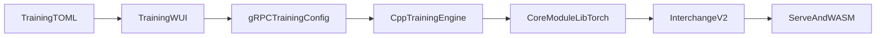

# Training: native Go + C++ gRPC (contract)

This document is the **authoritative contract** for training in-repo: **Mission Control (Training WUI)** + **gRPC** + **C++ LibTorch** `TrainingEngineService`. **Production training** from the WUI uses **only** that stack.

## Runtime map

Configs in TOML flow through the WUI into gRPC `TrainingConfig`, then into `CoreModule` (LibTorch), and out as **interchange v2** (TPEM weights) for **`qmw-serve` / WASM** consumption.

Interchange layout and Bloch keys: [`cpp/training/README.md`](../cpp/training/README.md). Paper ↔ binary traceability: [ARCHITECTURE_WHITEPAPERS.md](ARCHITECTURE_WHITEPAPERS.md#traceability-matrix).

## Native capability bounds

| Capability | Native LibTorch `CoreModule` | Matrix / detail |
|------------|------------------------------|-----------------|
| Ternary STE experts, stem/head | Yes | [1.58-bit ternary experts](ARCHITECTURE_WHITEPAPERS.md#traceability-matrix) |
| Bloch fidelity attention | Yes (broadcast token + `pos_embed`; see engine README for sequence limits) | [BlochSphere](ARCHITECTURE_WHITEPAPERS.md#traceability-matrix) |
| Joint SFT + cascade RL | When flags set: `train_step_joint_supervised_cascade` | [Native gRPC row](ARCHITECTURE_WHITEPAPERS.md#traceability-matrix) |
| Tropical / max-plus attention | Roadmap / partial — align with whitepaper | [Tropical geometry](ARCHITECTURE_WHITEPAPERS.md#traceability-matrix) |
| Trainable quantum router in core forward | Not in `CoreModule` forward | [MoE / QAOA routing](ARCHITECTURE_WHITEPAPERS.md#traceability-matrix) |
| Native OpenQASM + trinary sim | Optional build `QMINIWASM_WITH_QUANTUM` | [`cpp/README.md`](../cpp/README.md#native-quantum-optional) |

When a run fails with interchange or geometry errors, align `[model] attention_backend`, `native_bloch_*`, and checkpoint envelope tensors with [`cpp/training/README.md`](../cpp/training/README.md#checkpoints-native-engine).

## Implementation map (native only)

| Area | Location |
|------|----------|
| TOML → `TrainingConfig` | [`training-wui/trainingconfig`](../training-wui/trainingconfig/config.go) |
| Cascade / curriculum | Proto + C++ engine mapping |
| HF tabular / datasets | `HfDatasetParams` + C++ `hf_fetch_encoded_rows` |
| WASM / tier env in training | Native engine + TOML → C++ |
| Inference HTTP | Go `qmw-serve` + WUI stub until C++ tensor RPC |

## Operational requirements

- Local: run `qminiwasm_training_engine_server` on `[wui] grpc_addr` from `configs/wui.toml` (see `scripts/start-training-stack.ps1`).
- RunPod / remote: **Go**, **CMake-built** engine server, **LibTorch** on `LD_LIBRARY_PATH` (see `training-wui/runpod_remote.go`).

## Related docs

- Native boundary: [ENGINE_QMINIWASM_BOUNDARY.md](ENGINE_QMINIWASM_BOUNDARY.md)
- Depythonization: [DEPYTHONIZATION.md](DEPYTHONIZATION.md)
- Whitepaper traceability: [ARCHITECTURE_WHITEPAPERS.md](ARCHITECTURE_WHITEPAPERS.md)
