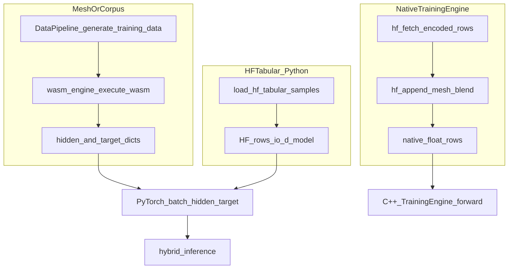
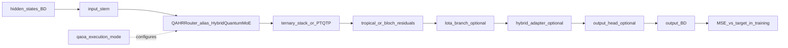

# Journey of a Vector

This document traces **one fixed-width training row**—typically **4096 float32 dimensions** (`d_model` / `io_d_model` in config)—from its origin in data loaders or WASM execution through **quantum-assisted routing (QAHR)**, optional escalation, and the native orchestration hooks that sit beside the main PyTorch path.

## Why this matters

The stack mixes **Wasmtime-backed mesh data**, **Hugging Face tabular encodings**, **optional native gRPC training**, **PyTorch**, and **Qiskit/PennyLane**. The walkthrough keeps each boundary explicit so operators know which code path owns the bytes versus the tensor math.

## What “the vector” is

- **Shape:** `[batch_size, io_d_model]` with `io_d_model` usually **4096** (must match `QMiniWASM` construction).
- **Roles:** **`hidden`** is the model input; **`target`** is the supervision signal (often identical to `hidden` for HF identity-MSE—see [../TRAINING_DATA.md](../TRAINING_DATA.md)).
- **Entry point:** [`QMiniWASM.hybrid_inference`](../../qminiwasm/model.py) validates `hidden_states` and runs the full hybrid forward (see [hybrid_inference implementation](../../qminiwasm/model.py) around the `input_stem` → `quantum_router` → ternary stack sequence).

## Provenance: where the row comes from

- **Mesh / corpus:** [`DataPipeline.generate_training_data`](../../qminiwasm/data/pipeline.py) calls **`wasm_engine.execute_wasm`** and builds samples with **`hidden`**, **`target`**, and optional **`wasm_memory`** / **`execution_state`** metadata.
- **HF tabular:** [`load_hf_tabular_samples`](../../qminiwasm/training/hf_loader.py) and friends feed [`run_training_loop`](../../qminiwasm/training/loop.py), including optional **mesh blend** (`hf_mesh_blend_fraction`) and curriculum / **`text_fields`** behavior documented in [../TRAINING_DATA.md](../TRAINING_DATA.md).
- **Native C++:** [`training_engine.cpp`](../../cpp/training/src/training_engine.cpp) uses **`hf_fetch_encoded_rows`** and **`hf_append_mesh_blend`** for the same conceptual row layout when HF is enabled; parity notes live in [../TRAINING_NATIVE_PARITY.md](../TRAINING_NATIVE_PARITY.md).

## Encoding: linear memory to floats

Edge snapshots are **bytes** in WASM linear memory; training consumes **4096 floats** per row.

- **Python (canonical):** `qminiwasm.wasm_host.memory_encode` (see [../ENGINE_QMINIWASM_BOUNDARY.md](../ENGINE_QMINIWASM_BOUNDARY.md)).
- **Native parity:** [`cpp/wasm/linear_memory_encode.hpp`](../../cpp/wasm/linear_memory_encode.hpp) / [`linear_memory_encode.cpp`](../../cpp/wasm/linear_memory_encode.cpp), exposed as **`encode_linear_memory_u8`** when the pybind target is built.

## Forward pass: inside `hybrid_inference`

- **Router type:** [`QAHRRouter`](../../qminiwasm/fabric/router.py) is the implementation; **`HybridQuantumMoE`** is the legacy public alias (same class).
- **Order of operations** in code: `input_stem` → `self.quantum_router(h)` → PTQTP or **`_forward_ternary_stack`** → optional **Bloch / tropical** add-on → optional **`lota_branch`**, **`hybrid_adapter`**, **`output_head`** ([`hybrid_inference`](../../qminiwasm/model.py)).
- **Training loop:** Batches from the pipeline feed **`hybrid_inference`** for supervised MSE against `target`; optional **cascade RL / MOPD** can attach policy updates that still use the same hidden tensor as context (see [../CASCADE_AND_MOPD.md](../CASCADE_AND_MOPD.md)).

## Quantum routing backends (QAHR)

Routing mode is driven by **`qaoa_execution_mode`** (and related training config), not by “every byte” of linear memory:

| Mode | Role |
|------|------|
| `pennylane` | Lightweight / identity-style path for QAHR wiring |
| `qiskit_statevector` | Local exact expectation evaluation |
| `qiskit_ibm` | IBM Quantum Runtime hardware path |

Credentials, backends, transpilation, **`EstimatorV2`**, and fallback behavior are documented in [../QUANTUM_QISKIT.md](../QUANTUM_QISKIT.md). Expectations feed into the classical router residual; they do **not** provide gradients through real hardware.

## Trainable vs detached

- **Trainable:** stems, router projections where implemented in PyTorch, ternary stack, adapters, and output heads.
- **Detached:** hardware / estimator execution is a **signal source**; results are mixed in as scalars / tensors without backprop through the QPU device.

## Escalation and cloud resume (Python + native policy)

**Python (default narrative for Tier-2 payloads):**

1. Edge capture builds a payload with [`prepare_escalation_payload`](../../qminiwasm/cognitive/escalation.py) (`linear_memory`, `stack_snapshot`, certainty metadata, etc.).
2. [`inference_from_escalation`](../../qminiwasm/model.py) runs **`qahr_route_after_escalation`**, applies **`StateMigrationInterconnect`** deltas (e.g. tropical attention), then calls **`hybrid_inference`** on the continuation hidden state.
3. For WLES-style resume, Python can write bytes back into linear memory via **`write_linear_memory`** in [`wles_wasmtime_harness.py`](../../qminiwasm/wasm_host/wles_wasmtime_harness.py).

**Native complement (embedded hosts):** [`qmw_escalation_resolve_next`](../../cpp/escalation/escalation_c_api.h), the **`QmwEscalationEnvelopeHeader`** prefix, and optional **`qmw_escalation_run_native_openqasm_if_applicable`** provide a **policy / framing surface** aligned with Certainty-Gated Escalation—they **do not replace** Python payload preparation in the default training stack (see [../ENGINE_QMINIWASM_BOUNDARY.md](../ENGINE_QMINIWASM_BOUNDARY.md) and [../ENCLAVE_LIFECYCLE.md](../ENCLAVE_LIFECYCLE.md)).

## WASM runtimes, host hooks, and expert fleet

- **Python mesh execution** uses **Wasmtime** under [`qminiwasm.wasm_host`](../../qminiwasm/wasm_host/)—not the C++ WasmEdge bridge—which produces realistic **`hidden`** / **`target`** from compiled modules.
- **`cpp/wasmedge/engine_bridge.cpp`** is a **correctness-first stub**: it invokes **`qmw_wasm_hooks_notify_before_execute` / `..._after_execute`** and returns an explicit “not implemented” style status while tests validate hook ordering ([`test_wasm_hooks.cpp`](../../cpp/tests/test_wasm_hooks.cpp)).
- **Experimental coordinator path:** [`QmwWASMHostCallbacks`](../../cpp/wasm/wasm_host_hooks_c_api.h) adds **`on_linear_memory_snapshot`** (e.g. around WLES save) and **`on_route_hint`**, intended to supply a **query vector** for native expert selection: **`qmw_expert_fleet_topk`** / **`qmw_expert_fleet_partition`** in [`expert_fleet_c_api.h`](../../cpp/router/expert_fleet_c_api.h) delegate to **`qmw_route_*`** when **`QMINIWASM_WITH_NATIVE_DQAOA_ROUTING`** is on, otherwise return safe stubs. **Fleet vocabulary and tier semantics** are in [../ENCLAVE_LIFECYCLE.md](../ENCLAVE_LIFECYCLE.md). This is **orchestration beside** the single-model `hybrid_inference` path, not a duplicate forward pass.

## Operational states (summary)

| State | Name | Meaning |
|------|------|--------|
| **State 1 (always-on)** | **Ternary WASM / tensor path** | Deterministic local execution and bounded linear memory in edge configs; vectors materialize in Python or native loaders. |
| **State 2 (triggered)** | **QAHR / QAOA routing** | Entered by policy when quantum routing is enabled—see mode table above—not on every batch by default. |

Detailed **enclave tiers**, **EF capacity**, and **FleetCoordinator** vs **ExpertMember** roles are centralized in [../ENCLAVE_LIFECYCLE.md](../ENCLAVE_LIFECYCLE.md) to avoid duplicating tier-page tables here.

## Serving note (HTTP inference)

Embedded **`qmw-serve`** and Training WUI **`POST /infer`** currently return **501 Not Implemented** for LibTorch-over-HTTP until a tensor bridge exists ([`training-wui/cmd/qmw-serve/main.go`](../../training-wui/cmd/qmw-serve/main.go), [`training-wui/infer_serve.go`](../../training-wui/infer_serve.go)). **Training** and **library inference in-process** are the accurate paths for `hybrid_inference` today.

## Related documents

| Topic | Document |
|-------|----------|
| Stack framing | [../../README.md](../../README.md) |
| Training data sources | [../TRAINING_DATA.md](../TRAINING_DATA.md) |
| Native vs Python training | [../TRAINING_NATIVE_PARITY.md](../TRAINING_NATIVE_PARITY.md), [../ENGINE_QMINIWASM_BOUNDARY.md](../ENGINE_QMINIWASM_BOUNDARY.md) |
| Quantum setup | [../QUANTUM_QISKIT.md](../QUANTUM_QISKIT.md) |
| Enclave / fleet / CGE | [../ENCLAVE_LIFECYCLE.md](../ENCLAVE_LIFECYCLE.md) |
| Operations | [../operations/OPERATIONS_RUNBOOK.md](../operations/OPERATIONS_RUNBOOK.md) |
