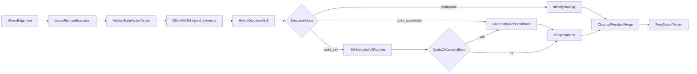

# Journey of a Vector

This document traces one vector through `qminiwasm-core` from edge-side Wasm execution to triggered IBM Quantum routing and back into a classical output tensor.

## Why this matters

The architecture can look like "magic" because WebAssembly, PyTorch, and Qiskit are all involved. This walkthrough makes each boundary explicit.

## End-to-end flow

## Operational states

| State | Name | Operational meaning |
|------|------|---------------------|
| **State 1 (Always-On)** | **Ternary WASM Inference** | Deterministic local execution in bounded WASM linear memory. |
| **State 2 (Triggered)** | **QAOA Routing (Quantum Approximate Optimization Algorithm)** | Entered only when routing/search pressure exceeds configured local budget. |

### When to use Quantum Routing

State 2 is a hard-trigger path, not a default path. Example policy (control-plane configured): if classical assignment over 64 or more experts exceeds a 50ms latency budget, local execution pauses and routing search is delegated to the Qiskit backend, then the selected path is returned and State 1 resumes.

## Enclave tiers and enforced memory boundaries

| Tier | Class | Default pages (64KiB) | Approx linear memory | Memory64 |
|------|-------|------------------------|----------------------|----------|
| 1 | Micro | 4096 | ~256 MiB | Off |
| 2 | Meso | 32768 | ~2 GiB | Off |
| 3 | Macro | 131072 | ~8 GiB | On (`8192 MB` ceiling default) |
| 4 | Workgroup | 262144 | ~16 GiB | On (`16384 MB` ceiling default) |
| 5 | Enterprise Core | 4194304 | ~256 GiB | On (`262144 MB` ceiling default) |

Runtime resolution order is explicit: override knobs (`max_linear_memory_pages`, `wasm_memory64_max_mb`, `use_memory64`) win over tier presets, and tier presets win over generic runtime defaults.

## Step-by-step trace

### Step 1: Vector originates in the Wasm edge environment

- The Wasm execution layer runs deterministic module logic and exposes execution state.
- In practical pipelines, edge-side state and features are transformed into fixed-width hidden vectors used by the model path.
- The `QMiniWASM` object owns the Wasm executor and data pipeline orchestration.

## Step 2: Handoff into Python orchestration

- `QMiniWASM` is initialized in `qminiwasm/model.py` and wires together:
  - `WasmExecutor`
  - `TernaryWASMExpert`
  - `HybridQuantumMoE`
- During inference, `QMiniWASM.hybrid_inference(...)` receives `hidden_states` as a tensor and calls the quantum router block.
- Escalation payload construction is handled by `prepare_escalation_payload(...)` in `qminiwasm/cognitive/escalation.py`.

## Step 3: Router mode decision

The quantum router mode is determined by `qaoa_execution_mode`:

- `pennylane`: identity/no-op routing path
- `qiskit_statevector`: local exact expectation evaluation
- `qiskit_ibm`: IBM Quantum Runtime hardware path

This selection is configured from training/serve config and environment surfaces documented in [../QUANTUM_QISKIT.md](../QUANTUM_QISKIT.md).

## Step 4: Qiskit execution contract

When `qiskit_ibm` is selected:

1. Build the QAOA circuit.
2. Resolve credentials (`IBM_QUANTUM_API_TOKEN` or `QISKIT_IBM_TOKEN`).
3. Resolve backend device name (`IBM_BACKEND_NAME` or equivalent config fallback).
4. Transpile to ISA-compliant circuit for the selected backend.
5. Execute with `EstimatorV2` and collect per-qubit `Z` expectations.

If IBM runtime fails due to quota or capacity conditions, the path can fall back to local `qiskit_statevector` when fallback is enabled.

## Step 5: Return to classical pipeline

- Quantum expectations are converted to a tensor and detached from hardware execution.
- The router projects quantum outputs back into the model dimension and mixes them as a scaled residual.
- The final routed tensor is returned as the model output for downstream serving or training logic.
- For pause/resume flows, Python writes the resumed bytes back into WASM linear memory (`write_linear_memory(...)` in `qminiwasm/wasm_host/wles_wasmtime_harness.py`) before continuing execution.

## Step 6: What is trainable vs detached

- Classical projection and merge layers remain trainable in PyTorch.
- IBM hardware execution itself is a detached signal source (no gradient through the quantum device).
- This creates a hybrid path where quantum results influence routing while preserving stable classical optimization.

## Practical checkpoints

- For conceptual architecture, return to [../../README.md](../../README.md#why-this-stack).
- For operator setup, use [../operations/OPERATIONS_RUNBOOK.md](../operations/OPERATIONS_RUNBOOK.md).
- For exact quantum configuration and constraints, use [../QUANTUM_QISKIT.md](../QUANTUM_QISKIT.md).
