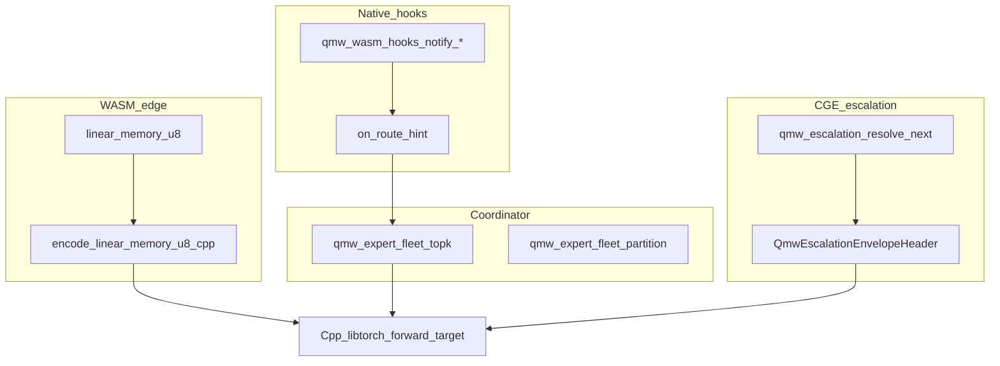
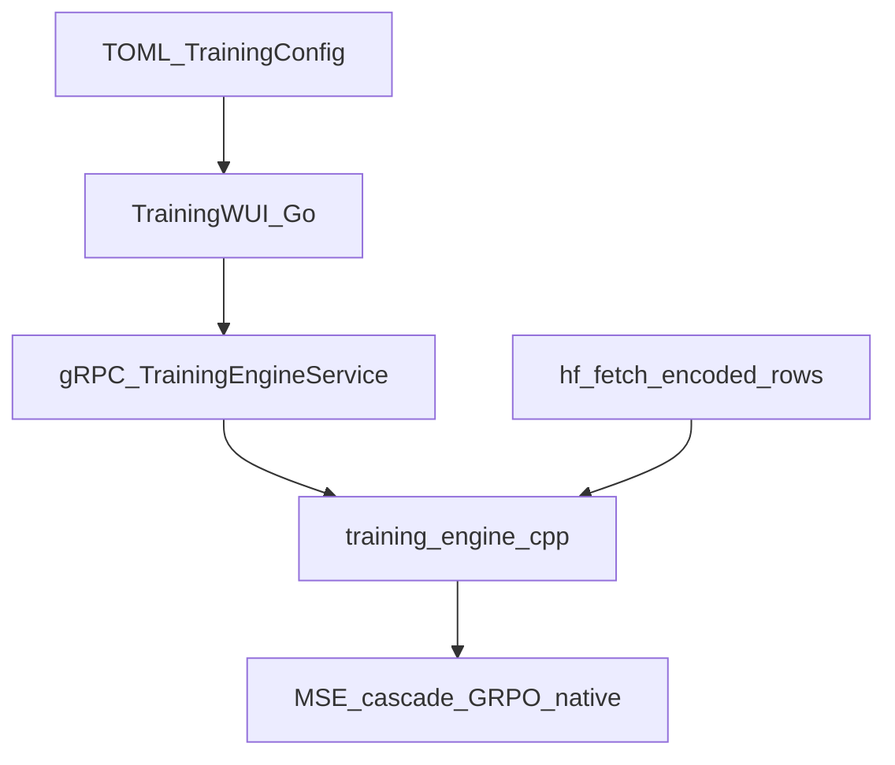

# Journey of a Vector

This document traces **one fixed-width activation**—typically **4096-wide** rows (`native_io_d_model` / `native_d_model` in training config; LibTorch default tensor element type)—from **WASM linear memory** or **native batch rows** through **escalation policy**, **expert-fleet routing**, optional **quantum backends**, and **native training** when producing weights.

The **operator path** is **Go** (WUI, gRPC) and **C++** (LibTorch engine, encoders, hooks). See [../DEPYTHONIZATION.md](../DEPYTHONIZATION.md) for removal of interpreter-era references elsewhere in the tree.

## What “the vector” is

- **Shape:** `[batch, D]` with **D** commonly **4096** for interchange and HF-native rows.
- **Roles:** **input** activations for the **C++ `CoreModule`** forward; **target** tensor for supervised loss inside the native engine when training.
- **Inference target:** same fixed-width tensor crosses **WASM** boundaries via byte packing and optional **HTTP/gRPC** serve (Go today; **501** until C++ tensor RPC completes).

## Track A — Inference lifecycle (edge → policy → resume)

1. **Bytes in linear memory** — WASM exports memory; host reads snapshots (WLES) and normalizes to float rows using [`cpp/wasm/linear_memory_encode.hpp`](../../cpp/wasm/linear_memory_encode.hpp) (`encode_linear_memory_u8`).
2. **Host hooks** — [`wasm_host_hooks_c_api.h`](../../cpp/wasm/wasm_host_hooks_c_api.h): `on_before_execute`, `on_after_execute`, `on_linear_memory_snapshot`, **`on_route_hint`** (query vector for expert top-k).
3. **Expert fleet** — [`expert_fleet_c_api.h`](../../cpp/router/expert_fleet_c_api.h) wraps **`qmw_route_topk_l2_f64`** / **`qmw_route_assign_clusters`** when `QMINIWASM_WITH_NATIVE_DQAOA_ROUTING=ON`. Vocabulary: [../ENCLAVE_LIFECYCLE.md](../ENCLAVE_LIFECYCLE.md).
4. **Escalation** — [`escalation_c_api.h`](../../cpp/escalation/escalation_c_api.h): tier chain, envelope header, optional **`qmw_escalation_run_native_openqasm_if_applicable`** when quantum build is enabled.
5. **Serve** — Go **`qmw-serve`** / WUI **`POST /infer`**: **501** today; production inference requires the **C++ tensor bridge** ([`training-wui/infer_serve.go`](../../training-wui/infer_serve.go)).

**WasmEdge bridge stub:** [`engine_bridge.cpp`](../../cpp/wasmedge/engine_bridge.cpp) exercises hook ordering for tests; real edge execution stays in your WASM runtime + host process.

## Track B — Training lifecycle (Mission Control)

1. **Config** — TOML through WUI → gRPC `TrainingConfig` ([`training-wui/trainingconfig`](../../training-wui/trainingconfig)).
2. **Rows** — [`training_engine.cpp`](../../cpp/training/src/training_engine.cpp): **`hf_fetch_encoded_rows`**, **`hf_append_mesh_blend`**, synthetic fallback when HF empty.
3. **Forward / loss** — **`CoreModule`** LibTorch; joint supervised + cascade when enabled (see [../TRAINING_NATIVE_PARITY.md](../TRAINING_NATIVE_PARITY.md)).
4. **Artifacts** — checkpoints and interchange v2 for TPEM / serve alignment ([`cpp/training/README.md`](../../cpp/training/README.md)).

## Quantum routing (QAHR)

Policy and credentials for `pennylane` / `qiskit_statevector` / `qiskit_ibm` are documented in [../QUANTUM_QISKIT.md](../QUANTUM_QISKIT.md). Expectations influence **routing cost**, not byte-for-byte WASM semantics.

## Trainable vs detached (native)

- **Gradients:** LibTorch parameters in **`CoreModule`** and attached native heads optimizers see.
- **Quantum device:** hardware estimators are **signals**—no device backprop (same as classical hybrid ML practice).

## Operational states (summary)

| State | Meaning |
|------|---------|
| **State 1** | Always-on **WASM + native** forward; bounded memory |
| **State 2** | **Triggered** QAHR / QAOA per policy—not every batch |

Tier tables and FleetCoordinator roles: [../ENCLAVE_LIFECYCLE.md](../ENCLAVE_LIFECYCLE.md).

## Related documents

| Topic | Document |
|-------|----------|
| Repo overview | [../../README.md](../../README.md) |
| Native training contract | [../TRAINING_NATIVE_PARITY.md](../TRAINING_NATIVE_PARITY.md) |
| Training data | [../TRAINING_DATA.md](../TRAINING_DATA.md) |
| Quantum | [../QUANTUM_QISKIT.md](../QUANTUM_QISKIT.md) |
| Enclave / fleet | [../ENCLAVE_LIFECYCLE.md](../ENCLAVE_LIFECYCLE.md) |
| Boundary / depythonization | [../ENGINE_QMINIWASM_BOUNDARY.md](../ENGINE_QMINIWASM_BOUNDARY.md), [../MASTER_REALIGNMENT_STATUS.md](../MASTER_REALIGNMENT_STATUS.md), [../DEPYTHONIZATION.md](../DEPYTHONIZATION.md) |
| Operations | [../operations/OPERATIONS_RUNBOOK.md](../operations/OPERATIONS_RUNBOOK.md) |
