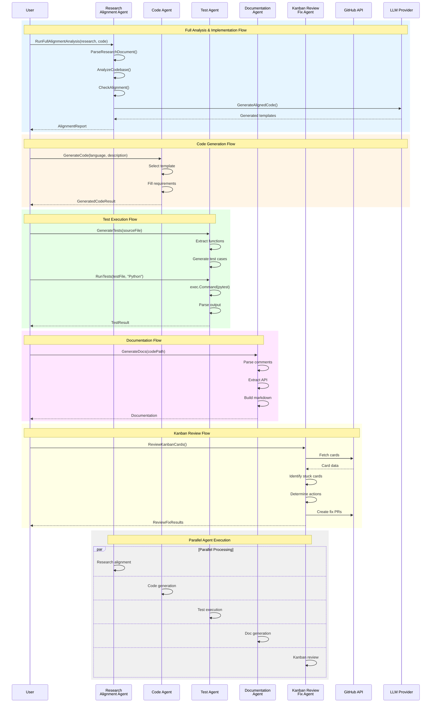
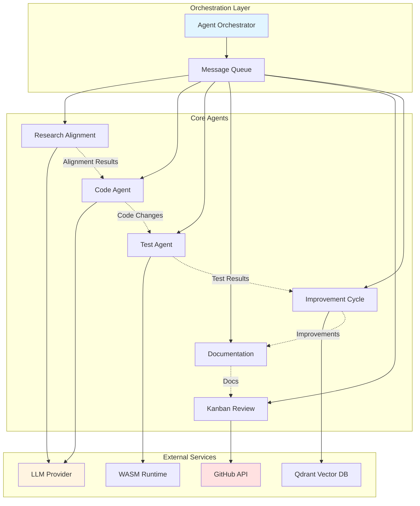
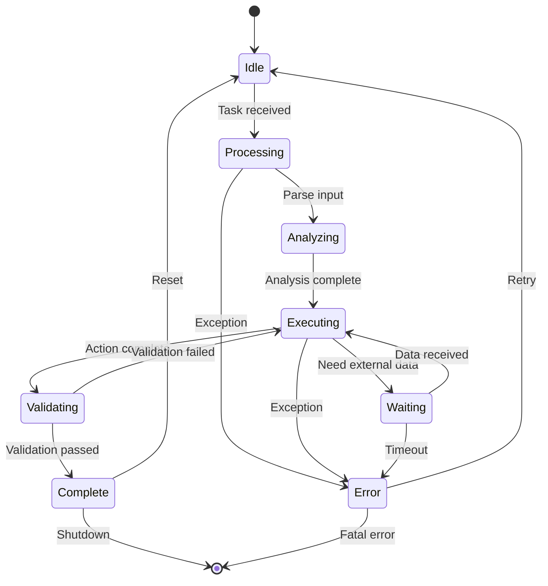
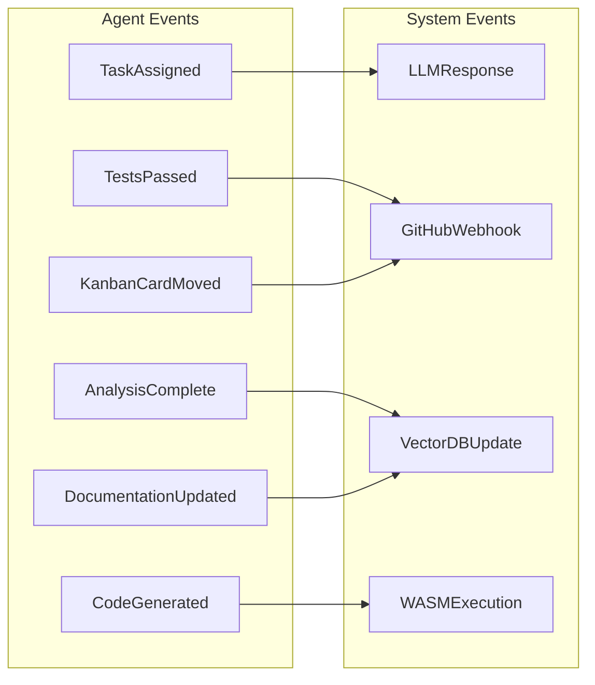

# Agent System Interaction Sequence

## Overview

This diagram shows the interaction sequence between agents in the QMINIWASM multi-agent system.

## Agent Communication Patterns

## Agent State Machine

## Agent Capabilities Matrix

| Agent | Research | Code Gen | Testing | Docs | Git Ops | LLM Calls |
|-------|----------|----------|---------|------|---------|-----------|
| Research Alignment | ✓✓ | ✓ | ✗ | ✗ | ✗ | ✓✓ |
| Code Agent | ✗ | ✓✓ | ✓ | ✗ | ✗ | ✓ |
| Test Agent | ✗ | ✗ | ✓✓ | ✗ | ✗ | ✗ |
| Documentation | ✗ | ✗ | ✗ | ✓✓ | ✗ | ✓ |
| Kanban Review | ✓ | ✓ | ✗ | ✗ | ✓✓ | ✓ |
| Improvement Cycle | ✓ | ✓ | ✓ | ✓ | ✓ | ✓✓ |

*✓✓ = Primary function, ✓ = Secondary function, ✗ = Not applicable*

## Event Types

---

*Generated: April 6, 2026*
*Diagram Type: Mermaid Sequence & Flow*
