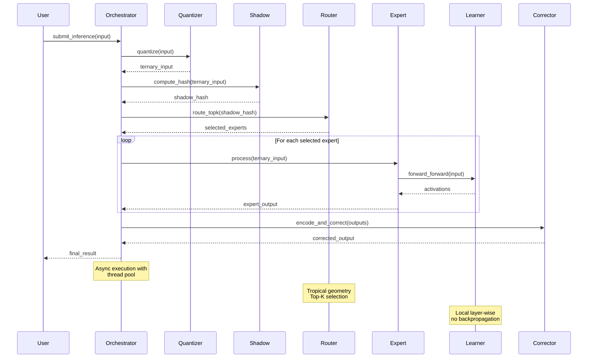

# Component Interaction Diagram

## API Contracts

| Component | Method | Input | Output |
|-----------|--------|-------|--------|
| Quantizer | `quantize()` | `vector<double>` | `vector<Trit>` |
| Shadow | `compute_hash()` | `vector<Trit>` | `uint64_t` |
| Router | `route_topk()` | `vector<Trit>` | `vector<int>` |
| Learner | `forward_forward()` | `vector<Trit>` | `vector<Trit>` |
| Corrector | `encode_and_correct()` | `vector<Trit>` | `vector<Trit>` |
