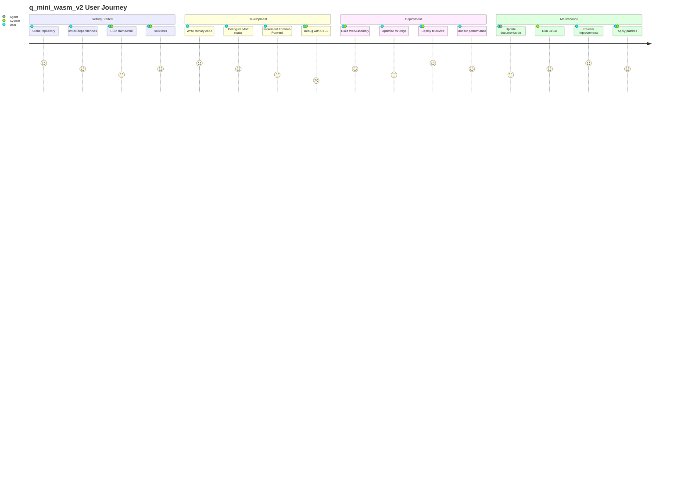

# User Journey Diagram

## User Personas

### 1. Framework Developer
- **Goal**: Extend core functionality
- **Key Actions**: Modify C++ code, add new gates
- **Pain Points**: Complex GF(3) arithmetic

### 2. Application Developer
- **Goal**: Build edge AI applications
- **Key Actions**: Use MoE routing, deploy to WASM
- **Pain Points**: SYCL setup, optimization

### 3. Researcher
- **Goal**: Experiment with ternary networks
- **Key Actions**: Run benchmarks, analyze results
- **Pain Points**: Documentation gaps

### 4. DevOps Engineer
- **Goal**: Maintain CI/CD pipeline
- **Key Actions**: Monitor builds, manage deployments
- **Pain Points**: Cross-platform builds
