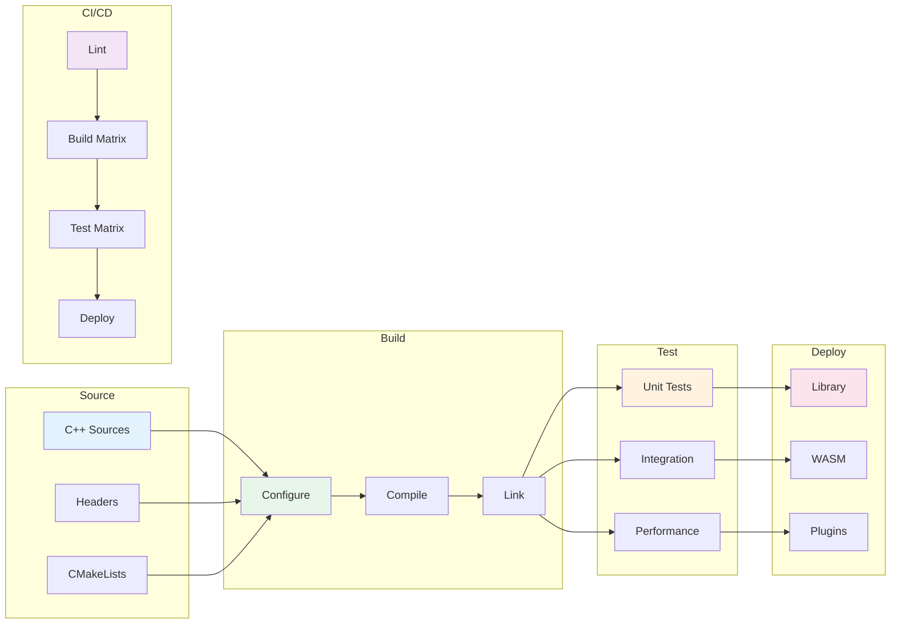

# Build Pipeline Diagram



## Build Matrix

| Platform | SYCL | Build Type | Status |
|----------|------|------------|--------|
| Windows | OFF | Release | OK |
| Windows | OFF | Debug | OK |
| Linux | OFF | Release | OK |
| Linux | OFF | Debug | OK |
| Linux | ON | Release | Optional |

## Build Commands

```bash
# Basic build
mkdir build && cd build
cmake ..
cmake --build .

# With SYCL
cmake -S q_mini_wasm_v2 -B q_mini_wasm_v2/build_sycl -DCMAKE_CXX_COMPILER=icpx ..
cmake --build .

# Run tests
ctest --output-on-failure
```
