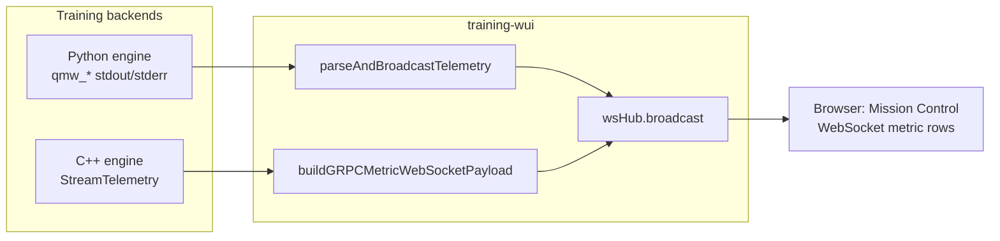
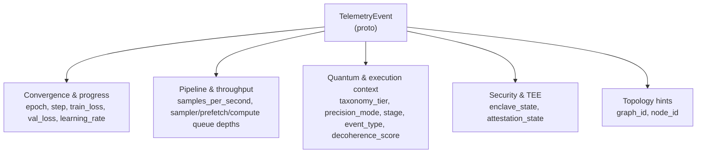
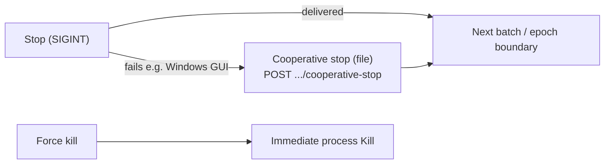

# Training WUI (Go)

The **Training WUI** is a Go-based web interface for configuring, launching, and monitoring **hybrid quantum–classical** training jobs against this repository. **What the model learns** (architecture, data mix, epochs, checkpoints, accelerators, and related TOML fields) lives in **`configs/training/*.toml`** and the in-app wizard. **Secrets and provider credentials**—RunPod, Hugging Face, IBM Quantum, and similar—belong in the repo **`.env`** file; they are not training hyperparameters. See [`.env.example`](../.env.example) and [docs/environment-variables.md](../docs/environment-variables.md) for the full variable map.

How telemetry reaches the browser from the native C++ gRPC engine is explained in **[Architecture & Vision](#architecture--vision)** below.

> **SECURITY & OPERATIONAL LIMITATIONS**
>
> - **No built-in authentication.** The WUI does not verify clients. Treat it as a **local development** tool. Do **not** bind `-addr` to a public interface or untrusted network without placing it behind a **reverse proxy** and **proper authentication**; otherwise anyone who can reach the port can start long-running training workloads.
> - **Single training process.** The server allows **only one active training run at a time**. Start another job only after the current run finishes or you use **Stop** (or equivalent) to clear the slot.

## Architecture & Vision

The WUI drives **native LibTorch TPEM over gRPC** only: the C++ **`TrainingEngineService`** (`StartTraining` / `StreamTelemetry` at `grpc_addr` from **`configs/wui.toml`**). **Local** training and **cloud GPU with “train on WUI host”** use the Go gRPC client (start `qminiwasm_training_engine_server` first). **Train on the remote RunPod** syncs the repo over SSH and runs **`go run ./cmd/qmw-grpc-train`** plus the C++ server on the pod (Go + LibTorch required on the image). **RunPod serverless** may still use the Python `serverless/handler.py` container entrypoint until replaced by a native image. There is **no Python fallback** when gRPC is unreachable: fix the server or address. The UI maps wizard and TOML selections into `TrainingConfig` fields in [`proto/training_engine.proto`](../proto/training_engine.proto); keys without a proto counterpart are ignored until the C++ backend loads the full TOML server-side.

**Mission Control** is the live operator surface: metrics and logs stream over per-run **WebSockets**. Two telemetry backends feed the same **`type: "metric"`** message shape, distinguished by `telemetry_source` (and, for gRPC, `engine: "grpc"`).

### Mission Control telemetry contract (gRPC)

| Surface | How data arrives | What the operator sees |
|--------|------------------|-------------------------|
| **C++ gRPC** | **`StreamTelemetry`** → `TelemetryEvent` in `proto/training_engine.proto` | WebSocket **`metric`** with `telemetry_source` = gRPC C++, **`engine`**: `"grpc"`, and populated **Step**, **LR**, **σ/s**, **Q**, **Tier**, **Stage**, **Dec**, **TEE** columns in Mission Control |

**Default: native C++ gRPC training.** The revision-controlled default in **`configs/wui.toml`** is **`training_runtime_mode = "native"`** (LibTorch `TrainingEngineService` at **`grpc_addr`**, default **`127.0.0.1:50061`**). Start the server first (e.g. **`scripts/start-training-stack.ps1`** / **`.sh`**, or run **`qminiwasm_training_engine_server`** yourself). Use **`auto`** to require gRPC reachability (no Python fallback). **`python`** mode is **removed** from the WUI training path. **Preflight** tries a **Python torch/XPU/IBM probe** when the interpreter works; otherwise (or with **`QMW_WUI_PREFLIGHT_GO_ONLY=1`**) it uses a **Go-only** probe (TOML + gRPC; torch/IBM rows show as unavailable). The UI still labels the Python block as reference-only for native training. See [docs/CONFIGURATION_POLICY.md](../docs/CONFIGURATION_POLICY.md) and [docs/TRAINING_NATIVE_PARITY.md](../docs/TRAINING_NATIVE_PARITY.md).

**`StreamTelemetry` lifecycle:** After the run finishes, the server closes the stream so the WUI client sees a normal end (EOF). If the stream were opened with no matching active run, it may end quickly while the engine is **idle**.

**Proto → WebSocket (operator-facing names):**

| `TelemetryEvent` field | Role |
|------------------------|------|
| `epoch`, `train_loss`, `val_loss` | Convergence; also mirrored as `mean_loss` / `mean_mse` for charts |
| `step`, `learning_rate`, `samples_per_second` | Training progress and throughput |
| `sampler_queue_depth`, `prefetch_queue_depth`, `compute_queue_depth` | Pipeline / loader backpressure |
| `taxonomy_tier`, `precision_mode` | Runtime / precision context |
| `stage`, `event_type`, `message` (`grpc_message`, `line`) | What the engine is doing |
| `graph_id`, `node_id` | Topology / placement hints |
| `enclave_state`, `attestation_state` | Security / TEE status |
| `decoherence_score` | Quantum-context signal from the engine |

**Prometheus / SOA-style metrics** (SML, LCI, LME, TtC, LMS/TBR, etc.) are **not** emitted on this WebSocket path. A future **metrics exporter** or scrape endpoint would be separate.

The architecture is still designed so **Stateful Operational Autonomy (SOA)** can be observed with external tools (for example Prometheus) using those latency and migration signals once a dedicated metrics surface exists. Until then, treat Mission Control as the **live operator console** and Prometheus as **out of scope** for this repo’s WebSocket bridge.

#### Telemetry paths into Mission Control



Use the **Live telemetry** stream filter (**All** / **C++ gRPC** / **Python**) so the table matches how your run was started. A long **first epoch** on Python still means **no `qmw_metric` row** until that epoch completes.

#### `TelemetryEvent` field groups (what to watch)



**Operator notes**

- **Losses:** Rising `val_loss` with falling `train_loss` suggests overfitting; both flat or diverging means revisit LR, data, or capacity.
- **Throughput vs queues:** Full **prefetch** queue with an empty **compute** queue often points to a **compute** bottleneck; the inverse suggests **data loading** or **sampler** pressure.
- **Decoherence:** `decoherence_score` tracks stability of quantum-routing-related state in the engine (when that path is active).
- **TEE:** `enclave_state` and `attestation_state` summarize trusted-execution context for the run when the engine reports them.

**Quantum routing (Python, Qiskit QAOA path):** With `qaoa_execution_mode` **`qiskit_statevector`** or **`qiskit_ibm`**, the router may emit **`qmw_routing_telemetry`** and **`qmw_routing_handoff`** lines. The WUI forwards them as WebSocket **`routing_telemetry`** / **`routing_handoff`** for Mission Control (latency budget default **50 ms**; override with **`QMW_ROUTING_LATENCY_BUDGET_MS`**—see [Appendix](#appendix-troubleshooting--edge-cases)).

**C++ engine reference:** Telemetry is pushed over **`StreamTelemetry`** and re-broadcast as WebSocket **`metric`** / **`alert`** (no `grpcurl`). The **`metric`** object keeps legacy keys (`epoch`, `mean_loss`, `mean_mse`, `mean_return`, `line`) for charts and adds the full proto field set in snake_case plus **`engine`: `"grpc"`**. See [`cpp/training/README.md`](../cpp/training/README.md).

Regenerate Go stubs after editing the proto (from **`training-wui/`**): `go generate ./...` (requires `protoc` plus `protoc-gen-go` and `protoc-gen-go-grpc` on `PATH`).

## Path A: Local quick start

Follow these steps in order the first time you run the WUI on your machine.

### 1. Dependencies

- [Go](https://go.dev/dl/) **1.22+**
- **`wat2wasm`** from [WABT](https://github.com/WebAssembly/wabt) on `PATH` if you use **Build / edge artifacts** in the WUI (`corpus/trit_kernels.wat` → `qminiwasm-kernels.wasm`). Tier **1** builds optionally use **`wasm-opt`** (Binaryen) when present.
- **Python** with the package installed: `pip install -e ".[training]"` from the **repository root**, and `python` on `PATH` (preflight, checkpoint → packed payload for edge builds, and other tooling)
- **Optional (cloud only):** [OpenTofu](https://opentofu.org/docs/intro/install/) **`tofu`** or a **Terraform-compatible** CLI on `PATH` for [`infra/runpod`](../infra/runpod). End-to-end checklist: [docs/RUNPOD_QUICKSTART.md](../docs/RUNPOD_QUICKSTART.md). Host automation with Incus is documented in the separate ops runbook (see [Appendix](#appendix-troubleshooting--edge-cases)).

### 2. Environment setup

Copy [`.env.example`](../.env.example) to **`.env`** at the repo root and fill in any providers you use. Training behavior is **not** controlled here—only credentials and environment-driven defaults. Details: [docs/environment-variables.md](../docs/environment-variables.md).

### 3. Start the server

From **`training-wui/`**:

```bash
go run . -root .. -addr :8765
```

Or build a binary:

```bash
go build -o training-wui .
./training-wui -root ..
```

**Windows:** `go build -o training-wui .` produces **`training-wui.exe`**. Run it with an explicit path so you do not pick up another copy on `PATH`:

```powershell
cd path\to\qminiwasm-core\training-wui
go build -o training-wui.exe .
.\training-wui.exe -root .. -strict-addr
```

**Still seeing an old UI (e.g. “Emergency Abort”) after rebuild?** The binary you **start** is not the one you **built**, or the browser is not talking to that process. Check:

1. Startup log includes **`embedded web/index.html sha256=…`** and **`training-wui UI: http://…`**.
2. Which executable is listening: `Get-NetTCPConnection -LocalPort 8765 | Select-Object OwningProcess` then `Get-Process -Id <pid> | Select-Object Path`.
3. Compare embed to disk: `GET /api/meta` field **`embedded_web_index_sha256`** must equal the SHA-256 of **`training-wui/web/index.html`** in *this* repo (PowerShell: `Get-FileHash -Algorithm SHA256 .\web\index.html` from `training-wui/` — compare hex, case-insensitive).

From the **repository root** you can use [`scripts/deploy-wui.sh`](../scripts/deploy-wui.sh); set **`DEST=/path/to/training-wui`** to copy the binary after build (optional). Script comments list cloud-related env vars—see [`.env.example`](../.env.example) and [docs/RUNPOD_SERVERLESS.md](../docs/RUNPOD_SERVERLESS.md).

| Flag | Default | Meaning |
|------|---------|---------|
| `-addr` | `:8765` | Listen address (`host:port`) |
| `-strict-addr` | off | If set, **exit** when `-addr` is already in use instead of trying the next port (`:8766`, …). Use this while developing so you never accidentally browse an **old** process still bound to `:8765` while the new binary listens elsewhere. |
| `-root` | `.` | **Repo root** (directory that contains `configs/` and `qminiwasm/`) |
| `-python` | `python` | Python executable name or path on `PATH` |

**Stale or missing UI after editing `web/index.html`:** The page is **embedded** into the binary at build time (`go:embed`). You must **rebuild** (`go build` / `go run`) and run **that** executable. If the requested port is busy, the server tries **8766, 8767, …** and logs a warning—opening the default URL can still hit an **older** server on `:8765`. Check the startup lines **`training-wui listening on …`** and **`training-wui UI: http://…`** (or use `-strict-addr`). On Windows, see what owns the port (for example `Get-NetTCPConnection -LocalPort 8765`) and stop the old process if needed.

### 4. Open the UI and walk through the app

Open the URL printed at startup (**`training-wui UI: …`**) or [http://127.0.0.1:8765](http://127.0.0.1:8765) when nothing else is listening on that port.

**Training** is a single **wizard** on one tab (dataset mix, model and runtime, data source, training knobs plus full **schema** form, then review). Saves go to **`configs/training/wui_working.toml`** unless you pick another file in the dropdown. **Launch training** is the control that actually starts work; **preflight**, **runs**, and **artifacts** sit alongside it.

**Mission Control** holds live metrics, the **telemetry** stream (charts and tables described under [Architecture & Vision](#architecture--vision)), and the training **log** when using the default layout. **Infra & Cloud GPU**, **Quantum Topology**, and **Artifact Registry** cover cloud tooling, topology views, and artifact browsing.

**API essentials:** `POST /api/runs/build` and `POST /api/runs/custom` only write `wui_working.toml`. **`POST /api/runs`** starts training. Optional JSON field **`allow_missing_checkpoint`**: when `true` and `checkpoint.load_path` is missing, the server runs from a temp TOML with that line removed (fresh weights), after you confirm in the UI.

**Floating panels (optional):** On **Training** and **Infra & Cloud GPU**, you can enable **Floating panels** to drag sections by title and resize from the corner grip. Layout is stored in **`localStorage`**.

### 5. Optional: C++ training engine on the same machine

For **native gRPC** training (local or “train on WUI host” with cloud):

1. Build and run `qminiwasm_training_engine_server` (see [`cpp/training/README.md`](../cpp/training/README.md)).
2. Point **`configs/wui.toml`** `[wui] grpc_addr` at the listener (default **`127.0.0.1:50061`**) or use **`-grpc-addr`** on **`training-wui`**.
3. Or use **`scripts/start-training-stack.sh`** / **`scripts/start-training-stack.ps1`** from the repo root: they **CMake-build** the C++ server when its binary is missing, then start it and the WUI (see **`cpp/training/README.md`** if configure fails).

Telemetry shape and Mission Control columns are described in [Architecture & Vision](#architecture--vision).

### 6. While a run is active

The server enforces **one training process at a time** (see [warnings](#training-wui-go) at the top).

**Stopping**



- **Stop (graceful)** — **SIGINT** to the local Python child (or cancel serverless job). Stops after the current batch when possible.
- **Cooperative stop (file)** — `POST /api/runs/<id>/cooperative-stop` creates a sentinel file the Python loop polls (same boundary as SIGINT). The UI exposes **Cooperative stop (file)** beside other stop controls. **RunPod SSH** runs use remote **`.wui/stop_<runId>`**. Not available for **native gRPC** or **RunPod serverless** (use **Stop** / cancel). For **Windows GUI–launched WUI**, SIGINT often fails; see [Appendix: Windows and cooperative stop](#windows-and-cooperative-stop).
- **Force kill** — immediate `Kill()`; may lose in-epoch work.

**Logs and metrics cadence:** Local training uses **`python -u -m qminiwasm.engine`** so stdout is line-oriented for the WUI. **`qmw_metric`** appears at **epoch end** (and on partial epoch after graceful stop), so a long first epoch can look quiet until it completes.

## Path B: Advanced cloud deployment

This path assumes you will provision **RunPod** (current integration) via **OpenTofu/Terraform** from the WUI host, optionally sync the repo to a GPU pod, and train either **on the pod** or **on the WUI machine** against a remote GPU stack.

### Prerequisites

- **`RUNPOD_TOKEN`** or **`RUNPOD_API_KEY`** in repo **`.env`**; the WUI loads it at startup.
- Stack under **[`infra/runpod`](../infra/runpod)**; **`tofu`** or **`terraform`** on **`PATH`** on the **WUI host**.
- Guided setup: [docs/RUNPOD_QUICKSTART.md](../docs/RUNPOD_QUICKSTART.md) and **`scripts/runpod_bootstrap.sh`**.

### Provisioning lifecycle

The dashboard can run **`apply`** before training and **`destroy`** when the job exits or you **Stop**, unless you opt to **skip destroy** to keep the pod. You can **skip OpenTofu apply** when using a **warm target** (saved SSH host) so training attaches to an existing machine.

### Train on pod vs train on WUI host

- **Train on the pod (default for RunPod):** Set **Execution target** to RunPod and leave **Train on cloud GPU** checked. **Launch training** runs **`tofu apply`** (unless skipped or warm target), waits for **`public_ip`** (or uses the warm host), **tar-syncs** the repo over **SSH**, then runs **`python -u -m qminiwasm.engine`** on the pod (venv + `pip install -e ".[training]"` each run) with **`--wui-stop-file .wui/stop_<runId>`** for cooperative stop.
- **Train on the WUI host:** Uncheck **Train on cloud GPU**. The pod may still be provisioned, but training runs **locally** via **gRPC** to the C++ engine, same idea as a pure local run.

**CUDA:** Pods default to **`ACCELERATOR=cuda`** in container env. See [`infra/runpod/CLOUD_ACCELERATOR.md`](../infra/runpod/CLOUD_ACCELERATOR.md).

### Sync, tools, and artifacts

The WUI host needs **`ssh`**, **`tar`**, and **`scp`** on **`PATH`** (`scp` when the server uses a generated temp config). Default SSH user, remote directory, and optional key path come from **`configs/wui.toml`** **`[wui.runpod]`** (not from `RUNPOD_SSH_*` env); per-target SSH user can override via the **warm-target** registry. The repo **`.env`** is included in the sync so Hub and IBM tokens work on the remote.

**Artifacts** land under the synced tree on the pod (e.g. **`artifacts/models/...`**). Copy checkpoints back with **scp** or **rsync** if you need them locally. **Stop** ends the local **ssh** session; the remote process may continue until the pod is destroyed or you intervene over SSH.

### Operator surfaces and APIs

- **Infra & Cloud GPU tab:** Edit **`infra/runpod/terraform.tfvars`**, view **Status** (badges for **ssh** / **scp** / **tar**), and drive **OpenTofu** from the UI.
- **`GET /api/meta`** — includes **`runpod_remote`** defaults and tool detection, plus **`runpod_serverless`** flags (`endpoint_key_present`, `management_key_present`).
- **`GET /api/runpod/status`** — token presence, binary, `tofu output` when state exists, **`remote_ssh`**, **`remote_scp`**, **`remote_tar`**, **`remote_ssh_user`**, **`remote_dir`**, **`remote_ssh_key_set`**.
- **`GET` / `PUT /api/runpod/warm-targets`** — JSON `{ "targets": [ { "id", "label", "host", "ssh_user?", "notes?", "updated_at?" } ] }`; pass **`runpod_warm_target_id`** on **`POST /api/runs`** to skip apply and use a registered host.
- **`GET` / `PUT /api/runpod/tfvars`** — read/write **`terraform.tfvars`** (`PUT` body `{ "content": "…" }`; `GET ?source=example` returns the example).
- **`POST /api/runpod/tofu`** — `{ "action": "init"|"plan"|"apply"|"destroy", "var_file": "terraform.tfvars" }` (`var_file` optional).

**`POST /api/runs`** accepts **`run_target`:** `"local"` | `"runpod"` | **`"runpod_serverless"`**. For pods: **`runpod_destroy_on_exit`**, optional **`runpod_var_file`**, **`runpod_train_on_pod`** (default **true** when `runpod`), **`runpod_skip_apply`**, optional **`runpod_warm_target_id`**. For serverless: optional **`runpod_serverless_endpoint_id`** or **`RUNPOD_SERVERLESS_ENDPOINT_ID`** in `.env`.

### Serverless cloud workers

Queue calls prefer **`RUNPOD_TOKEN_END`** (endpoint API key), else **`RUNPOD_API_KEY`** / **`RUNPOD_TOKEN`**. Management on `rest.runpod.io` uses the **account** key. Representative routes: `GET /api/runpod/serverless/meta`, `GET /api/runpod/serverless/worker-image?config=…`, `GET` / `POST /api/runpod/serverless/templates` (**`POST`** uses GraphQL `saveTemplate` on api.runpod.io), `GET` / `POST /api/runpod/serverless/endpoints`, `GET /api/runpod/serverless/health`, `POST /api/runpod/serverless/run`, `GET /api/runpod/serverless/job?id=…`. Full detail: **[docs/RUNPOD_SERVERLESS.md](../docs/RUNPOD_SERVERLESS.md)**.

## After training: artifacts, inference, and WUI serve

Each run writes checkpoints under **`artifacts/models/<model-slug>/`** (repo root, gitignored):

| File | Role |
|------|------|
| `final.pt` | End-of-run weights (`CHECKPOINT_SAVE_PATH`) |
| `best.pt` | Best training MSE so far (`CHECKPOINT_BEST_PATH`) — **default for serving** |
| `latest.pt` | Last epoch (`CHECKPOINT_LATEST_PATH`) — used for **resume** |
| `serve.toml` | Minimal `[serve]` table; load with **`QMINIWASM_SERVE_CONFIG=artifacts/models/<slug>/serve.toml`** |
| `agent_bundle.json` | Machine-readable paths + **`uvicorn qminiwasm.engine.serve:app`** hint + HTTP API summary |

After training, point tools at **`agent_bundle.json`** or set **`QMINIWASM_CHECKPOINT=artifacts/models/<slug>/best.pt`** and run **`uvicorn qminiwasm.engine.serve:app`** with **`pip install -e ".[serve]"`**. Inference is **`POST /infer`** with **`hidden_states`** (batch of 4096-float vectors); see the bundle for the exact contract.

**From the WUI:** After **`agent_bundle.json`** exists, **`POST /api/serve/start`** with body `{ "model_stem": "<slug>", "port": 8001 }` starts **`uvicorn`** on **`127.0.0.1`**, sets **`QMINIWASM_SERVE_CONFIG`**, and writes **`artifacts/models/<slug>/docker-compose.serve.yaml`**. **`POST /api/serve/stop`** stops it; **`GET /api/serve/status`** returns running flag, pid, and log tail. **Training and serve cannot run at the same time** in one WUI process.

## Appendix: Troubleshooting & edge cases

### Intel XPU (Iris / Arc) — memory and throughput

- **Supported stack**: Use an **Intel XPU–enabled PyTorch** build and a **Python version** listed on Intel’s current install matrix (see [Intel Extension for PyTorch — XPU](https://intel.github.io/intel-extension-for-pytorch/xpu/latest/)). **Python 3.13+** may be ahead of published wheels; preflight surfaces a short advisory when relevant.
- **Shared GPU memory vs utilization**: Low shared memory with moderate Task Manager “GPU %” is normal for **small `batch_size`** and a **host-driven** training loop. The main lever to increase XPU memory use is **`[training].batch_size`** (raise until OOM or diminishing returns).
- **Hugging Face row volume**: Larger **`[huggingface].num_samples`** increases **host RAM** and work per epoch; it does not add device feeding parallelism by itself.
- **Host overlap**: Set **`[training].dataloader_num_workers`** in TOML / WUI so batch collation can run in worker processes while the XPU trains the previous batch (`pin_memory` stays off for XPU; on CUDA it is enabled when workers > 0).
- **Training telemetry (TOML / WUI, not env)**: In **`[training]`** set **`log_xpu_memory`**, **`log_xpu_memory_reset_peak`**, and **`log_train_throughput`** (booleans). The WUI **schema form** (uncheck **Basic fields only** if needed) includes these keys so **`wui_working.toml`** carries them—no environment variables required for the WUI workflow.
  - **`log_xpu_memory`**: structured **`qmw_xpu_mem`** lines: **`phase=training_setup`**, then **`epoch_end`** / **`epoch_partial`** with **`allocated_mib`** / **`max_allocated_mib`** (XPU only).
  - **`log_xpu_memory_reset_peak`**: **`torch.xpu.reset_peak_memory_stats`** at each epoch start so peak reflects that epoch.
  - **`log_train_throughput`**: **`qmw_train_throughput`** after supervised steps: **`wall_s`**, **`samples_per_s`**, **`cascade_s`**, **`host_rss_mib`** if **`psutil`** is installed. Use Task Manager / HWiNFO for thermals, not Python.
- **WUI WebSocket**: Parsed **`qmw_xpu_mem`** and **`qmw_train_throughput`** lines are broadcast as **`type: xpu_mem`** and **`type: train_throughput`**.

### Preflight FAQ

- **CPU vs Build wizard accelerator**: Preflight loads the TOML from the **config dropdown** (e.g. `cascade_mopd.toml` has `accelerator = "cpu"`). The **Build wizard** accelerator is sent as `?accelerator=` so device resolution matches what you intend to train with, without editing that file.
- **IBM “pending jobs” = 0**: That field is the **backend queue depth** (jobs waiting on that IBM device). Zero does not mean “no quantum access”; it usually means nothing is queued right now. Training may still use a local/simulator path until it submits hardware jobs.
- **HF “dataset config” (none)**: Optional subset name for multi-config datasets. Empty means the **default** config on Hugging Face; Model Facts shows `(none)` when omitted.

### Windows and cooperative stop

When the WUI is started from a **Windows GUI** (no shared console), **graceful SIGINT** often **cannot** reach the Python child. The WUI then falls back to a hard kill and logs a warning. Use **Cooperative stop (file)** so training exits at the **next batch boundary** like a clean SIGINT: the UI calls **`POST /api/runs/<id>/cooperative-stop`**, which creates the sentinel the training loop polls. **Native gRPC** training and **RunPod serverless** do not use the file path—use **Stop** or provider cancel instead.

### Quantum routing latency budget

Override the default **50 ms** routing latency budget with **`QMW_ROUTING_LATENCY_BUDGET_MS`** when using **`qiskit_statevector`** or **`qiskit_ibm`** QAOA modes (see [Architecture & Vision](#architecture--vision)).

### Incus container (ops repo)

Alternative deployment on a host that uses **Incus** (e.g. WSL):

```bash
cd /mnt/c/GiTeaRepos/System_admin/runbooks/qminiwasm/incus
chmod +x run-setup.sh setup-instance.sh install-opentofu.sh install-systemd-wui.sh
./run-setup.sh
```

Or **`./setup-instance.sh /absolute/path/to/qminiwasm-core`**. Full details, autostart, and troubleshooting live in the `System_admin` runbook README. In the guest, repo root is typically **`/opt/qmw`** (WUI **`-root`**).
