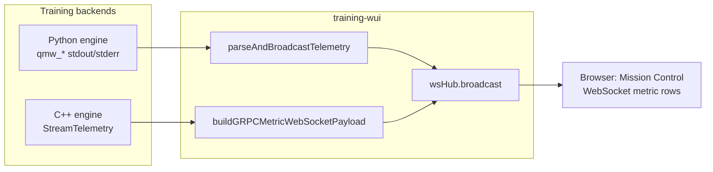
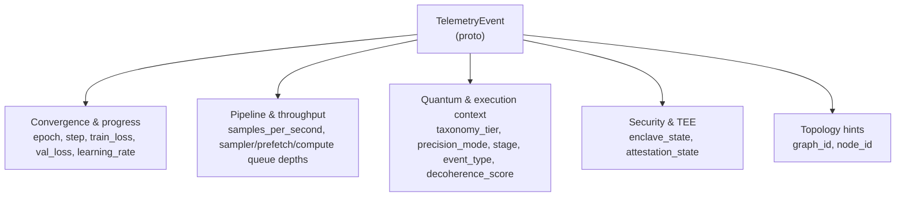
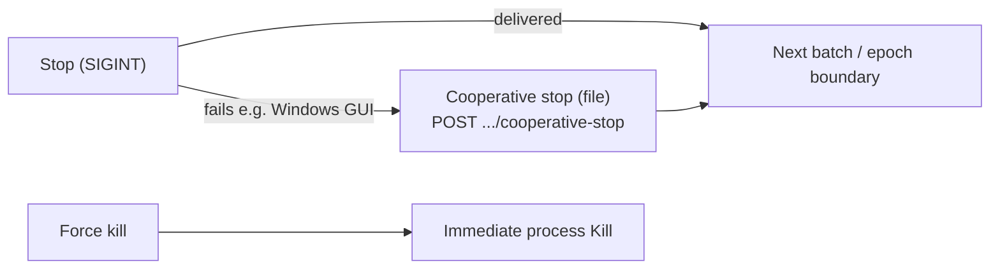

# Training WUI (Go)

Small web UI to pick a `configs/training/*.toml` file and start training. **Training behavior** comes from that TOML (and WUI edits). **RunPod / Hub / IBM tokens** in repo **`.env`** are **credentials**, not training hyperparameters — see [`.env.example`](../.env.example) and [docs/environment-variables.md](../docs/environment-variables.md). **Local** and **Cloud GPU (train on WUI host)** targets use the native **C++ `TrainingEngineService` gRPC** client (`StartTraining` / `StreamTelemetry`). **Cloud GPU (train on pod)** and **serverless cloud worker** paths still use **`python -m qminiwasm.engine`** (remote or async). The WUI maps the selected TOML to `TrainingConfig` fields that exist in `proto/training_engine.proto`; keys with no proto field are ignored until the engine loads full TOML server-side.

## Requirements

- [Go](https://go.dev/dl/) 1.22+
- Python env with the package installed (`pip install -e ".[training]"`) and `python` on `PATH`
- **Cloud GPU provider (optional):** [OpenTofu](https://opentofu.org/docs/intro/install/) **`tofu`** or **Terraform-compatible CLI** on `PATH` (the server shells out to `tofu` / `terraform` under `infra/runpod`). Setup checklist: [docs/RUNPOD_QUICKSTART.md](../docs/RUNPOD_QUICKSTART.md). Incus/host automation now lives in your separate ops runbook repository.
- **RunPod (optional):** [OpenTofu](https://opentofu.org/docs/intro/install/) **`tofu`** or HashiCorp **Terraform** on `PATH` (the server shells out to `tofu` / `terraform` under `infra/runpod`). Setup checklist: [docs/RUNPOD_QUICKSTART.md](../docs/RUNPOD_QUICKSTART.md).

## Run

From this directory:

```bash
go run . -root .. -addr :8765
```

Or build:

```bash
go build -o training-wui .
./training-wui -root ..
```

From the **repository root**, you can use **[`scripts/deploy-wui.sh`](../scripts/deploy-wui.sh)** (`./scripts/deploy-wui.sh`) to build the same binary; set **`DEST=/path/to/training-wui`** to copy it after the build (optional). The script comments list cloud-provider env vars (`RUNPOD_TOKEN`, `RUNPOD_API_KEY`, **`RUNPOD_TOKEN_END`**, **`RUNPOD_SERVERLESS_ENDPOINT_ID`**) — see [`.env.example`](../.env.example) and [docs/RUNPOD_SERVERLESS.md](../docs/RUNPOD_SERVERLESS.md).

Open [http://127.0.0.1:8765](http://127.0.0.1:8765).

### Flags

| Flag | Default | Meaning |
|------|---------|---------|
| `-addr` | `:8765` | Listen address (`host:port`) |
| `-root` | `.` | **Repo root** (directory that contains `configs/` and `qminiwasm/`) |
| `-python` | `python` | Python executable name or path on `PATH` |

### C++ gRPC training (local / WUI host)

- Start `qminiwasm_training_engine_server` (see [`cpp/training/README.md`](../cpp/training/README.md)).
- Optional env **`QMINIWASM_TRAINING_GRPC_ADDR`** (default **`127.0.0.1:50061`**).

Telemetry is pushed over **`StreamTelemetry`** and re-broadcast as the same WebSocket **`metric`** / **`alert`** shapes as before (no `grpcurl`). The **`metric`** object keeps legacy keys (`epoch`, `mean_loss`, `mean_mse`, `mean_return`, `line`) for charts and adds the full proto field set under snake_case names (`step`, `learning_rate`, queue depths, `stage`, `event_type`, `decoherence_score`, `enclave_state`, `attestation_state`, …) plus **`engine`: `"grpc"`**. Mission Control shows the extra columns when the source is C++ gRPC.

### Mission Control telemetry contract (Python vs gRPC)

| Surface | How data arrives | What the operator sees |
|--------|------------------|-------------------------|
| **Python** (`python -m qminiwasm.engine`) | Stdout lines parsed by the WUI (e.g. **`qmw_metric`** at epoch end, **`qmw_train_throughput`**, **`qmw_xpu_mem`**) | WebSocket **`metric`** with `telemetry_source` = Python VNV; table cells for step/LR/queues stay empty unless future Python emits matching fields |
| **C++ gRPC** | **`StreamTelemetry`** → `TelemetryEvent` in `proto/training_engine.proto` | Same **`metric`** type with `telemetry_source` = gRPC C++, **`engine`**: `"grpc"`, and populated **Step**, **LR**, **σ/s**, **Q**, **Tier**, **Stage**, **Dec**, **TEE** columns in Mission Control |

**Proto → WebSocket (operator-facing names):**

| `TelemetryEvent` field | Role |
|------------------------|------|
| `epoch`, `train_loss`, `val_loss` | Convergence; also mirrored as `mean_loss` / `mean_mse` for charts |
| `step`, `learning_rate`, `samples_per_second` | Training progress and throughput |
| `sampler_queue_depth`, `prefetch_queue_depth`, `compute_queue_depth` | Pipeline / loader backpressure |
| `taxonomy_tier`, `precision_mode` | Runtime / precision context |
| `stage`, `event_type`, `message` (`grpc_message`, `line`) | What the engine is doing |
| `graph_id`, `node_id` | Topology / placement hints |
| `enclave_state`, `attestation_state` | Security / TEE status |
| `decoherence_score` | Quantum-context signal from the engine |

**Prometheus / SOA-style metrics** (SML, LCI, LME, TtC, LMS/TBR, etc.) are **not** emitted on this WebSocket path. A future **metrics exporter** or scrape endpoint would be separate.

The architecture is still designed so **Stateful Operational Autonomy (SOA)** can be observed with external tools (for example Prometheus) using those latency and migration signals once a dedicated metrics surface exists. Until then, treat Mission Control as the **live operator console** and Prometheus as **out of scope** for this repo’s WebSocket bridge.

#### Telemetry paths into Mission Control



Use the **Live telemetry** stream filter (**All** / **C++ gRPC** / **Python**) so the table matches how your run was started. A long **first epoch** on Python still means **no `qmw_metric` row** until that epoch completes.

#### `TelemetryEvent` field groups (what to watch)



**Operator notes**

- **Losses:** Rising `val_loss` with falling `train_loss` suggests overfitting; both flat or diverging means revisit LR, data, or capacity.
- **Throughput vs queues:** Full **prefetch** queue with an empty **compute** queue often points to a **compute** bottleneck; the inverse suggests **data loading** or **sampler** pressure.
- **Decoherence:** `decoherence_score` tracks stability of quantum-routing-related state in the engine (when that path is active).
- **TEE:** `enclave_state` and `attestation_state` summarize trusted-execution context for the run when the engine reports them.

Regenerate Go stubs after editing the proto (from **`training-wui/`**): `go generate ./...` (requires `protoc` plus `protoc-gen-go` and `protoc-gen-go-grpc` on `PATH`).

### Tabs (workflow)

- **Training** — Single **LEGO-style wizard** (five steps on one tab): (1) dataset mix, (2) model & runtime, (3) data source, (4) training knobs + full **schema** form, (5) review/save, **Launch training** (only control that starts `python -m qminiwasm.engine`), preflight, runs, artifacts. All saves target **`configs/training/wui_working.toml`** unless you pick another file in the dropdown.
- **Mission Control**, **Infra & Cloud GPU** (node health, **warm RunPod targets**, `terraform.tfvars`, cloud status, OpenTofu), **Quantum Topology**, **Artifact Registry** — Mission Control holds quick metrics, live telemetry (including **quantum routing** State 1/2 visuals when the engine emits `qmw_routing_*` lines), and the training log moved off the wizard for headroom.

`POST /api/runs/build` and `POST /api/runs/custom` only write `wui_working.toml`; **`POST /api/runs`** starts training. Optional JSON field **`allow_missing_checkpoint`**: when `true` and the config’s `checkpoint.load_path` file is missing, the server runs from a temp copy of the TOML with that line removed (fresh weights). The UI sets this only after you confirm in the resume-without-file dialog.

Only one training process at a time is allowed (start another after the current run finishes or after **Stop**).

### Stopping training (SIGINT vs cooperative file)



- **Stop (graceful)** — sends **SIGINT** to the local training process (or cancels the RunPod serverless job). Finishes the current batch when possible.
- **Cooperative stop (file)** — `POST /api/runs/<id>/cooperative-stop` creates a sentinel file the Python loop polls (same behavior as SIGINT at the next batch boundary). Use when graceful SIGINT cannot reach the child (**Windows** WUI started from a GUI is a common case). The WUI also exposes **Cooperative stop (file)** next to other stop controls. **RunPod SSH** runs use `ssh` **touch** on the pod path `.wui/stop_<runId>`. Not available for **native gRPC** training or **RunPod serverless** (use **Stop** / cancel).
- **Force kill** — immediate `Kill()`; may lose in-epoch work.

Local training is started as **`python -u -m qminiwasm.engine`** so **stdout is line-buffered** and Mission Control can parse **`qmw_metric`** lines as epochs complete. **`qmw_metric`** is emitted at **epoch end** (and on partial epoch after a graceful stop), so a long first epoch can look quiet until it finishes.

### Cloud GPU provider (OpenTofu)

End-to-end setup: [docs/RUNPOD_QUICKSTART.md](../docs/RUNPOD_QUICKSTART.md) (API key in `.env`, `scripts/runpod_bootstrap.sh`).

The dashboard can target a **cloud GPU provider** (current integration: RUNPOD) so OpenTofu runs **`apply`** before training and **`destroy`** when the job exits or you **Stop** (optional checkbox: skip destroy if you want to keep the pod).

- Set **`RUNPOD_TOKEN`** (or `RUNPOD_API_KEY`) in the repo **`.env`**; the WUI loads it on startup (`loadDotenvFromRepo`).
- Stack lives in **`infra/runpod`**. **`tofu` or `terraform` must be on `PATH`** on the **WUI host**.
- **Train on the pod (default):** Set **Execution target** to RunPod in the header and leave **Train on cloud GPU** checked. **Launch training** will: `tofu apply` (unless you use a **warm target** or check **Skip OpenTofu apply**), wait for **`public_ip`** (or use the warm host), **tar-sync** the repo to the pod over **SSH**, then run **`python -u -m qminiwasm.engine`** on the pod (venv + `pip install -e ".[training]"` on each run), with **`--wui-stop-file .wui/stop_<runId>`** for cooperative stop from the WUI. The WUI host must have **`ssh`**, **`tar`**, and **`scp`** (scp only needed when the server uses a generated temp config) on **`PATH`**. Optional **`RUNPOD_SSH_USER`**, **`RUNPOD_REMOTE_DIR`**, **`RUNPOD_SSH_KEY`** in `.env` (see [`.env.example`](../.env.example)); per-target **SSH user** can be stored in the warm-target registry. Your repo **`.env`** is included in the sync so Hub / IBM tokens work remotely.
- **Train on the WUI host:** Uncheck **Train on cloud GPU** — the pod is still provisioned, but training runs on the WUI machine via **gRPC** to the C++ engine (same as **local** target).
- **Artifacts:** Checkpoints are written on the **pod** under the synced repo (e.g. `artifacts/models/...`). Copy them back with **scp**/**rsync** if you need them on your laptop. **Stop** terminates the local **ssh** process; the remote Python process may keep running until the pod is destroyed or you SSH in manually.

**Cloud GPU (CUDA):** Pods default to **`ACCELERATOR=cuda`** in container env (`infra/runpod/variables.tf`). See **`infra/runpod/CLOUD_ACCELERATOR.md`**.

**Infra & Cloud GPU tab:** edit **`infra/runpod/terraform.tfvars`**, **Status** (badges include **ssh** / **scp** / **tar**), and **OpenTofu CLI**. **`GET /api/meta`** includes **`runpod_remote`** defaults and tool detection.

**Floating panels (optional):** On **Training** and **Infra & Cloud GPU**, enable **Floating panels** to drag sections by their **title** and resize from the **corner grip**. The **Log** panel lives on **Mission Control** when using the default layout. Layout is stored in **`localStorage`**.

### Agent / inference outputs (after Launch training)

Each training run writes checkpoints under **`artifacts/models/<model-slug>/`** (repo root, gitignored):

| File | Role |
|------|------|
| `final.pt` | End-of-run weights (`CHECKPOINT_SAVE_PATH`) |
| `best.pt` | Best training MSE so far (`CHECKPOINT_BEST_PATH`) — **default for serving** |
| `latest.pt` | Last epoch (`CHECKPOINT_LATEST_PATH`) — used for **resume** |
| `serve.toml` | Minimal `[serve]` table; load with **`QMINIWASM_SERVE_CONFIG=artifacts/models/<slug>/serve.toml`** |
| `agent_bundle.json` | Machine-readable paths + **`uvicorn qminiwasm.engine.serve:app`** hint + HTTP API summary |

After training, point tools or agents at **`agent_bundle.json`** or set **`QMINIWASM_CHECKPOINT=artifacts/models/<slug>/best.pt`** and run **`uvicorn qminiwasm.engine.serve:app`** (**`pip install -e ".[serve]"`**). Inference is **`POST /infer`** with **`hidden_states`** (batch of 4096-float vectors); see the bundle JSON for the exact contract.

`GET /api/runpod/status` — token, binary, `tofu output` (when state exists), plus **`remote_ssh`**, **`remote_scp`**, **`remote_tar`**, **`remote_ssh_user`**, **`remote_dir`**, **`remote_ssh_key_set`**. `GET` / `PUT /api/runpod/warm-targets` — JSON `{ "targets": [ { "id", "label", "host", "ssh_user?", "notes?", "updated_at?" } ] }` for saved SSH hosts (training can pass `runpod_warm_target_id` on **`POST /api/runs`**). `GET` / `PUT /api/runpod/tfvars` — read or write **`terraform.tfvars`** only (`PUT` body `{ "content": "…" }`; `GET ?source=example` returns the example file). `POST /api/runpod/tofu` — JSON `{ "action": "init"|"plan"|"apply"|"destroy", "var_file": "terraform.tfvars" }` (`var_file` optional).

**Inference from the WUI (after `agent_bundle.json` exists):** `POST /api/serve/start` — body `{ "model_stem": "<slug>", "port": 8001 }` spawns **`uvicorn`** on **`127.0.0.1`** with **`QMINIWASM_SERVE_CONFIG`** and writes **`artifacts/models/<slug>/docker-compose.serve.yaml`**. **`POST /api/serve/stop`** terminates it. **`GET /api/serve/status`** — running flag, pid, log tail. Training and serve are mutually exclusive on one WUI process.

**Quantum routing telemetry (Qiskit QAOA path):** With `qaoa_execution_mode` **`qiskit_statevector`** or **`qiskit_ibm`**, the Python router may emit stdout lines **`qmw_routing_telemetry`** and **`qmw_routing_handoff`** (latency budget default **50 ms**, override with **`QMW_ROUTING_LATENCY_BUDGET_MS`**). The WUI forwards these over the run WebSocket as **`routing_telemetry`** / **`routing_handoff`** for Mission Control.

**Serverless cloud workers:** Queue calls use **`RUNPOD_TOKEN_END`** (endpoint API key) when set, else **`RUNPOD_API_KEY`** / **`RUNPOD_TOKEN`**. Management (`rest.runpod.io`: templates + endpoints) uses the account key only. Routes: `GET /api/runpod/serverless/meta`, `GET /api/runpod/serverless/worker-image?config=…`, `GET` / `POST /api/runpod/serverless/templates` (**`POST` creates templates via GraphQL `saveTemplate` on api.runpod.io**), `GET` / `POST /api/runpod/serverless/endpoints`, `GET /api/runpod/serverless/health`, `POST /api/runpod/serverless/run`, `GET /api/runpod/serverless/job?id=…`. See **[docs/RUNPOD_SERVERLESS.md](../docs/RUNPOD_SERVERLESS.md)**. **`GET /api/meta`** includes **`runpod_serverless`** flags (`endpoint_key_present`, `management_key_present`).

**`POST /api/runs`** accepts `run_target`: `"local"` | `"runpod"` | **`"runpod_serverless"`**; for pods: `runpod_destroy_on_exit`, optional **`runpod_var_file`**, **`runpod_train_on_pod`** (default **true** when `runpod`), **`runpod_skip_apply`**, optional **`runpod_warm_target_id`** (skips OpenTofu apply; uses registered host). For serverless: optional **`runpod_serverless_endpoint_id`** (else `RUNPOD_SERVERLESS_ENDPOINT_ID` in `.env`).

**Preflight FAQ**

- **CPU vs Build wizard accelerator**: Preflight loads the TOML from the **config dropdown** (e.g. `cascade_mopd.toml` has `accelerator = "cpu"`). The **Build wizard** accelerator is sent as `?accelerator=` so device resolution matches what you intend to train with, without editing that file.
- **IBM “pending jobs” = 0**: That field is the **backend queue depth** (jobs waiting on that IBM device). Zero does not mean “no quantum access”; it usually means nothing is queued right now. Training may still use a local/simulator path until it submits hardware jobs.
- **HF “dataset config” (none)**: Optional subset name for multi-config datasets. Empty means the **default** config on Hugging Face; Model Facts shows `(none)` when omitted.

### Intel XPU (Iris / Arc) — memory and throughput

- **Supported stack**: Use an **Intel XPU–enabled PyTorch** build and a **Python version** listed on Intel’s current install matrix (see [Intel Extension for PyTorch — XPU](https://intel.github.io/intel-extension-for-pytorch/xpu/latest/)). **Python 3.13+** may be ahead of published wheels; preflight surfaces a short advisory when relevant.
- **Shared GPU memory vs utilization**: Low shared memory with moderate Task Manager “GPU %” is normal for **small `batch_size`** and a **host-driven** training loop. The main lever to increase XPU memory use is **`[training].batch_size`** (raise until OOM or diminishing returns).
- **Hugging Face row volume**: Larger **`[huggingface].num_samples`** increases **host RAM** and work per epoch; it does not add device feeding parallelism by itself.
- **Host overlap**: Set **`[training].dataloader_num_workers`** in TOML / WUI so batch collation can run in worker processes while the XPU trains the previous batch (`pin_memory` stays off for XPU; on CUDA it is enabled when workers > 0).
- **Training telemetry (TOML / WUI, not env)**: In **`[training]`** set **`log_xpu_memory`**, **`log_xpu_memory_reset_peak`**, and **`log_train_throughput`** (booleans). The WUI **schema form** (uncheck **Basic fields only** if needed) includes these keys so **`wui_working.toml`** carries them—no environment variables required for the WUI workflow.
  - **`log_xpu_memory`**: structured **`qmw_xpu_mem`** lines: **`phase=training_setup`**, then **`epoch_end`** / **`epoch_partial`** with **`allocated_mib`** / **`max_allocated_mib`** (XPU only).
  - **`log_xpu_memory_reset_peak`**: **`torch.xpu.reset_peak_memory_stats`** at each epoch start so peak reflects that epoch.
  - **`log_train_throughput`**: **`qmw_train_throughput`** after supervised steps: **`wall_s`**, **`samples_per_s`**, **`cascade_s`**, **`host_rss_mib`** if **`psutil`** is installed. Use Task Manager / HWiNFO for thermals, not Python.
- **WUI WebSocket**: Parsed **`qmw_xpu_mem`** and **`qmw_train_throughput`** lines are broadcast as **`type: xpu_mem`** and **`type: train_throughput`**.

## Incus container (ops repo)

On the machine where `incus` runs (e.g. WSL):

```bash
cd /mnt/c/GiTeaRepos/System_admin/runbooks/qminiwasm/incus
chmod +x run-setup.sh setup-instance.sh install-opentofu.sh install-systemd-wui.sh
./run-setup.sh
```

Or **`./setup-instance.sh /absolute/path/to/qminiwasm-core`**. Full details, autostart, and troubleshooting are in the `System_admin` runbook README. In the guest, repo root remains **`/opt/qmw`** (WUI `-root`).

## Security note

This tool is for **local development**. It does not authenticate clients and can start arbitrary-length training jobs. Do not expose `-addr` on a public network without a reverse proxy and auth.
