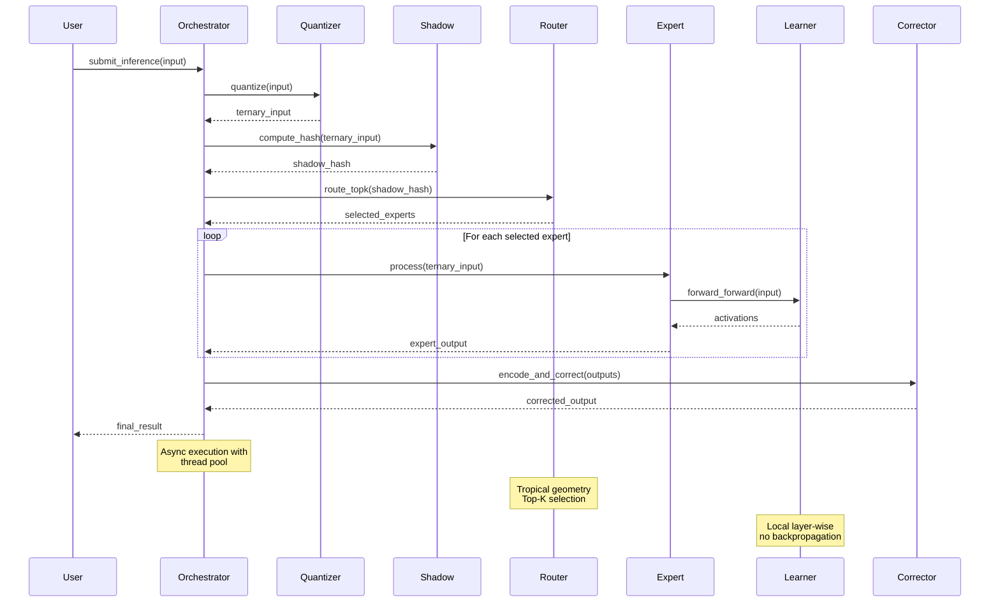

# Architecture Overview


## Architecture Diagram

```mermaid
graph TB
    subgraph "Core Framework"
        T[Ternary State Space<br/>GF(3) Arithmetic]
        S[Stabilizer Tableau<br/>Clifford Gates]
        M[MoE Router<br/>Tropical Geometry]
        F[Forward-Forward<br/>Learning]
    end
    
    subgraph "Runtime"
        O[Orchestrator<br/>Thread Pool]
        Y[SYCL Kernels<br/>GPU/CPU]
    end
    
    subgraph "External"
        W[WebAssembly<br/>Target]
        G[Go/DLL<br/>Plugin]
        C[Flash-CIM<br/>Interface]
    end
    
    subgraph "Input Processing"
        Q[Quantizer<br/>Absmean]
        SH[Shadow<br/>Clifford Hash]
    end
    
    subgraph "Output"
        EC[Error Correction<br/>Steane Code]
        ACT[Activations<br/>Trit Vectors]
    end
    
    Q --> SH
    SH --> M
    M --> T
    M --> S
    T --> F
    S --> F
    F --> EC
    EC --> ACT
    
    O --> Y
    Y --> T
    Y --> S
    
    F -.-> W
    F -.-> G
    F -.-> C
    
    style T fill:#e1f5fe
    style S fill:#f3e5f5
    style M fill:#fff3e0
    style F fill:#e8f5e8
    style O fill:#fce4ec
    style Y fill:#f1f8e9
```

## Architecture Diagram

```mermaid
flowchart LR
    subgraph Input
        A[Continuous<br/>Input]
        B[Absmean<br/>Quantizer]
        C[Ternary<br/>Trits]
    end
    
    subgraph Processing
        D[Clifford<br/>Shadow]
        E[MoE<br/>Router]
        F[Expert<br/>Selection]
        G[Forward-Forward<br/>Inference]
    end
    
    subgraph Correction
        H[Steane<br/>Code]
        I[Error<br/>Detection]
        J[Error<br/>Correction]
    end
    
    subgraph Output
        K[Final<br/>Activations]
        L[Result<br/>Vector]
    end
    
    A -->|FP32 values| B
    B -->|{+1,0,-1}| C
    C -->|Trit vector| D
    D -->|Hash| E
    E -->|Top-K| F
    F -->|Selected experts| G
    G -->|Raw output| H
    H -->|Syndrome| I
    I -->|Corrections| J
    J -->|Corrected| K
    K -->|Trit vector| L
    
    style A fill:#ffebee
    style B fill:#fce4ec
    style C fill:#f3e5f5
    style D fill:#ede7f6
    style E fill:#e8eaf6
    style F fill:#e3f2fd
    style G fill:#e1f5fe
    style H fill:#e0f7fa
    style I fill:#e0f2f1
    style J fill:#e8f5e9
    style K fill:#f1f8e9
    style L fill:#f9fbe7
```

## Architecture Diagram



## System Design

q_mini_wasm_v2 is a modular C++17 framework organized around five core
subsystems that work together to provide quantum-inspired, energy-efficient
AI inference at the extreme edge.

```
┌─────────────────────────────────────────────────────────────┐
│                    TernaryNeuralNetwork                      │
│                    (network.hpp/cpp)                         │
├─────────┬──────────┬──────────┬──────────┬─────────────────┤
│ Ingest  │ Shadow   │ MoE      │ Learning │ Fault Tolerance │
│ Layer   │ Layer    │ Router   │ Layer    │ Layer           │
├─────────┴──────────┴──────────┴──────────┴─────────────────┤
│                    Runtime Orchestrator                      │
│              (async task scheduling, SYCL)                   │
└─────────────────────────────────────────────────────────────┘
```

## Key Design Principles

1. **Ternary State Space**: All computation operates in GF(3) with values
`{+1, 0, -1}`
2. **No Floating Point**: Eliminates FP32 operations for extreme energy
efficiency
3. **Quantum-Inspired Parallelism**: Uses stabilizer formalism for
classical simulation
4. **Combinatorial Depth**: Sparse routing achieves exponential
expressivity
5. **Local Learning**: Forward-Forward algorithm eliminates backpropagation

## Subsystems

| Subsystem | Location | Purpose | Key Components |
|---|---|---|---|
| **Ternary** | `core/ternary/` | Trit types, GF(3) arithmetic | `Trit`, `BCT`, `TritBlock5` |
| **Stabilizer** | `core/stabilizer/` | Qutrit tableau, Clifford gates | `StabilizerTableau`, Clifford synthesis |
| **MoE** | `core/moe/` | Tropical geometry expert routing | `MoERouter`, `ExpertConfig` |
| **Learning** | `core/learning/` | Forward-Forward algorithm | `ForwardForwardLearner`, `FFConfig` |
| **Ingestion** | `core/ingestion/` | Data quantization, Clifford shadows | `AbsmeanQuantizer`, `CliffordShadow` |
| **Steane** | `core/steane/` | Fault-tolerant error correction | `QutritSteaneCode` |
| **Runtime** | `runtime/` | Thread pool, async orchestration | `RuntimeOrchestrator`, `RuntimeConfig` |
| **SYCL** | `sycl/` | GPU/parallel kernel declarations | Parallel tableau kernels |

## Data Flow

The framework processes data through a pipeline of specialized subsystems:

### 1. Input Processing
```cpp
// Continuous input → Ternary trits
std::vector<double> continuous_input = {0.5, -0.3, 0.8, -0.1, 0.2};
auto quantizer = std::make_unique<AbsmeanQuantizer>();
auto ternary_input = quantizer->quantize(continuous_input);
```

### 2. Clifford Shadow Encoding
```cpp
// Create hash-based representation
auto shadow = std::make_unique<CliffordShadow>();
auto shadow_hash = shadow->compute_hash(ternary_input);
```

### 3. MoE Routing
```cpp
// Select Top-K experts via tropical geometry
ExpertConfig config{8, 2, 4};  // 8 experts, Top-2, 4 routing qutrits
auto router = std::make_unique<MoERouter>(config);
auto selected_experts = router->route_topk(ternary_input);
```

### 4. Expert Inference
```cpp
// Process input through selected experts
FFConfig ff_config{
    .num_layers = 2,
    .neurons_per_layer = 64,
    .learning_rate = 0.01
};
auto learner = std::make_unique<ForwardForwardLearner>(ff_config);
```

### 5. Fault Tolerance
```cpp
// Apply Steane code for error correction
auto steane = std::make_unique<QutritSteaneCode>();
auto corrected_output = steane->encode_and_correct(output);
```

### 6. Output
```cpp
// Final ternary activations
std::vector<Trit> final_output = corrected_output;
```

## Memory Model

### Stack-Allocated Trit Vectors
All operations use stack-allocated trit vectors with deterministic sizing.
This eliminates heap allocation in the hot path, providing predictable
memory usage and avoiding garbage collection overhead.

### SYCL Device Memory
When SYCL acceleration is enabled, data is transferred to device memory
for parallel processing:

```cpp
// SYCL kernel execution
queue.submit([&](handler& h) {
    h.parallel_for(range{n}, [=](id<1> i) {
        // Parallel tableau row update
        tableau_data[i] = (tableau_data[i] + 1) % 3;
    });
});
```

### Memory Layout

```
StabilizerTableau:
  tableau[2n][2n] : int8_t  // GF(3) matrix
  phase[2n]       : int8_t  // Phase vector
  
MoERouter:
  weights[total_experts][routing_dim] : double
  routing_logits[total_experts]       : double
  
ForwardForwardLearner:
  weights[num_layers][neurons_per_layer] : Trit
  activations[num_layers][neurons_per_layer] : Trit
```

## Performance Characteristics

### Time Complexity

| Operation | Complexity | Notes |
|---|---|---|
| GF(3) arithmetic | O(1) | Single trit operations |
| Trit packing/unpacking | O(1) | 5 trits ↔ 8 bits |
| Tableau Hadamard | O(n) | Row updates |
| Tableau CSUM | O(n) | Two-qubit gate |
| Tableau measurement | O(n²) | Full column scan |
| MoE routing | O(N×K) | N experts, K active |
| Forward-Forward | O(L×N) | L layers, N neurons |

### Energy Efficiency

| Operation | Energy | Comparison |
|---|---|---|
| FP32 multiply | ~3.7 pJ | Baseline |
| Trit operation | <1 pJ | 3.7× more efficient |
| Trit pack/unpack | <0.1 pJ | 37× more efficient |

## Build Targets

| Target | Description | Use Case |
|---|---|---|
| `q_mini_wasm_v2_core` | Static/shared library | Integration into other projects |
| `q_mini_wasm_v2_tests` | Unit test suite | Development and CI |
| `q_mini_wasm_v2_network_test` | Integration tests | Full system validation |
| `q_mini_wasm_v2_wasm` | WebAssembly (Emscripten) | Browser deployment |

## Configuration Options

### Build Options

| Flag | Default | Description |
|---|---|---|
| `BUILD_TESTS` | `ON` | Build test executables |
| `USE_SYCL` | `OFF` | Enable SYCL acceleration |
| `BUILD_WASM` | `OFF` | Build WebAssembly target |
| `BUILD_SHARED_LIBS` | `OFF` | Build shared library |

### Runtime Configuration

```cpp
RuntimeConfig config{
    .num_worker_threads = 4,      // Parallel worker threads
    .max_queue_size = 100,        // Maximum pending tasks
    .enable_async = true,         // Async execution
    .enable_flash_cim = false     // Flash-CIM interface
};
```

## See Also

- [API Reference](API-Core Reference.md) - Complete API documentation
- [Ternary State Space](Ternary State Space) - GF(3) arithmetic details
- [Stabilizer Tableau](Stabilizer Tableau) - Clifford gate operations
- [Build Guide](Guides-Building.md) - Build instructions
