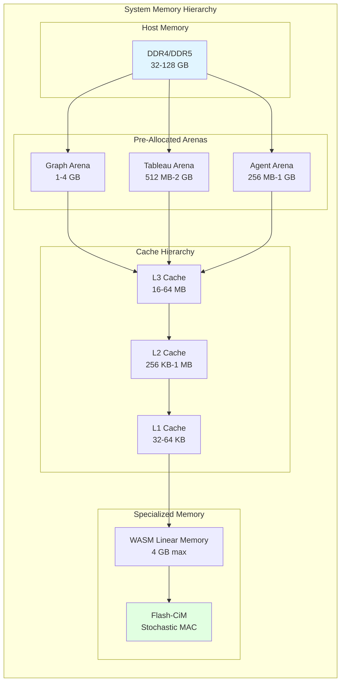
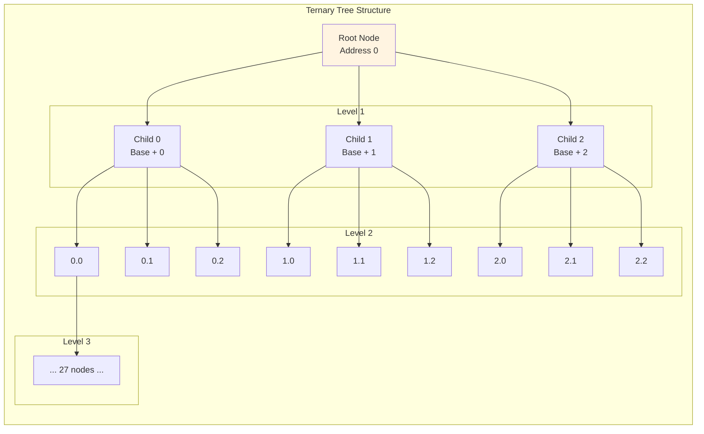
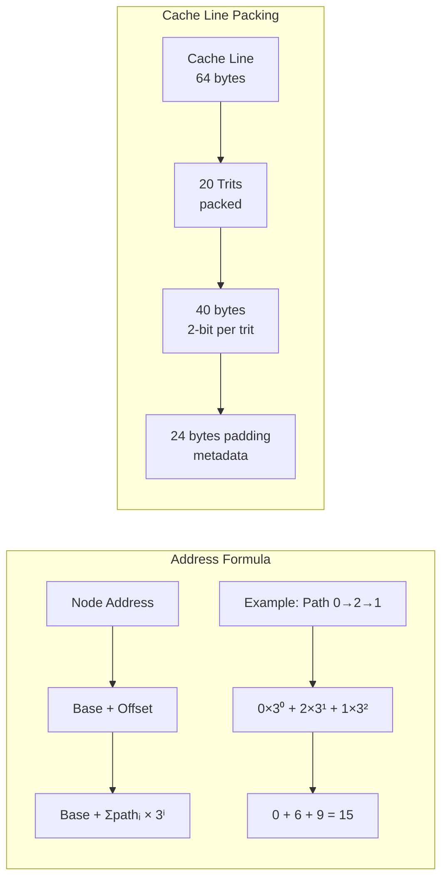
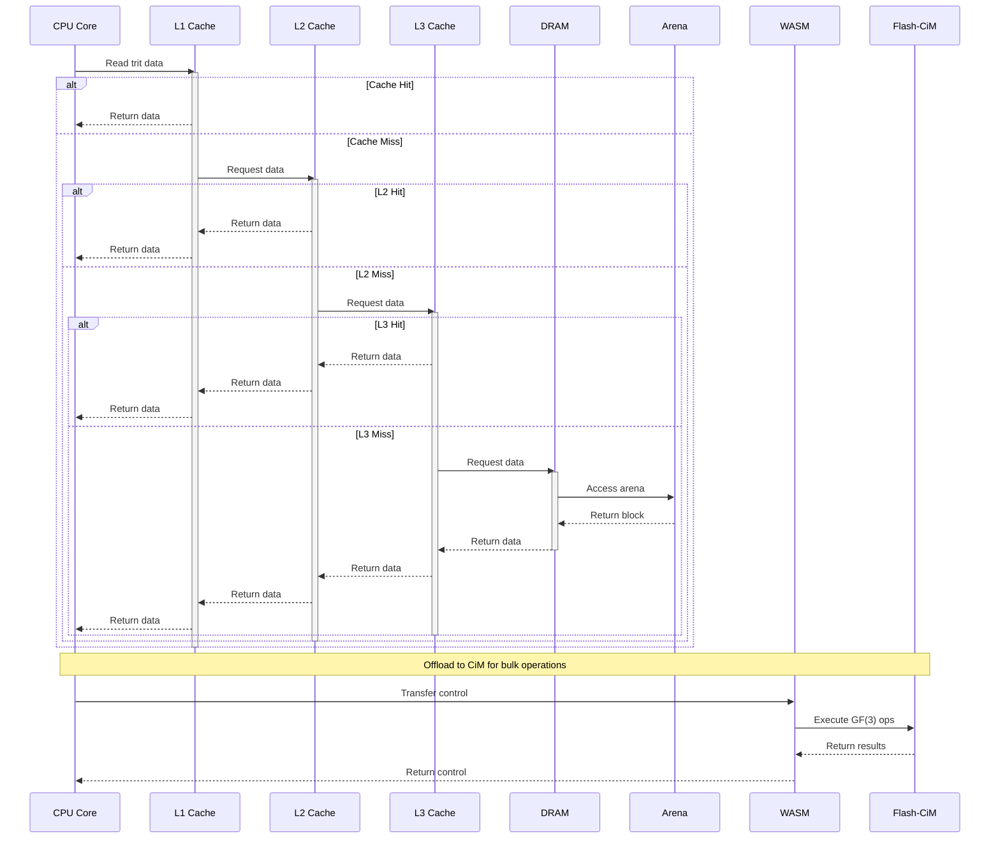

# Memory Layout Architecture

## Overview

This diagram illustrates the memory layout and hierarchy for the QMINIWASM
quantum-inspired computing system.



## Ternary Tree Memory Layout



## Address Calculation



## Memory Allocation Strategy

```mermaid
graph TB
    subgraph "Arena Allocation"
        INIT[Initialize Arena
Pre-allocate 1GB] --> BUMP[Bump Allocator
Sequential growth]
        
        BUMP --> CHUNK[Chunk Management
64KB blocks]
        
        CHUNK --> {
            Small Objects
            < 1KB
        }
        
        CHUNK --> {
            Medium Objects
            1KB - 64KB
        }
        
        CHUNK --> {
            Large Objects
            > 64KB
            Direct mmap
        }
    end
    
    subgraph "Object Layout"
        HEADER[8 bytes
Header] --> DATA[Variable
Data]
        DATA --> PADDING[0-7 bytes
Alignment]
    end
    
    subgraph "Header Fields"
        SIZE[4 bytes
Size]
        TYPE[2 bytes
Type ID]
        FLAGS[2 bytes
Flags]
    end
```

## WASM Memory Mapping

```mermaid
graph TB
    subgraph "WASM Linear Memory Layout"
        direction TB
        
        STACK[Stack
1 MB growth downward]
        
        HEAP[Heap
Dynamic growth upward]
        
        STATIC[Static Data
Pre-allocated]
        
        RESERVED[Reserved
~60 MB system]
    end
    
    subgraph "QMINIWASM Regions"
        TERNARY[Ternary Data
0x1000-0x100000]
        
        TABLEAU[Stabilizer Tableau
0x100000-0x500000]
        
        GRAPH[Graph Structures
0x500000-0x900000]
        
        AGENT[Agent State
0x900000-0xD00000]
        
        RAG[RAG Index
0xD00000-0xFFFFFFFF]
    end
    
    STATIC --> TERNARY
    TERNARY --> TABLEAU
    TABLEAU --> GRAPH
    GRAPH --> AGENT
    AGENT --> RAG
    
    STACK -.-> HEAP
```



## Flash-CiM Memory Array

```mermaid
graph TB
    subgraph "Flash CiM Architecture"
        direction TB
        
        WL[Word Lines
1024 cells]
        
        subgraph "Memory Cell"
            FG[Floating Gate
Charge storage]
            SA[Sense Amplifier
Stochastic MAC]
        end
        
        BL[Bit Lines
Data output]
    end
    
    subgraph "GF(3) Operations"
        A[Input Trits] --> B{Sense}
        B --> C[Stochastic
Multiplication]
        C --> D[Accumulate
Partial sums]
        D --> E[Normalize
GF(3) result]
    end
    
    subgraph "Energy Efficiency"
        READ[< 0.5 pJ/read]
        WRITE[< 10 pJ/write]
        MAC[< 0.5 pJ/MAC]
    end
```

## Memory Access Patterns



## Performance Metrics

| Memory Level | Latency | Bandwidth | Capacity |
|--------------|---------|-----------|----------|
| L1 Cache | 1-2 ns | 100+ GB/s | 32-64 KB |
| L2 Cache | 5-10 ns | 50+ GB/s | 256 KB-1 MB |
| L3 Cache | 20-50 ns | 30+ GB/s | 16-64 MB |
| DRAM | 50-100 ns | 20+ GB/s | 32-128 GB |
| Flash-CiM | 100 ns | 10 GB/s | 1-4 GB |

---

*Generated: April 6, 2026*
*Diagram Type: Mermaid Architecture*
