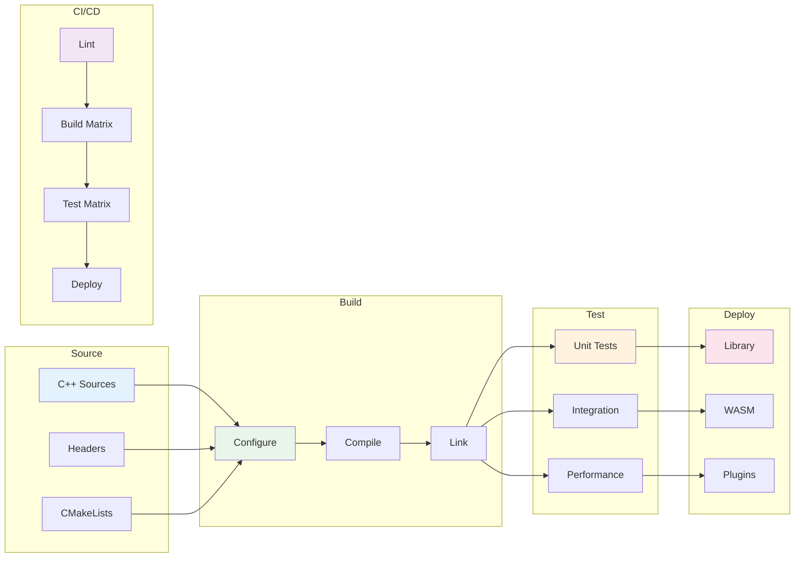

# Build Guide


## Architecture Diagram



## Prerequisites

- C++17 compiler (GCC 7+, Clang 5+, MSVC 2017+)
- CMake 3.14+
- Git

## Quick Build

```bash
git clone https://github.com/kennetholsenatm-gif/q_mini_wasm_v2.git
cd q_mini_wasm_v2/q_mini_wasm_v2
mkdir build && cd build
cmake ..
cmake --build .
```

## Build Options

| Flag | Default | Description |
|---|---|---|
| `BUILD_TESTS` | `ON` | Build test executables |
| *(native SYCL)* | *(always on)* | Main `q_mini_wasm_v2` tree: configure with **icpx/icx**; see CONTRIBUTING.md |
| `BUILD_WASM` | `OFF` | Build WebAssembly target |
| `BUILD_SHARED_LIBS` | `OFF` | Build shared library |

## Running Tests

```bash
cd build
ctest --output-on-failure
```

## Platform Notes

### Windows (MSVC)

```powershell
cmake -G "Visual Studio 17 2022" ..
cmake --build . --config Release
```

### Linux (GCC/Clang)

```bash
cmake -DCMAKE_BUILD_TYPE=Release ..
cmake --build . -j$(nproc)
```

### macOS (Clang)

```bash
cmake -DCMAKE_BUILD_TYPE=Release ..
cmake --build . -j$(sysctl -n hw.ncpu)
```
</content>
<write_to_file>
<path>docs/guides/sycl-setup.md</path>
<content>
# SYCL Setup Guide

## Intel oneAPI

1. Download Intel oneAPI Base Toolkit from intel.com
2. Install with default options
3. Source the environment:

```bash
source /opt/intel/oneapi/setvars.sh
```

## Build with SYCL

```bash
cmake -S q_mini_wasm_v2 -B q_mini_wasm_v2/build_sycl -G Ninja -DCMAKE_CXX_COMPILER=icpx ..
cmake --build . -j$(nproc)
```

## Verify SYCL

```bash
./q_mini_wasm_v2_tests --gtest_filter="*sycl*"
```

## Troubleshooting

| Issue | Solution |
|---|---|
| `IntelSYCL not found` | Source `setvars.sh` first |
| GPU not detected | Check `sycl-ls` output |
| Link errors | Ensure DPC++ runtime installed |