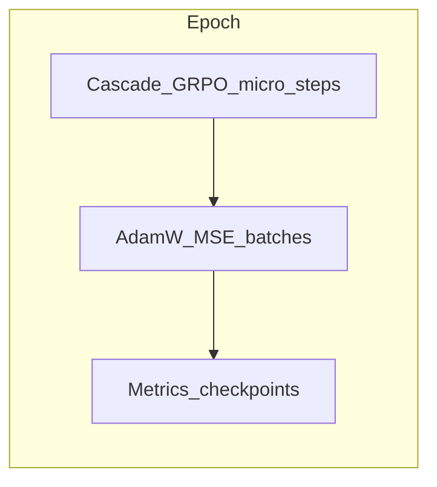

# AI training pipeline

This page explains **how** the Q-Mini-WASM / **qminiwasm-core** training path works and **why** it is shaped this way. For every environment variable, metric name, and checkpoint field, use the canonical in-repo reference:

**[docs/TRAINING_DATA.md](https://github.com/kennetholsenatm-gif/qminiwasm-core/blob/main/docs/TRAINING_DATA.md)**

## Goal

Train the hybrid stack around `QMiniWASM` so **`hybrid_inference`** improves under a **supervised signal**: mean **MSE** between model output and a **4096-dimensional target**, built from [`memory_encode`](https://github.com/kennetholsenatm-gif/qminiwasm-core/blob/main/qminiwasm/wasm/memory_encode.py) (metadata slots plus byte-derived floats).

The entrypoint is **`python -m engine`**, which loads env-driven [`EngineConfig`](https://github.com/kennetholsenatm-gif/qminiwasm-core/blob/main/engine/config.py) and calls [`run_training_loop`](https://github.com/kennetholsenatm-gif/qminiwasm-core/blob/main/qminiwasm/training/loop.py) in [`engine/train.py`](https://github.com/kennetholsenatm-gif/qminiwasm-core/blob/main/engine/train.py).

**Why MSE on a fixed vector?** It keeps the objective simple and comparable across batches: same shape, same reduction (`mean` over all elements including the full 4096 dims). It is **not** full next-token language modeling; plateaus and residual error are expected on diverse encodings.

## Data sources: what and why

| Source | Role | Why it exists |
|--------|------|----------------|
| **`mesh`** | Embedded C snippets run under wasmtime; linear memory → 4096-d **hidden** / **target** | **Deployment-aligned**: supervision matches real WASM execution semantics. |
| **`corpus`** | Manifest of bare wasm32 modules + exports; same encoding path | Same as mesh for teams with their own WASM binaries. |
| **`hf_tabular`** | Hugging Face rows → UTF-8 blob → **hidden**; **target = hidden** (identity MSE) | **Scale and diversity** (e.g. CodeSearchNet) without compiling every sample to WASM. |

**Why distinguish them?** If the product must track **real linear memory** at the edge, prefer **`mesh`** or **`corpus`**. **`hf_tabular`** is useful for cheap pretraining or auxiliary signal; it does **not** replace wasmtime-backed traces for WASM-faithful behavior.

**`HF_MESH_BLEND_FRACTION` (hf_tabular only):** Append mesh-generated samples equal to **fraction × (HF row count)** (minimum one), then **shuffle** when `SEED` is set. **Why:** Pull large Hub runs back toward WASM curriculum so optimization does not drift entirely toward text-only encodings.

Install training extras:

```bash
pip install -e ".[training]"
```

Use a local **`.env`** for `HUGGING_FACE_HUB_TOKEN` / `HF_TOKEN` (never commit secrets). Intel GPU: set **`ACCELERATOR=xpu`** after installing PyTorch XPU — see **[INSTALL_TORCH_XPU.md](https://github.com/kennetholsenatm-gif/qminiwasm-core/blob/main/docs/INSTALL_TORCH_XPU.md)**.

## Training loop: cascade then supervised MSE

At a high level each **epoch** looks like this:



### Cascade phase (optional; on by default)

Before the main supervised batches, the loop runs a small number of **GRPO** updates on a **toy routing MDP** (`ToyRoutingEnv`, policy via `TinyCascadePolicy` or `CascadeRouter`). **Why:** Warm up an escalation-style policy head that is trained with its own optimizer—not the main AdamW on the ternary/hybrid stack.

**`CASCADE_SEED_FROM_HIDDEN`:** The MDP initial state can be derived from a **digest** of recent training hiddens so cascade training **bridges** to the same distribution the MSE phase sees.

**`CASCADE_COUPLE_FORWARD` (default on):** The digest blends **0.5 × mean(input hidden) + 0.5 × mean(`hybrid_inference` output)** each batch (one forward). **Why:** Tie the toy MDP to the **live** model, not only raw inputs. Set to `0` to use **input hidden mean only**.

Optional **`CASCADE_MOPD_LAMBDA`** and **`CASCADE_MOPD_FEAT_LOSS`:** Adds a feature-alignment term (MOPD) during the cascade phase. Details, equations, and the current synthetic teacher behavior: **[Cascade RL and MOPD](Cascade-RL-and-MOPD.md)** and **[docs/CASCADE_AND_MOPD.md](https://github.com/kennetholsenatm-gif/qminiwasm-core/blob/main/docs/CASCADE_AND_MOPD.md)**.

### Supervised phase

**AdamW** steps **mean MSE** over batches. Common knobs:

- **`HYBRID_ADAPTER`:** Residual MLP after the ternary expert for extra capacity toward hard **low-MSE** targets without changing the loss form.
- **`GRAD_CLIP_NORM`**, **`ReduceLROnPlateau`**, **`EARLY_STOP_PATIENCE`:** Stability and less wasted epochs when the curve flattens.
- **Holdout:** `EVAL_HOLDOUT_FRACTION` + `EVAL_EVERY_EPOCH` — **why:** Judge quality on data not trained in the optimizer step.
- **`TARGET_MEAN_MSE` + `STOP_ON_TARGET_MSE`:** Operational “good enough” threshold; when eval every epoch is on, the stop logic **prefers eval** MSE (see TRAINING_DATA.md for the exact precedence).

**Why `1e-4` shows up often for HF:** It is a demanding but concrete mean-MSE scale on 4096-d vectors; strict achievement on very diverse rows may need adapter + data + schedule. Defaults for `hf_tabular` when unset are documented in TRAINING_DATA.md.

### IBM Quantum hardware (QAOA MoE path — validated)

The **`HybridQuantumMoE`** can execute a **Qiskit** QAOA ansatz on **real IBM Quantum devices** via **IBM Quantum Runtime** (`EstimatorV2`), not only simulators. When `qaoa_execution_mode` is **`qiskit_ibm`** (for example **`QUANTUM_EXECUTION_POLICY=hardware_only`** maps default `pennylane` to `qiskit_ibm`), training calls that path inside **`hybrid_inference`** / the supervised loop.

**Status (March 2026):** This stack has been **successfully exercised end-to-end** against IBM hardware: jobs complete through Runtime (ISA-transpiled circuits, device-backed Z expectations feeding the detached MoE signal). IBM **plan quota** and **usage limits** apply; the code can **fall back** to local **`qiskit_statevector`** when Runtime rejects jobs (e.g. quota exhausted). Gradients do **not** flow through the device; expectations are mixed in as a classical signal.

Canonical technical reference: **[docs/QUANTUM_QISKIT.md](https://github.com/kennetholsenatm-gif/qminiwasm-core/blob/main/docs/QUANTUM_QISKIT.md)**.

**Note:** **Cascade RL** remains a **classical** toy MDP; only the MoE QAOA block targets IBM when configured.

## Checkpoints and serving

- **`CHECKPOINT_SAVE_PATH` / `CHECKPOINT_BEST_PATH` / `CHECKPOINT_LOAD_PATH`:** Single `.pt` with `quantum_router`, `ternary_expert`, optional **`hybrid_adapter`**, optional **`cascade_policy`** (maps to `model.cascade_router` when **`USE_CASCADE_ROUTER=1`**).
- **Why strict naming matters:** Serving with `uvicorn engine.serve:app` and **`QMINIWASM_CHECKPOINT`** must use the same **adapter** and **cascade** flags as training or weights will not load as expected (`strict=False` still logs missing keys).

See the **Serving** and **Checkpoints** sections in [docs/TRAINING_DATA.md](https://github.com/kennetholsenatm-gif/qminiwasm-core/blob/main/docs/TRAINING_DATA.md).

## Related wiki pages

- **[Cascade RL and MOPD](Cascade-RL-and-MOPD.md)** — GRPO cascade phase and MOPD feature loss.
- **[Quantum Optimization](Quantum-Optimization.md)** — QAOA context; IBM hardware validation note.
- **[Development](Development.md)** — clone, tests, and ML quick start.
- **[Architecture Overview](Architecture-Overview.md)** — infrastructure context.

---

**Last Updated:** 2026-03-23
