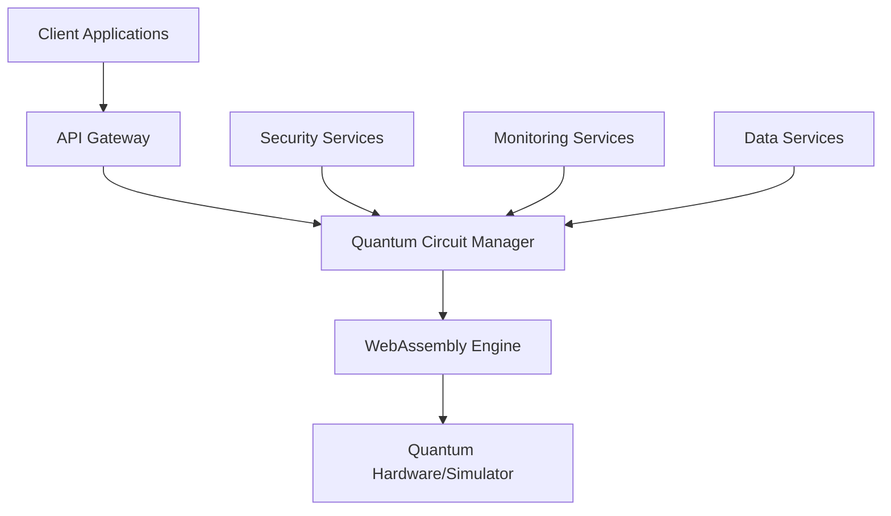

# Project Overview

## Introduction to Q-Mini-WASM

Q-Mini-WASM is a cutting-edge quantum computing framework that combines the power of WebAssembly (WASM) with quantum machine learning capabilities. This project represents a significant advancement in quantum computing by providing a secure, scalable platform for quantum applications while adhering to modern DevSecOps principles.

## Core Architecture

### Quantum Computing Layer
- **Qiskit Integration**: IBM's quantum computing framework for circuit creation and execution
- **PennyLane Integration**: Cross-platform quantum machine learning library
- **Quantum Circuit Simulation**: High-fidelity simulation of quantum circuits
- **Hardware Abstraction**: Platform-independent quantum hardware interface

### WebAssembly Layer
- **WASM Compilation**: High-performance compilation of quantum algorithms
- **Execution Engine**: Optimized WASM runtime for quantum computations
- **Memory Management**: Efficient memory allocation and garbage collection
- **Parallel Execution**: Multi-threaded quantum circuit execution

### Application Layer
- **API Interface**: RESTful APIs for quantum service integration
- **Data Pipeline**: Secure data processing and transformation
- **Machine Learning**: Integration with ML frameworks for quantum-enhanced models
- **Visualization**: Real-time quantum circuit visualization and monitoring

## Technical Specifications

### System Requirements
- **Python Version**: 3.11+
- **Operating Systems**: Linux, macOS, Windows
- **Memory**: Minimum 8GB RAM, recommended 16GB+
- **Storage**: 2GB free space for installation
- **Network**: Internet connection for package downloads

### Dependencies
- **Core Libraries**: Qiskit, PennyLane, NumPy, SciPy
- **Development Tools**: Black, Flake8, MyPy, Bandit
- **Security Tools**: Safety, Semgrep, Gitleaks, Trivy
- **Build Tools**: Setuptools, Wheel, Poetry (optional)

## Key Features

### Quantum Computing Capabilities
- **Circuit Creation**: Intuitive quantum circuit design interface
- **Algorithm Library**: Pre-built quantum algorithms and protocols
- **Optimization Tools**: Quantum circuit optimization and error mitigation
- **Simulation Engine**: High-performance quantum state simulation

### WebAssembly Integration
- **Performance**: Near-native execution speed for quantum algorithms
- **Portability**: Cross-platform compatibility with WASM support
- **Security**: Sandboxed execution environment with memory protection
- **Scalability**: Horizontal scaling for large quantum computations

### DevSecOps Features
- **Automated Security**: Continuous security scanning and vulnerability detection
- **Compliance**: STIG, CMMC2.0, and NIST SP 800-53 compliance
- **CI/CD Pipeline**: Automated testing, building, and deployment
- **Monitoring**: Real-time performance and security monitoring

## Use Cases

### Research and Development
- **Quantum Algorithm Development**: Prototyping and testing new quantum algorithms
- **Quantum Machine Learning**: Developing quantum-enhanced ML models
- **Quantum Simulation**: Simulating complex quantum systems and phenomena
- **Academic Research**: Educational tools and research platforms

### Enterprise Applications
- **Financial Modeling**: Quantum optimization for portfolio management
- **Drug Discovery**: Molecular simulation and protein folding analysis
- **Supply Chain Optimization**: Quantum logistics and routing optimization
- **Cybersecurity**: Quantum-resistant encryption and security protocols

### Cloud Services
- **Quantum-as-a-Service**: Scalable quantum computing in the cloud
- **API Integration**: RESTful quantum services for application integration
- **Multi-tenant Support**: Secure isolation between quantum computing tenants
- **Cost Optimization**: Pay-per-use quantum computing resources

## Architecture Diagram

## Development Philosophy

### Security-First Approach
- **Zero Trust Architecture**: No implicit trust in any component
- **Defense in Depth**: Multiple layers of security controls
- **Secure by Default**: Security features enabled by default
- **Continuous Monitoring**: Real-time security event detection

### Performance Optimization
- **Algorithm Efficiency**: Optimized quantum algorithms for performance
- **Resource Management**: Efficient memory and CPU utilization
- **Parallel Processing**: Multi-threaded execution for speed
- **Caching Strategies**: Intelligent caching for frequently used operations

### Scalability Principles
- **Horizontal Scaling**: Support for distributed quantum computations
- **Load Balancing**: Intelligent distribution of quantum workloads
- **Resource Pooling**: Shared quantum computing resources
- **Auto-scaling**: Dynamic resource allocation based on demand

## Integration Capabilities

### Third-Party Integrations
- **Cloud Platforms**: AWS, Azure, Google Cloud quantum services
- **Container Orchestration**: Kubernetes, Docker Swarm support
- **CI/CD Systems**: Jenkins, GitLab CI, GitHub Actions integration
- **Monitoring Tools**: Prometheus, Grafana, ELK stack integration

### API Specifications
- **RESTful APIs**: Standard HTTP-based quantum service APIs
- **GraphQL Support**: Flexible query language for quantum data
- **WebSocket APIs**: Real-time quantum computation streaming
- **SDKs**: Python, JavaScript, and other language bindings

## Future Roadmap

### Near-term Goals (1-3 months)
- Enhanced security features and compliance updates
- Performance improvements and optimization
- Additional quantum algorithms and protocols
- Improved documentation and tutorials

### Medium-term Goals (3-6 months)
- Advanced monitoring and observability features
- Scalability improvements and distributed computing support
- Integration enhancements with cloud platforms
- Community features and collaboration tools

### Long-term Goals (6+ months)
- Advanced security capabilities and threat detection
- Performance optimizations and quantum advantage demonstrations
- New quantum computing features and protocols
- Enterprise-grade features and support

## Getting Started

Ready to begin your quantum computing journey with Q-Mini-WASM? Follow our [Development Workflow](Development) guide to set up your development environment and start building quantum applications today.

---

**Last Updated**: 2026-03-12
**Version**: 1.4.0