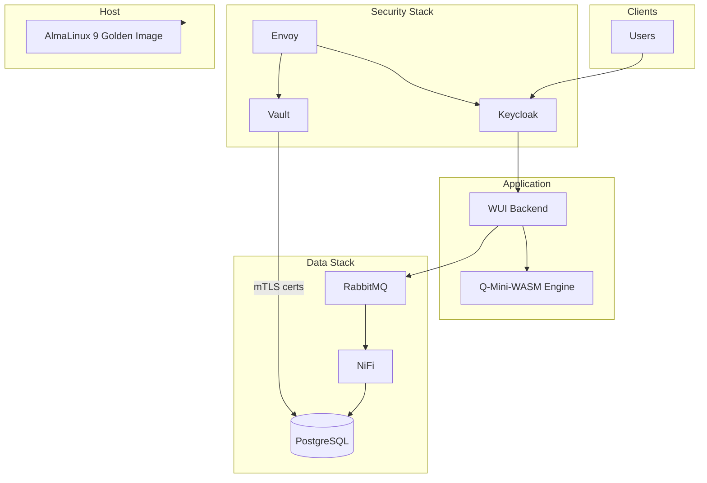

# Project Overview

## Introduction to Q-Mini-WASM

Q-Mini-WASM is a quantum computing framework that combines WebAssembly (WASM) with quantum machine learning capabilities. It provides a secure, scalable platform for quantum applications with mature DevSecOps, Zero Trust security, and event-driven data infrastructure suitable for tactical edge and air-gapped deployments.

## Product focus: event-driven SASE edge

A primary product of this platform is the **tactical edge**: autonomous edge agents that connect over **DMVPN** to the central Solace mesh, use MCP tools for security, telemetry, NetOps, logs, and infrastructure lifecycle, and rely on guaranteed delivery when the tunnel is flaky. The four pillars (host, data, security, application) and optional NetOps exist to build, run, and operate that edge and its central broker/orchestrator.

## Platform Architecture (Current State)

The pillars below support the edge product described above. The repository is organized into four main pillars:

### 1. Host Appliance (Packer + QEMU)
- **Location:** `infra/image-builder/`
- **Purpose:** Build a hardened AlmaLinux 9 QCOW2 golden image for tactical edge.
- **Contents:** Packer HCL (QEMU builder), Kickstart (ks.cfg), and a provision script that installs K3s, applies STIG-like hardening (SSH, chrony, firewalld), and creates an `admin` user.
- **Output:** `output-almalinux9/almalinux9-golden.qcow2`. Aligns with [DockerOS Platform Standard](https://github.com/kennetholsenatm-gif/qminiwasm-core/blob/main/docs/DockerOS-Platform-Standard.md) (AlmaLinux 9 as host OS).

### 2. Data Stack (Event-Driven Architecture)
- **Location:** `containers/data-stack/`
- **Purpose:** Vertically scalable, air-gap-friendly data ingestion and storage.
- **Components:** PostgreSQL (pgvector for LLM/quantum data), RabbitMQ (event broker), Apache NiFi (data flow engine). All use `deploy.resources` for vertical scaling on a single host.
- **Flow:** WUI backend publishes events to RabbitMQ; NiFi consumes, transforms, and writes final state to PostgreSQL. Optional mTLS for Postgres via Vault-issued client certs (see `postgres-mtls.conf` and security-stack).

### 3. Security Stack (Zero Trust / PQC-Ready)
- **Location:** `containers/security-stack/`
- **Purpose:** Passwordless human and machine identity; TLS 1.3 with post-quantum (ML-KEM) readiness.
- **Components:** Keycloak (FIDO2/Passkeys, OIDC for Teleport), HashiCorp Vault (PKI secrets engine for short-lived mTLS certs), Envoy (reverse proxy with TLS 1.3 and PQC curve options). Dedicated PostgreSQL for Keycloak.
- **Integration:** Teleport uses Keycloak as OIDC IdP; services request client certs from Vault for passwordless database access.

### 4. Application (Core Engine + WUI)
- **Location:** `qminiwasm/` (Python package), `wui/` (FastAPI backend + React frontend), `charts/qminiwasm-wui/` (Helm chart).
- **Purpose:** Quantum circuit simulation, WASM execution, Intel Quantum/ARC integration, and the Web UI for configuration and control.
- **Deployment:** Docker (e.g. `docker/Dockerfile.backend`) or Kubernetes via Helm; chart is STIG/Kyverno-aware (non-root, securityContext, optional Trivy scan annotation).

Optional Kubernetes/OpenTofu: `infra/opentofu/` (Teleport, Kyverno, Falco), `infra/teleport/`, `infra/kyverno/`, `infra/falco/`. See the [Greenfield Deployment Guide](https://github.com/kennetholsenatm-gif/qminiwasm-core/blob/main/docs/Greenfield-Deployment.md) in the repository for full deployment order.

## Core Application Architecture

### Quantum Computing Layer
- **PennyLane Integration**: Cross-platform quantum machine learning (primary).
- **Intel Quantum**: Integration points for Intel Quantum SDK, IQS, and Tunnel Falls (see [Intel Quantum and ARC](Intel-Quantum-and-ARC)).
- **Quantum Circuit Simulation**: High-fidelity simulation and hardware abstraction.

### WebAssembly Layer
- **WASM Compilation and Execution**: High-performance WASM runtime (e.g. wasmtime, pywasm).
- **Memory Management and Parallel Execution**: Optimized for quantum and classical workloads.

### Application Layer
- **API Interface**: FastAPI backend (REST) for the WUI and service integration.
- **Data Pipeline**: Event-driven flow via RabbitMQ and NiFi; canonical state in PostgreSQL (pgvector for embeddings).
- **Web UI**: React frontend for configuration, quantum backend selection, and monitoring.

## Technical Specifications

### System Requirements
- **Python Version**: 3.11+
- **Operating Systems**: Linux, macOS, Windows
- **Memory**: Minimum 8GB RAM, recommended 16GB+
- **Storage**: 2GB free space for installation
- **Network**: Internet connection for package downloads

### Dependencies
- **Core Libraries**: Qiskit, PennyLane, NumPy, SciPy
- **Development Tools**: Black, Flake8, MyPy, Bandit
- **Security Tools**: Safety, Semgrep, Gitleaks, Trivy
- **Build Tools**: Setuptools, Wheel, Poetry (optional)

## Key Features

### Quantum Computing Capabilities
- **Circuit Creation**: Intuitive quantum circuit design interface
- **Algorithm Library**: Pre-built quantum algorithms and protocols
- **Optimization Tools**: Quantum circuit optimization and error mitigation
- **Simulation Engine**: High-performance quantum state simulation

### WebAssembly Integration
- **Performance**: Near-native execution speed for quantum algorithms
- **Portability**: Cross-platform compatibility with WASM support
- **Security**: Sandboxed execution environment with memory protection
- **Scalability**: Horizontal scaling for large quantum computations

### DevSecOps Features
- **Automated Security**: Continuous security scanning and vulnerability detection
- **Compliance**: STIG, CMMC2.0, and NIST SP 800-53 compliance
- **CI/CD Pipeline**: Automated testing, building, and deployment
- **Monitoring**: Real-time performance and security monitoring

## Use Cases

### Research and Development
- **Quantum Algorithm Development**: Prototyping and testing new quantum algorithms
- **Quantum Machine Learning**: Developing quantum-enhanced ML models
- **Quantum Simulation**: Simulating complex quantum systems and phenomena
- **Academic Research**: Educational tools and research platforms

### Enterprise Applications
- **Financial Modeling**: Quantum optimization for portfolio management
- **Drug Discovery**: Molecular simulation and protein folding analysis
- **Supply Chain Optimization**: Quantum logistics and routing optimization
- **Cybersecurity**: Quantum-resistant encryption and security protocols

### Cloud Services
- **Quantum-as-a-Service**: Scalable quantum computing in the cloud
- **API Integration**: RESTful quantum services for application integration
- **Multi-tenant Support**: Secure isolation between quantum computing tenants
- **Cost Optimization**: Pay-per-use quantum computing resources

## Architecture Diagram



## Tactical Edge End-to-End Architecture

The following diagram shows the full path from CI/NetOps provisioning through far-edge devices to the tactical edge node (SDN, security stack, data stack, and application stack), including DMVPN SASE and Solace Agent Mesh A2A communication.

```mermaid
flowchart TB
    subgraph CI["Provisioning & NetOps (CI/CD Pipeline)"]
        direction LR
        Packer["Packer + Ansible\n(Builds QCOW2 Image & SBOM)"]
        NetBox["NetBox + Netdisco\n(Network Source of Truth & IPAM)"]
    end

    subgraph FarEdge["Far Edge Device (IoT/Sensor/Drone)"]
        direction TB
        Incus["Incus Orchestrator (LXC)"]
        subgraph LXC["LXC System Containers"]
            direction LR
            SASE["SASE Proxy\n(DMVPN + Envoy)"]
            IDS["Security IDS\n(Wazuh Agent)"]
            AIAgent["AI Agent Runtime\n(Solace Agent Mesh)"]
        end
        AIAgent -->|Local Tool Call| IDS
        AIAgent -->|Filtered Local API| SASE
    end

    subgraph HostNode["Tactical Edge Node (Ruggedized Hardware)"]
        direction TB
        OS["AlmaLinux 9 Host OS\n(Hardened Golden Image)"]

        subgraph SDN["SDN & Network Fabric"]
            VyOS["VyOS Router\n(BGP EVPN / VXLAN)"]
            OVS["AsterNOS / Open vSwitch\n(VXLAN VTEP)"]
        end

        subgraph Security["Security & Zero Trust Stack"]
            Ingress["Envoy / NGINX Ingress\n(Post-Quantum TLS 1.3 ML-KEM)"]
            Vault["HashiCorp Vault\n(PKI & Dynamic Secrets)"]
            Keycloak["Keycloak IAM\n(FIDO2/Passkeys)"]
            Teleport["Teleport\n(Cert-based Access Proxy)"]
        end

        subgraph DataStack["Event & Data Stack"]
            Solace["Solace PubSub+\n(Event Broker & Agent Orchestrator)"]
            NiFi["Apache NiFi\n(Data Routing & Flow)"]
            DB[("PostgreSQL\n(pgvector)")]
        end

        subgraph AppStack["Core Application Stack"]
            Backend["FastAPI WUI Backend\n(QminiWASM Engine)"]
            Frontend["React Web UI"]
        end

        VyOS --- OVS
        OVS --- Ingress

        Ingress --> Frontend
        Ingress --> Backend
        Ingress --> Solace

        Backend <-->|Publishes/Subscribes Events| Solace
        NiFi <-->|Subscribes & Transforms| Solace
        NiFi -->|Writes Final State (mTLS)| DB
        Backend -->|Direct Query (mTLS)| DB

        Teleport -.->|OIDC Trust| Keycloak
        Backend -.->|Requests Short-Lived Cert| Vault
        NiFi -.->|Requests Short-Lived Cert| Vault
    end

    Packer -.->|Deploys to| HostNode
    NetBox -.->|Ansible Dynamic Inventory| VyOS

    SASE <===>|Encrypted DMVPN SASE Tunnel| VyOS
    AIAgent <.->|Async A2A Comm (Guaranteed Delivery)| Solace
```

## Development Philosophy

### Security-First Approach
- **Zero Trust Architecture**: No implicit trust in any component
- **Defense in Depth**: Multiple layers of security controls
- **Secure by Default**: Security features enabled by default
- **Continuous Monitoring**: Real-time security event detection

### Performance Optimization
- **Algorithm Efficiency**: Optimized quantum algorithms for performance
- **Resource Management**: Efficient memory and CPU utilization
- **Parallel Processing**: Multi-threaded execution for speed
- **Caching Strategies**: Intelligent caching for frequently used operations

### Scalability Principles
- **Horizontal Scaling**: Support for distributed quantum computations
- **Load Balancing**: Intelligent distribution of quantum workloads
- **Resource Pooling**: Shared quantum computing resources
- **Auto-scaling**: Dynamic resource allocation based on demand

## Integration Capabilities

### Third-Party Integrations
- **Cloud Platforms**: AWS, Azure, Google Cloud quantum services
- **Container Orchestration**: Kubernetes, Docker Swarm support
- **CI/CD Systems**: Jenkins, GitLab CI, GitHub Actions integration
- **Monitoring Tools**: Prometheus, Grafana, ELK stack integration

### API Specifications
- **RESTful APIs**: Standard HTTP-based quantum service APIs
- **GraphQL Support**: Flexible query language for quantum data
- **WebSocket APIs**: Real-time quantum computation streaming
- **SDKs**: Python, JavaScript, and other language bindings

## Future Roadmap

### Near-term Goals (1-3 months)
- Enhanced security features and compliance updates
- Performance improvements and optimization
- Additional quantum algorithms and protocols
- Improved documentation and tutorials

### Medium-term Goals (3-6 months)
- Advanced monitoring and observability features
- Scalability improvements and distributed computing support
- Integration enhancements with cloud platforms
- Community features and collaboration tools

### Long-term Goals (6+ months)
- Advanced security capabilities and threat detection
- Performance optimizations and quantum advantage demonstrations
- New quantum computing features and protocols
- Enterprise-grade features and support

## Getting Started

Ready to begin your quantum computing journey with Q-Mini-WASM? Follow the [Development Workflow](Development) guide to set up your development environment and start building quantum applications today.

---

**Last Updated**: 2026-03-12
**Version**: 1.4.0