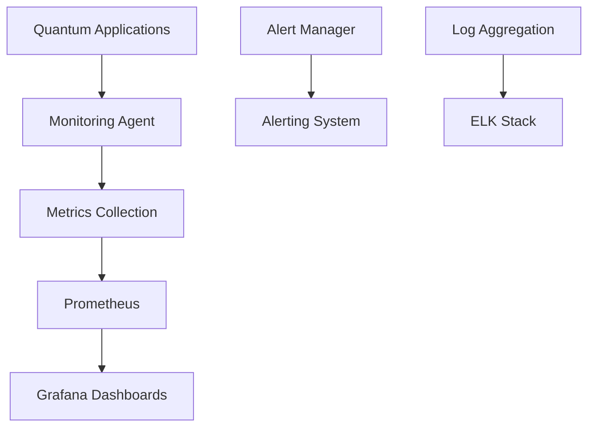

# Performance and Monitoring

## Overview

Q-Mini-WASM implements a comprehensive performance and monitoring framework that ensures optimal execution of quantum computing applications while providing real-time insights into system behavior. Our performance approach combines advanced optimization techniques with comprehensive monitoring capabilities to deliver high-performance quantum computing solutions.

## Performance Optimization

### Quantum Circuit Optimization
- **Circuit Simplification**: Automatic simplification of quantum circuits
- **Gate Optimization**: Optimization of quantum gate operations
- **Error Mitigation**: Error detection and mitigation strategies
- **Resource Optimization**: Efficient resource utilization

### WebAssembly Optimization
- **WASM Compilation**: High-performance WASM compilation
- **Memory Management**: Efficient memory allocation and garbage collection
- **Parallel Execution**: Multi-threaded quantum circuit execution
- **Caching Strategies**: Intelligent caching for frequently used operations

### Algorithm Optimization
- **Quantum Algorithm Optimization**: Optimized quantum algorithms
- **Classical Algorithm Optimization**: Optimized classical algorithms
- **Hybrid Optimization**: Combined quantum-classical optimization
- **Adaptive Optimization**: Dynamic optimization based on workload

## Performance Metrics

### Key Performance Indicators
- **Execution Time**: Quantum circuit execution time
- **Resource Utilization**: CPU, memory, and network utilization
- **Throughput**: Operations per second
- **Latency**: Response time for quantum operations

### Performance Benchmarks
- **Quantum Circuit Benchmarks**: Standard quantum circuit benchmarks
- **WASM Performance**: WASM execution performance metrics
- **Memory Performance**: Memory allocation and usage metrics
- **Network Performance**: Network communication performance

## Monitoring Architecture

### Real-time Monitoring
- **System Monitoring**: Real-time system performance monitoring
- **Application Monitoring**: Application-specific performance monitoring
- **Security Monitoring**: Security event and threat monitoring
- **Compliance Monitoring**: Compliance status monitoring

### Monitoring Tools
- **Prometheus**: Metrics collection and alerting
- **Grafana**: Visualization and dashboard creation
- **ELK Stack**: Log aggregation and analysis
- **Splunk**: Security information and event management

## Monitoring Implementation

### Metrics Collection
- **Performance Metrics**: Execution time, resource utilization, throughput
- **System Metrics**: CPU usage, memory usage, disk I/O
- **Network Metrics**: Network traffic, latency, bandwidth
- **Application Metrics**: Application-specific performance metrics

### Alerting System
- **Performance Alerts**: Performance degradation alerts
- **Security Alerts**: Security event alerts
- **System Alerts**: System health and availability alerts
- **Compliance Alerts**: Compliance violation alerts

## Performance Testing

### Performance Test Categories
- **Benchmarking**: Performance benchmarks for critical operations
- **Load Testing**: System performance under load
- **Stress Testing**: System behavior under extreme conditions
- **Scalability Testing**: System scalability assessment

### Performance Test Implementation
```python
# Example performance test
def test_performance_benchmark():
    """Test performance of quantum circuit execution"""
    import time
    
    start_time = time.time()
    result = execute_quantum_circuit(test_circuit)
    end_time = time.time()
    
    execution_time = end_time - start_time
    assert execution_time < MAX_EXECUTION_TIME
    assert check_performance_metrics(result)
```

## Monitoring Implementation

### Monitoring Architecture


### Monitoring Components
- **Metrics Collection**: Comprehensive metrics collection
- **Data Processing**: Real-time data processing and analysis
- **Visualization**: Interactive dashboards and visualizations
- **Alerting**: Intelligent alerting and notification system

## Performance Optimization Techniques

### Quantum Optimization
- **Circuit Optimization**: Quantum circuit optimization techniques
- **Gate Optimization**: Quantum gate operation optimization
- **Error Mitigation**: Quantum error detection and mitigation
- **Resource Optimization**: Quantum resource optimization

### Classical Optimization
- **Algorithm Optimization**: Classical algorithm optimization
- **Memory Optimization**: Memory usage optimization
- **CPU Optimization**: CPU utilization optimization
- **Network Optimization**: Network communication optimization

## Monitoring Best Practices

### Monitoring Strategy
- **Comprehensive Coverage**: All system components monitored
- **Real-time Monitoring**: Real-time performance monitoring
- **Historical Analysis**: Historical performance analysis
- **Predictive Analytics**: Predictive performance analytics

### Monitoring Implementation
- **Instrumentation**: Comprehensive system instrumentation
- **Data Collection**: Efficient data collection and processing
- **Visualization**: Clear and actionable visualizations
- **Alerting**: Intelligent and actionable alerting

## Performance Analysis

### Performance Analysis Tools
- **Profiling Tools**: Performance profiling and analysis
- **Benchmarking Tools**: Performance benchmarking tools
- **Monitoring Tools**: Performance monitoring tools
- **Analytics Tools**: Performance analytics and reporting

### Performance Analysis Techniques
- **Bottleneck Analysis**: Performance bottleneck identification
- **Root Cause Analysis**: Performance issue root cause analysis
- **Trend Analysis**: Performance trend analysis
- **Predictive Analysis**: Performance prediction and forecasting

## Scalability Considerations

### Scalability Strategies
- **Horizontal Scaling**: Horizontal scaling capabilities
- **Vertical Scaling**: Vertical scaling capabilities
- **Load Balancing**: Intelligent load balancing
- **Resource Pooling**: Resource pooling and sharing

### Scalability Testing
- **Load Testing**: System performance under load
- **Stress Testing**: System behavior under extreme conditions
- **Scalability Testing**: System scalability assessment
- **Performance Testing**: Performance under scaling conditions

## Performance Tuning

### Performance Tuning Process
- **Baseline Establishment**: Performance baseline establishment
- **Tuning Implementation**: Performance tuning implementation
- **Validation**: Performance tuning validation
- **Monitoring**: Performance tuning monitoring

### Performance Tuning Techniques
- **Algorithm Tuning**: Algorithm performance tuning
- **Configuration Tuning**: System configuration tuning
- **Resource Tuning**: Resource allocation tuning
- **Network Tuning**: Network performance tuning

## Monitoring Best Practices

### Monitoring Implementation
- **Comprehensive Coverage**: All system components monitored
- **Real-time Monitoring**: Real-time performance monitoring
- **Historical Analysis**: Historical performance analysis
- **Predictive Analytics**: Predictive performance analytics

### Monitoring Tools
- **Prometheus**: Metrics collection and alerting
- **Grafana**: Visualization and dashboard creation
- **ELK Stack**: Log aggregation and analysis
- **Splunk**: Security information and event management

## Performance Documentation

### Performance Documentation
- **Performance Plans**: Comprehensive performance planning
- **Performance Metrics**: Performance metrics and targets
- **Performance Reports**: Performance reporting and analysis
- **Performance Guidelines**: Performance guidelines and best practices

### Documentation Standards
- **Performance Documentation**: Standardized performance documentation
- **Result Reporting**: Consistent performance result reporting
- **Issue Tracking**: Performance-related issue tracking
- **Knowledge Sharing**: Performance knowledge sharing

## Continuous Improvement

### Performance Improvement Process
- **Metrics Analysis**: Regular analysis of performance metrics
- **Process Refinement**: Continuous improvement of performance processes
- **Tool Evaluation**: Regular evaluation of performance tools
- **Best Practices**: Adoption of performance best practices

### Future Performance Initiatives
- **AI-powered Optimization**: Machine learning for performance optimization
- **Automated Tuning**: Automated performance tuning
- **Advanced Analytics**: Advanced performance analytics
- **Predictive Performance**: Predictive performance capabilities

## Getting Started with Performance

Ready to optimize performance in your quantum computing projects? Follow the [Development Workflow](Development) guide to set up your development environment with comprehensive performance practices.

---

**Last Updated**: 2026-03-12
**Version**: 1.4.0