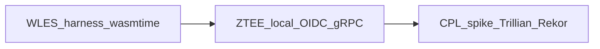

# Roadmap: Stateful WASM tooling

This roadmap prioritizes **concrete implementation tooling** for the **Stateful WASM Agent** paradigm—harnesses, local simulators, and audit integration spikes—not speculative algorithm research or quarterly “quantum advantage” narratives.

**North star:** Ship deterministic **Edge Cognitive Looping (ECL)**, **Certainty-Gated Escalation (CGE)**, **WASM Linear Execution Snapshots (WLES)**, and **Zero-Trust Ephemeral Enrollment (ZTEE)** *as testable, automatable artifacts* in this repository.

Normative identity/trust reference for ZTEE remains [`docs/IDENTITY_STACK_REFERENCE.md`](../docs/IDENTITY_STACK_REFERENCE.md); this page tracks *engineering milestones* only.

**Layout pilots:** Trainable TPEM I/O — [`qminiwasm/tpem/`](../qminiwasm/tpem/); WASM host — [`qminiwasm/wasm_host/`](../qminiwasm/wasm_host/) (`qminiwasm.wasm` = package-level alias only); **training surface** — Go WUI + C++ gRPC ([`docs/TRAINING_NATIVE_PARITY.md`](../docs/TRAINING_NATIVE_PARITY.md)); **TOML / EngineConfig / tests** — [`qminiwasm/engine/`](../qminiwasm/engine/). See [`docs/LAYOUT_REALIGNMENT_RFC.md`](../docs/LAYOUT_REALIGNMENT_RFC.md).

*Flow: snapshot and migration tooling informs enrollment and transport testing; both feed an append-only provenance narrative.*

---

## Immediate tooling priorities

### 1) WLES test harness

**Goal:** Freeze a **Wasmtime** guest mid-loop, capture **linear memory** (and enough metadata to resume), restore, and prove **reconstruction without unplanned degradation** (byte-identity where the model promises it).

| Area | Current repo state |
|------|-------------------|
| Envelope / metadata | [`qminiwasm/wasm_host/memory_encode.py`](../qminiwasm/wasm_host/memory_encode.py) (`build_wles_envelope`) |
| Wasmtime snapshot / restore | [`qminiwasm/wasm_host/wles_wasmtime_harness.py`](../qminiwasm/wasm_host/wles_wasmtime_harness.py); tests [`tests/test_wles_wasmtime_harness.py`](../tests/test_wles_wasmtime_harness.py) |
| Smoke tests | [`tests/test_wles_esi_harness.py`](../tests/test_wles_esi_harness.py) (JSON envelope invariants, CGE payload metadata—not full instance restore) |
| Kernels / compile | [`qminiwasm/wasm_host/trit_wasm_runtime.py`](../qminiwasm/wasm_host/trit_wasm_runtime.py), [`qminiwasm/wasm_host/engine.py`](../qminiwasm/wasm_host/engine.py) |

**Next milestones**

1. **Instantiate + snapshot** — Run a minimal Wasmtime `Instance`, read exported memory into `build_wles_envelope`, persist and reload the envelope; assert structural fields and memory bytes match.
2. **Cooperative suspend** — Guest exports a host-visible “yield” or uses a deterministic trap boundary so the harness can snapshot **mid** guest loop (not only at exit).
3. **Restore + resume** — New instance (or reset path), write linear memory from envelope, resume execution; compare memory to a golden post-resume state or document tolerated deltas (globals, stack snapshot policy).

**Docs:** [`docs/architecture/JOURNEY_OF_A_VECTOR.md`](../docs/architecture/JOURNEY_OF_A_VECTOR.md), [`docs/operations/OPERATIONS_RUNBOOK.md`](../docs/operations/OPERATIONS_RUNBOOK.md).

---

### 2) ZTEE local simulator (extend)

**Goal:** Local mock environment: **internal CA**, **OIDC-shaped tokens**, and eventually **gRPC-style** payload sync tests—without a full production broker mesh.

| Area | Current repo state |
|------|-------------------|
| Crypto / JWT / X.509 / AES-GCM | [`qminiwasm/security/ztee_local_simulator.py`](../qminiwasm/security/ztee_local_simulator.py) |
| Tests | [`tests/test_ztee_handshake_simulator.py`](../tests/test_ztee_handshake_simulator.py) |

**Done (M1):** Ephemeral CA + host EE chain verification, RS256 JWT with JWKS-shaped key set, `jti` revocation, AES-256-GCM encrypt/decrypt for WLES-sized blobs.

**Next milestones**

2. **HTTP OIDC stub** — Minimal `localhost` server: `/.well-known/openid-configuration`, token endpoint, static JWKS document; enclave client flow against stub (or curl contract tests). *Schema helper:* :func:`qminiwasm.security.ztee_local_simulator.build_oidc_provider_metadata` (unit-tested).
3. **gRPC delta-sync harness** — Small `.proto` + in-process or test-scoped server that carries **encrypted WLES** chunks consistent with [`docs/IDENTITY_STACK_REFERENCE.md`](../docs/IDENTITY_STACK_REFERENCE.md) (no claim of full QAHR or broker semantics).

---

### 3) Cognitive Provenance Ledger (CPL) integration

**Goal:** Architectural path to an **append-only Merkle log** that can **audit** certainty scalars, **CGE/WLES** migration evidence, and bindings to **ZTEE** identities (by reference to external IdP/PKI).

| Area | Current repo state |
|------|-------------------|
| Spike (this phase) | Track in [`docs/TODO.md`](../docs/TODO.md) + roadmap milestones |
| Protocol context | [`docs/IDENTITY_STACK_REFERENCE.md`](../docs/IDENTITY_STACK_REFERENCE.md) (CPL as external audit consumer) |

**Milestones**

1. **Spike doc** — Trillian vs Sigstore Rekor tradeoffs, event schema sketch, verification story (see doc).
2. **Canonical event schema** — Agree on stable field names and hashes for: certainty scalar stream, WLES/CGE correlation IDs, envelope digests, enclave subject/`jti` references.
3. **Backend choice + verifier hook** — Later: pick **Trillian** or **Rekor**, add optional offline inclusion verification CLI or CI check against a staging log.

**Non-goal for this repo today:** Running a full transparency log stack in default CI.

---

## Deferred / research backlog

The following are **not** primary roadmap drivers; they remain documented elsewhere for readers who need them.

- **Autonomous LR discovery** and other training-meta automation experiments — defer to issue-driven work; not a release theme for the Stateful WASM agent stack.
- **Generic “quantum advantage” or enterprise quarterly release** marketing phases — replaced by the tooling table above.
- **Validated historical note:** Training integration that can use **IBM Quantum** hardware for certain QAOA paths is documented in [AI-Training-Pipeline](AI-Training-Pipeline.md) and [`docs/QUANTUM_QISKIT.md`](../docs/QUANTUM_QISKIT.md). It is optional to configuration and **not** centered in this roadmap.

---

## Maintainer references

- Tooling execution checklist: [`docs/TODO.md`](../docs/TODO.md)
- Edge AI taxonomy / CI gates: [`docs/Q-Mini-WASM_ Edge AI Taxonomy.md`](../docs/Q-Mini-WASM_%20Edge%20AI%20Taxonomy.md), [`configs/ci/taxonomy_linter.json`](../configs/ci/taxonomy_linter.json)

**Last updated:** 2026-03-25 (Phase 4 tooling pivot)
